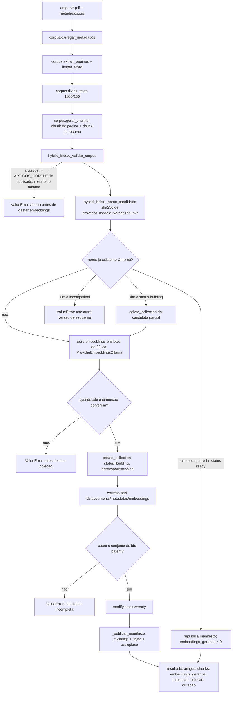
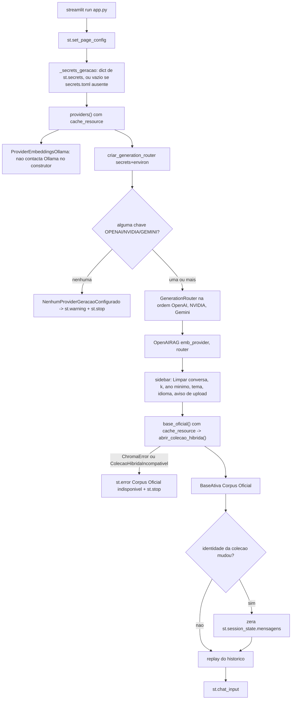
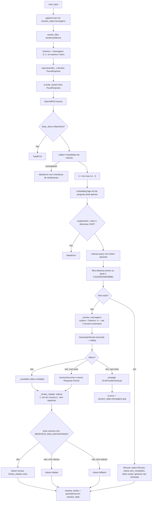
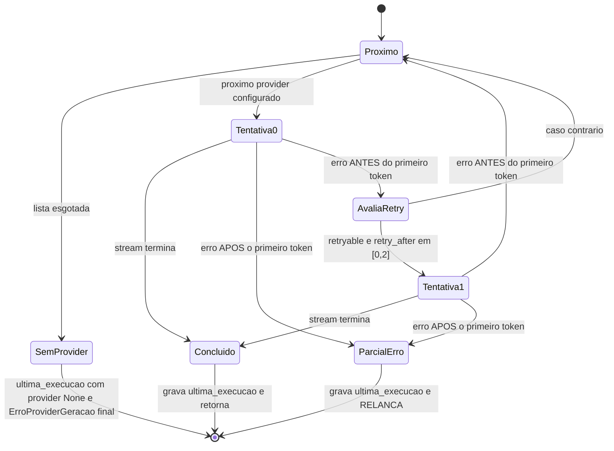
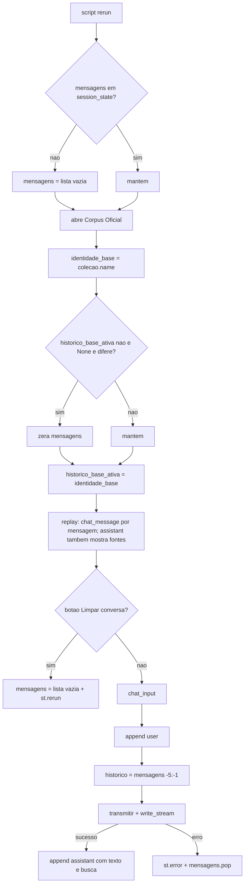
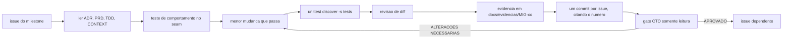
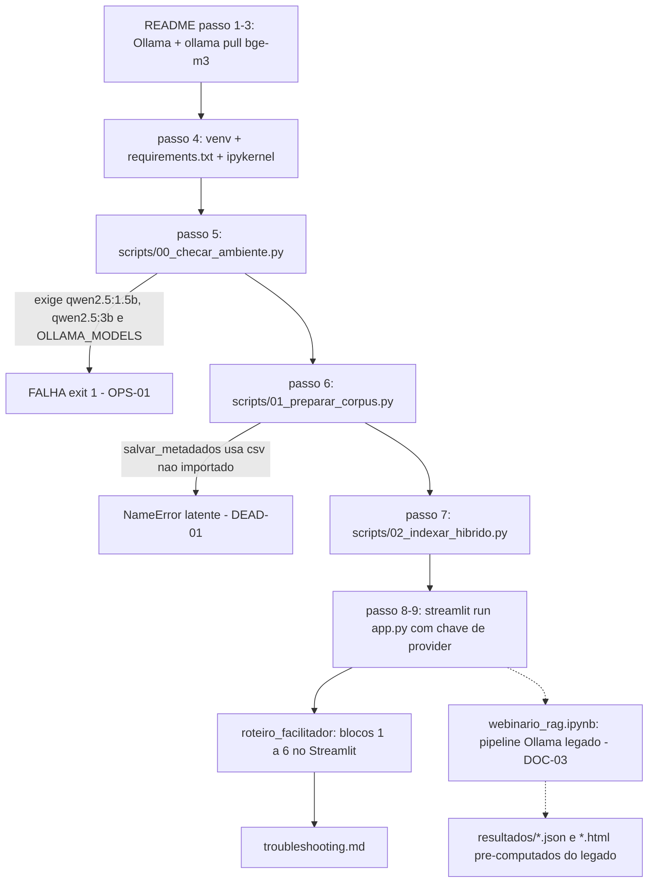
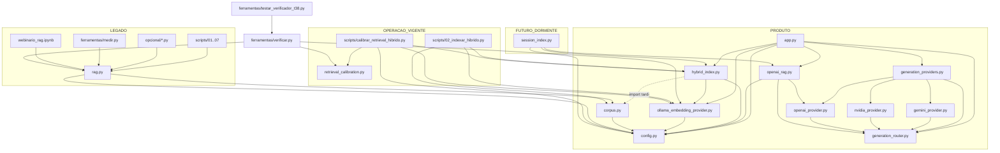

# Auditoria integral do repositório — RODADA-2 (Claude)

## 1. Metadados da auditoria

| Campo | Valor |
|---|---|
| Repositório | `D:\webinarioOllamaRAG-openai` (worktree isolado; remoto `https://github.com/Roger-Quinelato/webinarioOllamaRAG.git`) |
| Branch | `main` |
| `HEAD` | `a191feab6a145f3d5915537960485eb9510bacbc` — `docs: alinha estado atual ao fallback remoto` |
| Estado do worktree | **limpo**: nenhum arquivo staged, unstaged, deletado ou untracked |
| Data/hora da coleta | 2026-09-20 20:50:07 -0300 |
| Tag de rollback | `legacy-pre-openai` presente, aponta para `8726fef` |
| Interpretador | `.venv\Scripts\python.exe`, Python 3.12.10 |
| Natureza | Somente leitura. Nenhum arquivo do repositório foi alterado além da criação deste relatório. |

> **Nota sobre a branch.** A auditoria começou e foi conduzida inteiramente com `main` em
> `a191feab6a145f3d5915537960485eb9510bacbc`. Ao final da coleta, `git status` passou a reportar
> `codex/test-provider-keys` como branch atual. Essa troca **não partiu desta auditoria**. O commit
> continua sendo `a191fea` e, no momento da troca, `git diff main --stat` não acusava nenhuma
> diferença: a árvore auditada era idêntica à de `main`.
>
> Durante a redação do adendo da prova real, outra sessão passou a editar o worktree. `git status`
> agora reporta como modificados `openai_provider.py`, `nvidia_provider.py`, `gemini_provider.py` e
> os três testes correspondentes — 85 inserções e 4 remoções, acrescentando um auxiliar
> `_valor_config` que passa a ler `OPENAI_GENERATION_MODEL`, `NVIDIA_MODEL` e `GEMINI_MODEL` também
> de `st.secrets`, e não só do ambiente. Essas edições **não partiram desta auditoria** e não foram
> auditadas. Elas inserem linhas acima de trechos que este relatório cita, portanto deslocam a
> numeração nesses três arquivos.
>
> **Toda citação `arquivo:linha` deste relatório vale para `a191fea`**, e é nesse commit que ela
> deve ser conferida.

### Comandos executados (todos somente leitura)

```powershell
git status --short --branch
git rev-parse HEAD
git branch --show-current
git branch -a
git tag -l
git remote -v
git log -15 --oneline --decorate
git diff --stat
git diff --cached --stat
git ls-files
git ls-files -s .claude/
git ls-files --others --exclude-standard
git ls-files --deleted --modified
git log --oneline -S"import csv" -- rag.py
git show 46d84f3 --stat
.venv\Scripts\python.exe -B -m unittest discover -s tests -v
.venv\Scripts\python.exe -m pip check
.venv\Scripts\python.exe -m pip list --format=freeze
```

Além disso: leitura por AST de todo arquivo `.py` versionado (inventário de símbolos e grafo de
imports), leitura do `webinario_rag.ipynb` e comparação célula a célula contra
`ferramentas/construir_notebook.py` com `nbformat.write` interceptado em memória (nenhuma escrita em
disco), e listagem somente leitura das coleções em `chroma_db/`.

### Resultado das verificações executadas

- `unittest discover -s tests`: **68 testes, OK**, 48,1 s.
- `pip check`: `No broken requirements found.`
- Coleções presentes em `chroma_db/` (ambiente local, diretório não versionado):
  `artigos_rag_hibrido_a280e65e16ee` (661 chunks, dimensão 1024, `status: ready`),
  `artigos_rag_openai` (0, `status: building`),
  `artigos_rag_openai_1789869651617850` (0, `status: building`).
- `chroma_db/hybrid_manifest.json` publica `artigos_rag_hibrido_a280e65e16ee` com `status: ready`.

### Prova real dos providers — executada em 2026-09-20 (adendo)

Depois da primeira passagem desta auditoria, o autor configurou as chaves de NVIDIA e Gemini e
autorizou explicitamente a execução real. A prova foi feita com um script temporário fora do
repositório (diretório de rascunho da sessão), que:

- lê as chaves de `.streamlit/secrets.toml` e **nunca** as imprime nem as registra;
- abre o Corpus Oficial publicado em modo somente leitura (`artigos_rag_hibrido_a280e65e16ee`, 661
  chunks, dimensão 1024);
- usa `ProviderEmbeddingsOllama` real e `OpenAIRAG` real, sem simulação;
- executa quatro cenários da matriz do ensaio — recuperação, citação, recusa e filtro composto —
  com cada provider **isolado**, e depois a cadeia completa na ordem canônica;
- registra provider, modelo, tentativa, tempo até o primeiro token, Base Ativa, classe de fontes e
  fontes citadas, sem prompt integral e sem chave.

Modelos efetivamente configurados na máquina auditada:

| Provider | Modelo | Origem |
|---|---|---|
| OpenAI | `gpt-5.6-luna` | padrão de `openai_provider.py:9` |
| NVIDIA | `nvidia/nemotron-3-nano-omni-30b-a3b-reasoning` | `NVIDIA_MODEL` em `.streamlit/secrets.toml`, sobrepondo o padrão `meta/llama-3.1-8b-instruct` de `nvidia_provider.py:10` |
| Gemini | `gemini-3.5-flash` | `GEMINI_MODEL` em `.streamlit/secrets.toml`, sobrepondo o padrão `gemini-2.0-flash` de `gemini_provider.py:10` |

**Resultado consolidado (14 execuções reais de geração):**

| Cenário | OpenAI | NVIDIA | Gemini |
|---|---|---|---|
| recuperação ("Como funciona a arquitetura RAG proposta por Lewis et al.?") | falha | 2 sucessos, 1 falha, em 3 tentativas; 1 dos sucessos foi **Recusa** | 3 de 3 **Recusa** |
| citação ("Quais métricas o Ragas usa…?") | falha | sucesso, `classe_fontes: citadas`, 1 fonte (`es2023_ragas.pdf p.5`), primeiro token 19,85 s | falha HTTP 503 |
| recusa ("Qual é a receita de pão de queijo mineiro?") | **Recusa correta sem chamar geração** (0,12 s) | idem (2,40 s) | idem (2,14 s) |
| filtro composto (`ano >= 2020` e `idioma in [en]`) | falha | sucesso, 2 fontes de `karpukhin2020_dpr.pdf`, primeiro token 29,20 s | sucesso, 3 fontes de `karpukhin2020_dpr.pdf`, primeiro token 3,91 s |
| **cadeia completa** | — | — | `status: completa`, `generation_provider: "Gemini"`, `fallback_used: true`, `attempted_providers: ["OpenAI","NVIDIA","Gemini"]`, primeiro token 6,55 s |

**O que a prova real confirmou:**

1. O **fallback de três providers funciona ponta a ponta**: OpenAI falhou, NVIDIA falhou, Gemini
   concluiu, com `fallback_used: true` e a lista completa de tentados. O retrieval e o embedding
   rodaram **uma única vez**.
2. A **Recusa por evidência insuficiente funciona nos três providers** e não chama geração:
   `attempted_providers: []`, `classe_fontes: "sem_resultados"`, entre 0,12 s e 2,40 s.
3. O **filtro composto de metadados funciona** com NVIDIA e Gemini, devolvendo só chunks de
   `karpukhin2020_dpr.pdf`.
4. A **classificação de fontes funciona com modelos reais**: `citadas` quando há marcador válido,
   `recusa` quando o texto começa pela mensagem padrão.
5. `gpt-5.6-luna` **é um identificador válido** para a conta usada: o erro bruto do SDK é
   `RateLimitError` HTTP 429 com `code: credit_balance_exhausted`, não `NotFound`.

**O que a prova real revelou de novo:** `OPS-07`, `OPS-08`, `OPS-09`, `ARQ-07`, `ARQ-08` e a
confirmação da hipótese `H-2`. Estão detalhados na seção 15.

### Limitações declaradas

| # | Limitação | Consequência |
|---|---|---|
| L1 | **Superada em 2026-09-20.** A primeira passagem não fez chamada real; depois o autor configurou NVIDIA e Gemini e autorizou a execução. | A prova real foi feita e está no adendo acima. Resta pendente apenas a geração real pela OpenAI, impedida por saldo esgotado na conta (`OPS-07`), não por decisão da auditoria. |
| L2 | Nenhuma reindexação foi executada (`scripts/02_indexar_hibrido.py` é caro e grava). | Idempotência e recuperação de falha parcial foram auditadas por leitura de código e pelos testes de `tests/test_hybrid_index.py`, não por execução real. |
| L3 | Issues e milestone do GitHub não foram consultados (sem chamada de rede). | Status de issue/milestone foi inferido apenas de commits, PRs citados em mensagens de merge e documentos versionados. |
| L4 | `chroma_db/`, `artigos/`, `.venv/` e `.streamlit/` não são versionados. | Toda afirmação sobre eles vale para **esta máquina**, não para o repositório. Está sinalizado em cada achado. |
| L5 | O notebook não foi executado. | A validade das saídas versionadas do notebook não foi reconfirmada. |

---

## 2. Veredito executivo

**Veredito: `ALTERAÇÕES NECESSÁRIAS`.**

O núcleo da arquitetura híbrida está implementado e testado com qualidade acima da média:
retrieval local `bge-m3`, Base Ativa única, grounding estrito, Recusa, classificação
`Fonte Citada` × `Chunk Recuperado`, roteador de três providers com troca somente antes do primeiro
token e preservação de Resposta Parcial. A suíte de 68 testes passa e cobre esses comportamentos no
seam correto.

O que impede o aceite não está no núcleo: está na **borda reprodutível** — o caminho que o
participante e o facilitador percorrem — e na **governança documental**.

### Cinco riscos principais

1. **O passo 5 do README falha por construção.** `scripts/00_checar_ambiente.py:194` exige
   `qwen2.5:1.5b` e `qwen2.5:3b` instalados no Ollama, e `scripts/00_checar_ambiente.py:204-206`
   exige `OLLAMA_MODELS` apontando exatamente para `<RAIZ>/Ollama/models`. O README manda instalar
   somente `bge-m3` (`README.md:60`), trata `OLLAMA_MODELS` como opcional (`README.md:46`) e afirma
   que a última linha deve ser `Ambiente pronto.` (`README.md:90`). O roteiro do facilitador repete a
   instrução (`docs/roteiro_facilitador.md:9,12`). Quem seguir a documentação vê duas falhas e
   `exit 1` antes de chegar ao app. (`OPS-01`)
2. **`rag.salvar_metadados` quebra com `NameError`.** O commit `46d84f3` extraiu o CSV para
   `corpus.py` e removeu `import csv` de `rag.py`, mas deixou `salvar_metadados` (`rag.py:67-71`)
   usando `csv.DictWriter`. `scripts/01_preparar_corpus.py:65` ainda chama a função. Hoje o caminho
   está latente porque `metadados.csv` já tem todos os resumos preenchidos; qualquer artigo novo ou
   `--regerar-resumos` derruba o passo 6 do README. (`DEAD-01`)
3. **Ferramentas anunciadas no README não rodam contra o `app.py` atual.**
   `ferramentas/testar_app.py` lê `app.sidebar.radio[0]` (linha 62) e
   `mensagens[-1]['resultados']` / `['citadas']` / `['caminho']` (linhas 42, 56, 68) — nada disso
   existe no `app.py` de hoje. `ferramentas/rodar_scripts.sh:8` percorre `scripts/0*.py`, ou seja,
   roda o pipeline legado Ollama inteiro, incluindo `scripts/02_indexar.py`, que recria a coleção
   legada; `README.md:183` descreve o script como "apenas a lista explícita de comandos híbridos".
   (`DEAD-02`, `DEAD-03`)
4. **O material didático descreve outro sistema.** `webinario_rag.ipynb` é 100% legado: 40 células,
   `import rag`, `rag.responder` com Ollama, `MODELO_CHAT` sete vezes, SHAP doze vezes, zero
   menções a `openai_rag`, `hybrid_index` ou aos providers remotos. O `README.md:161` o apresenta
   como "Notebook da aula". A projeção final exige que notebook, scripts, README e evidências
   descrevam o mesmo sistema que o participante executa. (`DOC-03`)
5. **A observabilidade exigida pelo TDD não existe.** Não há uma única ocorrência de `logging` no
   repositório. `docs/tdd/migracao-openai-rag.md:81-82` e `CLAUDE.md` exigem registro de modelo,
   Base Ativa, quantidade de chunks, latência, tentativa, recusa e resposta parcial. O que existe é
   `GenerationRouter.ultima_execucao` exibido como legenda em `app.py:72-76`. `request_id` é
   capturado nos três providers e nunca usado. Sem isso, a matriz de cinco perguntas do ensaio não
   tem como produzir a evidência que o PRD pede. (`SEC-03`)

### Riscos revelados pela prova real de 2026-09-20

A execução real com credenciais confirmou o núcleo e **acrescentou quatro riscos de ensaio**, todos
de severidade alta. Eles reforçam o veredito, não o alteram.

6. **A primeira pergunta da matriz do ensaio produz Recusa.** "Como funciona a arquitetura RAG
   proposta por Lewis et al.?" recupera 5 chunks, e **nenhum** vem de `lewis2020_rag.pdf`: os cinco
   são de `gao2023_survey.pdf`, `es2023_ragas.pdf` e `medeiros2025_embeddings_pt.pdf`, com
   distâncias entre 0,4105 e 0,4196. O Gemini respondeu **Recusa em 3 de 3 execuções**. O grounding
   está certo; o retrieval é que erra o documento. (`OPS-09`)
7. **A conta OpenAI está sem saldo.** O SDK devolve HTTP 429 com
   `code: credit_balance_exhausted`. Como a OpenAI é a primeira da fila, toda pergunta paga o custo
   de uma tentativa perdida antes de chegar a NVIDIA ou Gemini. (`OPS-07`)
8. **Erros de streaming da OpenAI perdem o status HTTP.** Na via de streaming — a única que o
   produto usa — o SDK levanta `openai.APIError` **sem** `status_code`. Logo
   `openai_provider._mensagem_erro:51-61` nunca alcança os ramos 401 e 429, e
   `ErroProviderGeracao.retryable` (`generation_router.py:24-26`) resulta `False`. O usuário lê
   "A OpenAI não respondeu como esperado" em vez de "sem saldo", e a repetição curta nunca se
   aplica à OpenAI. (`ARQ-07`)
9. **O provider NVIDIA é instável com o modelo configurado.** `nvidia/nemotron-3-nano-omni-30b-a3b-reasoning`
   falhou em 3 de 8 execuções de streaming, com `status_code: None`, e uma das falhas demorou
   93,76 s. Quando funciona, o primeiro token levou entre 19,85 s e 29,20 s. (`OPS-08`)

### Confiança geral

**Alta** para tudo que foi verificado por leitura de código versionado, AST, execução da suíte e,
desde 2026-09-20, pela prova real com credenciais. **Média** para afirmações sobre o ambiente local
(`chroma_db/`, `.venv/`, `artigos/`), marcadas individualmente, e para a taxa de falha da NVIDIA,
medida em apenas 8 execuções. **Baixa / não verificável** apenas para a geração real pela OpenAI
(conta sem saldo) e para o status atual de issues e milestone no GitHub.

### Condições objetivas para mudar o veredito

Para `APROVADO COM RESSALVAS`, basta fechar os itens que bloqueiam a reprodução: `OPS-01`,
`DEAD-01`, `DEAD-02`, `DEAD-03` e a decisão explícita sobre `DOC-03` (regenerar o notebook para a
arquitetura híbrida **ou** rotulá-lo, no README e no roteiro, como material histórico que não é
executado na aula).

Para `APROVADO`, além do acima: resolver `OPS-09` (a pergunta de recuperação precisa trazer
`lewis2020_rag.pdf`), `OPS-07` (saldo ou reordenação dos providers), `ARQ-07` (status HTTP
preservado no streaming) e `OPS-08` (provider NVIDIA estável ou modelo trocado); AppTests do fluxo
enxuto cobrindo streaming, fontes, Recusa, Resposta Parcial e limpeza; telemetria mínima do
`SEC-03`; evidência real versionada em `docs/evidencias/`; e o gate CTO de MIG-05 reemitido.

---

## 3. Projeção final e conformidade

| # | Item da projeção final | Estado | Evidência |
|---|---|---|---|
| 1 | Streamlit como interface | **conforme** | `app.py:1-172`; `tests/test_app.py` (4 AppTests) |
| 2 | Corpus Oficial persistente em Chroma | **conforme** | `hybrid_index.py:30-66,128-202`; `chroma_db/hybrid_manifest.json` (`status: ready`, 661 chunks — ambiente local) |
| 3 | Uma pergunta consulta exatamente uma `BaseAtiva` | **conforme** | `openai_rag.py:87-89` (`TypeError` se não for `BaseAtiva`); `app.py:109,149` passam uma única base |
| 4 | Embeddings exclusivamente locais `bge-m3` via Ollama | **conforme** | `ollama_embedding_provider.py:7,26`; `hybrid_index.py:130-131,172-175`; `session_index.py:37-38,52-55` |
| 5 | Geração remota na ordem OpenAI, NVIDIA, Gemini, só providers configurados | **conforme** | `generation_providers.py:13-28`; `tests/test_generation_providers.py:14-24` |
| 6 | Retry curto e seguro antes do primeiro token | **conforme** | `generation_router.py:43,66-69,83-90` (uma repetição, `retry_after` em [0, 2]); `tests/test_generation_router.py:37-62` |
| 7 | Após o primeiro token: sem troca de provider, preserva `Resposta Parcial` | **conforme** | `generation_router.py:56-64`; `openai_rag.py:67-74`; `tests/test_generation_router.py:63-78`; `tests/test_openai_rag.py:356-366` |
| 8 | Retrieval, prompt e fontes grounded; insuficiência gera `Recusa` sem conhecimento externo | **conforme** | `openai_rag.py:41-48,144,186-198,210-211`; `tests/test_openai_rag.py:243-262` |
| 9 | Distinção semântica `Chunk Recuperado` × `Fonte Citada` | **conforme** | `openai_rag.py:158-177,201-207`; `app.py:67-84`; `tests/test_openai_rag.py:234-262` |
| 10 | Streaming na UI | **parcial** | `app.py:149-152` usa `st.write_stream(FluxoResposta)`; nenhum AppTest exercita esse caminho (`TEST-01`) |
| 11 | Erros acionáveis sem segredo nem traceback | **parcial** | Mensagens curadas em `openai_provider.py:50-61`, `nvidia_provider.py:64-72`, `gemini_provider.py:72-82`, `ollama_embedding_provider.py:28-37`; porém `app.py:167-169` substitui a mensagem de reindexação de `openai_rag.py:102-106` por texto genérico (`ARQ-03`) |
| 12 | Histórico limitado aos dois turnos anteriores | **conforme** | `app.py:144-147` (`[-5:-1]`); `openai_rag.py:196` (`historico[-4:]`); `tests/test_openai_rag.py:367-385` |
| 13 | Durante o treino, somente Corpus Oficial | **conforme** | `app.py:29-30,109`; nenhuma construção de `IndiceSessao` em `app.py` |
| 14 | Upload atrás de `UPLOADS_STREAMLIT_HABILITADOS=False` | **conforme** | `config.py:30`; `app.py:102-103`; `tests/test_app.py:44-53` |
| 15 | `session_index.py` dormente, explícito, sem contaminar o treino | **conforme** | `session_index.py:1-93` sem consumidor de produto; declarado em `docs/tdd/migracao-openai-rag.md:14-15,28-30`; único consumidor é `tests/test_session_index.py` |
| 16 | Migração reversível, sem apagar a coleção anterior, tag preservada | **parcial** | `hybrid_index.py:128-202` nunca apaga coleção `ready`; tag `legacy-pre-openai` presente. Porém a coleção legada `artigos_rag` **não existe** no `chroma_db/` desta máquina, então o rollback exige reindexação de ~19–24 min (`OPS-03`, evidência de ambiente) |
| 17 | Sem LangChain, LlamaIndex, FAISS, SentenceTransformers, OCR, bounding boxes, upload persistente, consulta combinada, Playwright novo | **conforme** | `requirements.txt:1-12` e `requirements-dev.txt:1-6` não os declaram; `playwright` já existia antes da migração (`ferramentas/capturar_app.py`), nada novo foi adicionado |
| 18 | SHAP/RAGAS fora do P0 | **divergente na documentação** | `docs/prd/migracao-openai-rag.md:33` exclui SHAP/RAGAS; `README.md:9` ainda anuncia "**SHAP** explica o retrieval" como componente do sistema (`DOC-04`). O código SHAP em si é legado preservado, não caminho ativo |
| 19 | Material didático, scripts, notebook, README, troubleshooting e evidências descrevem o mesmo sistema | **divergente** | `webinario_rag.ipynb` é integralmente legado (`DOC-03`); `docs/ESTADO_ATUAL.md:44,47,55` declara a arquitetura Ollama como "vigente" (`DOC-02`); `docs/VERIFICACAO.md:24-34` mantém E0–E10 ✅ sem marcação de legado (`DOC-10`). `docs/troubleshooting.md` e `docs/roteiro_facilitador.md` **estão** alinhados à arquitetura híbrida |
| 20 | Reprodução do participante ponta a ponta | **divergente** | `OPS-01` (passo 5 falha), `DEAD-01` (passo 6 latente), `DEAD-02` e `DEAD-03` (ferramentas do README quebradas) |
| 21 | Prova real dos três providers | **parcial** | Executada em 2026-09-20 (adendo da seção 1). Cadeia completa concluiu com `fallback_used: true` e `attempted_providers: ["OpenAI","NVIDIA","Gemini"]`. **Gemini conforme**; **NVIDIA instável** (3 falhas em 8 execuções, `OPS-08`); **OpenAI sem saldo**, portanto a geração real por OpenAI continua não comprovada (`OPS-07`) |
| 22 | Matriz de cinco perguntas do ensaio passa com evidência versionada | **divergente** | A pergunta de recuperação produz **Recusa** com Gemini em 3 de 3 execuções, porque o retrieval não traz nenhum chunk de `lewis2020_rag.pdf` (`OPS-09`). A quinta pergunta, de upload, é inexecutável com a flag atual (`DOC-07`) |

---

## 4. Mapa do repositório

O mapa inicial do prompt está **quase correto**. Três correções obrigatórias:

1. `corpus.py` é módulo próprio e é a **única** implementação de extração/chunking hoje; `rag.py`
   apenas reexporta suas funções (`rag.py:13`). A afirmação de `docs/ESTADO_ATUAL.md:55` de que
   `rag.py` é "a única implementação do pipeline" está superada.
2. `rag.py` **não** é redundante com `openai_rag.py`. Eles não têm consumidor em comum: `rag.py`
   alimenta notebook, `scripts/01`–`07`, `opcional/` e `ferramentas/verificar.py`;
   `openai_rag.py` alimenta somente `app.py`. Coexistência é legado preservado, não duplicação
   perigosa — veja a seção 9.
3. `ferramentas/verificar.py` importa **ao mesmo tempo** `rag` (legado) e `retrieval_calibration`
   (atual), o que o torna o único módulo que cruza as duas eras.

| Módulo | Responsabilidade real | Owner lógico | Entradas | Saídas | Consumidores |
|---|---|---|---|---|---|
| `app.py` | Estado Streamlit, filtros, histórico de 2 turnos, streaming, exibição de fontes, limpeza, erros seguros | Produto (UI) | `st.secrets`, `os.environ`, entrada de chat, sliders | Render Streamlit, `st.session_state.mensagens` | entrypoint (`streamlit run app.py`), `tests/test_app.py` |
| `openai_rag.py` | `BaseAtiva`, validação de compatibilidade, retrieval com corte por distância, montagem do prompt, classificação de fontes, Recusa, Resposta Parcial, resultado normalizado | Produto (fachada) | pergunta, `BaseAtiva`, histórico, `k`, `where` | `FluxoResposta` (iterável) + dicionário de resultado | `app.py`, `session_index.py`, `tests/test_openai_rag.py` |
| `generation_router.py` | Contrato de erro (`ErroProviderGeracao`), ordem de tentativa, retry único, corte de fallback no primeiro token, telemetria `ultima_execucao` | Produto (roteamento) | lista de providers, mensagens | deltas de texto, `ultima_execucao` | `generation_providers.py`, os três providers, `openai_rag.py`, `tests/test_generation_router.py` |
| `generation_providers.py` | Descoberta por credencial, ordem OpenAI, NVIDIA, Gemini; erro acionável quando nenhuma chave existe | Produto (composição) | `secrets`, `environ` | `GenerationRouter` | `app.py`, `tests/test_generation_providers.py`, `tests/test_app.py` |
| `openai_provider.py` | Responses API, streaming, tradução segura de erro, `ChaveOpenAIAusente`, `ErroProviderOpenAI` | Fronteira externa | mensagens | deltas / erro normalizado | `generation_providers.py`, `openai_rag.py` (import de exceção), testes |
| `nvidia_provider.py` | Chat Completions via SDK OpenAI com `base_url` NVIDIA, streaming, timeout opcional | Fronteira externa | mensagens | deltas / erro normalizado | `generation_providers.py`, testes |
| `gemini_provider.py` | SDK `google-genai`, conversão de `system`/histórico para `contents`, streaming, timeout em ms | Fronteira externa | mensagens | deltas / erro normalizado | `generation_providers.py`, testes |
| `ollama_embedding_provider.py` | Única fronteira local; `bge-m3` fixo em constante de módulo | Fronteira externa | lista de textos | lista de vetores / `ErroProviderEmbeddingsOllama` | `app.py`, `hybrid_index.py`, `session_index.py`, `scripts/02_indexar_hibrido.py`, `scripts/calibrar_retrieval_hibrido.py`, testes |
| `hybrid_index.py` | Validação do corpus, nome de coleção por hash de identidade, geração em lotes de 32, publicação atômica do manifesto, abertura segura | Produto (índice) | `ProviderEmbeddingsOllama`, chunks, cliente Chroma | coleção `ready` + `hybrid_manifest.json` + resumo | `app.py`, `session_index.py`, `scripts/02_indexar_hibrido.py`, `scripts/calibrar_retrieval_hibrido.py`, testes |
| `session_index.py` | Coleção efêmera por sessão, isolada, com descarte idempotente | Domínio futuro (dormente) | provider, `sessao_id`, chunks | `IndiceSessao` | somente `tests/test_session_index.py` |
| `corpus.py` | Leitura de `metadados.csv`, limpeza de texto, chunking por página com sobreposição, chunk de resumo | Produto (ingestão) | PDFs, `metadados.csv` | lista de chunks | `hybrid_index.py`, `rag.py`, `scripts/02_indexar_hibrido.py` |
| `config.py` | Caminhos, modelos, limiares, vocabulários fechados, URLs do corpus, flag de upload | Produto + legado | variáveis de ambiente | constantes | quase todos |
| `retrieval_calibration.py` | Matriz versionada de 8 positivas + 5 negativas, política de limiar por ponto médio, medição na coleção | Desenvolvimento | coleção, provider, limiar | relatório de calibração | `scripts/calibrar_retrieval_hibrido.py`, `ferramentas/verificar.py`, testes |
| `rag.py` | Pipeline Ollama completo: embeddings, indexação, busca simples e em dois estágios, prompt, chat, fontes, SHAP, Shapley | **Legado preservado** | — | — | notebook, `scripts/00`–`07`, `opcional/`, `ferramentas/verificar.py`, `ferramentas/medir.py` |
| `scripts/02_indexar_hibrido.py`, `scripts/calibrar_retrieval_hibrido.py` | Operação da arquitetura vigente | Operação | CLI | JSON em stdout | facilitador, README passo 7 |
| `scripts/00`–`07`, `opcional/` | Blocos da aula legada com Ollama | **Legado preservado** | CLI | stdout + `resultados/` | `ferramentas/rodar_scripts.sh`, aula histórica |
| `webinario_rag.ipynb` | Sequência didática legada (40 células) | **Gerado + legado** | — | notebook com saídas versionadas | participante; gerado por `ferramentas/construir_notebook.py` |
| `tests/` | 68 testes de comportamento nos seams acordados | Verificação | — | resultado unittest | `unittest discover -s tests` |
| `ferramentas/verificar.py` | 16 checagens por critério da era legada, mais `e6_cli_seguro` | Verificação legada | CLI | stdout + `exit≠0` | `ferramentas/testar_verificador_t38.py` |

### Entrypoints reais

| Tipo | Entrypoint | Situação |
|---|---|---|
| Produto | `streamlit run app.py` | **ativo** |
| Operação vigente | `python scripts/02_indexar_hibrido.py` | **ativo** |
| Operação vigente | `python scripts/calibrar_retrieval_hibrido.py` | **ativo** |
| Verificação | `python -m unittest discover -s tests` | **ativo** |
| Ambiente | `python scripts/00_checar_ambiente.py` | **ativo, mas reprova por construção** (`OPS-01`) |
| Aula legada | `python scripts/01_preparar_corpus.py` … `07_ollama.py` | legado preservado; `01` tem defeito latente (`DEAD-01`) |
| Aula legada | `python opcional/calcular_shapley_chunks.py`, `opcional/avaliacao_estilo_ragas.py` | legado preservado |
| Manutenção | `python ferramentas/construir_notebook.py` | ativo e **em sincronia** com o notebook versionado |
| Manutenção | `python ferramentas/executar_notebook.py [--offline]` | legado (executa notebook legado) |
| Manutenção | `bash ferramentas/rodar_scripts.sh` | **quebrado conforme documentado** (`DEAD-03`) |
| Manutenção | `python ferramentas/testar_app.py` | **quebrado** (`DEAD-02`) |
| Manutenção | `python ferramentas/medir.py <cenario>` | legado (mede o pipeline Ollama) |
| Manutenção | `python ferramentas/gerar_plano_v11.py` | requer `python-docx`, ausente no `.venv` atual |
| Manutenção | `python ferramentas/capturar_app.py` | requer `playwright`, ausente no `.venv` atual |
| Manutenção | `python ferramentas/verificar.py <checagem>` | legado; despacho por `globals()[sys.argv[1]]()` em `ferramentas/verificar.py:598` |
| Manutenção | `python ferramentas/testar_verificador_t38.py` | legado |

---

## 5. Diagramas de workflow

### 5.1 Preparação e publicação do Corpus Oficial



**Sequência real:** `scripts/02_indexar_hibrido.py:15-18` → `corpus.gerar_chunks()` →
`hybrid_index.reindexar_corpus_oficial(...)` → `ProviderEmbeddingsOllama.gerar_embeddings` →
`chromadb.PersistentClient`.

**Entradas:** PDFs em `config.PASTA_ARTIGOS` (`config.py:6`), `metadados.csv`, Ollama em
`config.OLLAMA_HOST`.
**Saídas:** coleção `artigos_rag_hibrido_<12 hex>` e `chroma_db/hybrid_manifest.json`.
**Estado mutável:** diretório `chroma_db/` e o manifesto.

**Verificações confirmadas:**

- Integridade e identidade: `hybrid_index.py:69-83` compara o conjunto de arquivos com
  `config.ARTIGOS_CORPUS`, exige IDs únicos e seis metadados obrigatórios por chunk.
- Dimensão e quantidade: `hybrid_index.py:169-175` recusa contagem divergente e qualquer dimensão
  diferente de 1024, **antes** de criar a coleção.
- Idempotência: `hybrid_index.py:141-158` reaproveita a candidata já `ready` com o mesmo conjunto de
  IDs e devolve `embeddings_gerados: 0`. Coberto por
  `tests/test_hybrid_index.py:156-186`.
- Preservação de coleções existentes: o único `delete_collection` (`hybrid_index.py:160`) só atinge
  uma candidata com `status: building`, ou seja, restos da própria reindexação. Coberto por
  `tests/test_hybrid_index.py:156-186`.
- Estados `building` e `ready`: `hybrid_index.py:183,199-200`.
- Falha parcial: `tests/test_hybrid_index.py:187-220` prova que a publicação anterior sobrevive.
- Publicação atômica: `hybrid_index.py:86-98` usa `mkstemp` + `fsync` + `os.replace`.

**Falhas esperadas:** `ErroProviderEmbeddingsOllama` (Ollama fora ou `bge-m3` ausente), `ValueError`
de corpus/dimensão/contagem, `TypeError` se o provider não for `ProviderEmbeddingsOllama`
(`hybrid_index.py:130-131`). `scripts/02_indexar_hibrido.py:20-22` captura tudo e sai com código 2
sem traceback.

**Lacuna:** não existe teste do caminho `scripts/02_indexar_hibrido.py` em si (só da função), e a
execução real pós-`bge-m3` não foi reproduzida nesta auditoria (L2).

### 5.2 Inicialização do Streamlit



**Ausência de chave:** `openai_provider.py:43-46`, `nvidia_provider.py:31-34`,
`gemini_provider.py:30-33` levantam a exceção específica; `generation_providers.py:20-22` ignora só
essa exceção e continua. **Chave parcial funciona**: com apenas `NVIDIA_API_KEY`, o router nasce com
um provider. Coberto por `tests/test_generation_providers.py:14-24` e `tests/test_app.py:12-19`.

**Coleção incompatível:** `hybrid_index.py:41-65` compara cinco campos do metadado **e** do
manifesto, mais a dimensão, e a mensagem manda reindexar. `openai_rag.py:90-106` repete a validação
por pergunta.

**Ollama desligado:** não afeta a inicialização (o construtor não contacta o serviço); a falha só
aparece na primeira pergunta, como `ErroProviderEmbeddingsOllama` com mensagem acionável
(`ollama_embedding_provider.py:28-37`), tratada em `app.py:164-166`.

**Cache de recursos:** `@st.cache_resource` em `app.py:22,28`. `tests/test_app.py:9` limpa o cache
entre testes.

**Segredo:** nenhum valor de chave chega à UI ou a log. `app.py:16-20` converte `st.secrets` em
dicionário e o repassa apenas aos construtores dos providers; as mensagens de erro são strings
constantes. Confirmado por leitura de `app.py:35,162,165,168,171`.

### 5.3 Pergunta e resposta grounded



**Auditoria dos limites e tipos:**

| Aspecto | Comportamento observado | Arquivo:linha |
|---|---|---|
| Limite de `k` | Clampado a `[1, 5]` **silenciosamente**; o slider da UI vai até 10 | `openai_rag.py:107` × `app.py:95` — divergência `ARQ-01` |
| Chunks no prompt | No máximo 3 | `openai_rag.py:12,184` |
| Corte por distância | `<= 0.5100454390048981`, constante calibrada | `openai_rag.py:144`, `config.py:27` |
| Lista vazia | Recusa sem chamar geração | `openai_rag.py:41-48`; `tests/test_openai_rag.py:243-252` |
| Filtro composto | `$and` de até três condições | `app.py:39-54` |
| `ano_minimo` | O slider começa em 2020, logo `if ano_minimo:` é sempre verdadeiro e `where` nunca é `None` | `app.py:40,44,98` — `ARQ-05` |
| Citação inválida | Índice fora de `1..min(len(chunks), 3)` é ignorado | `openai_rag.py:205`; `tests/test_openai_rag.py:234-242` |
| Resposta sem citação | Classe `fallback`, chunks recuperados exibidos, nenhuma fonte citada | `openai_rag.py:164-165`; `app.py:82-84`; `tests/test_openai_rag.py:253-262` |
| Recusa com citação | `_eh_recusa` tem precedência e zera `citadas` | `openai_rag.py:159-161` |
| Falha antes do primeiro token | Router tenta o próximo provider; a fachada não repete quando o provider é `GenerationRouter` | `openai_rag.py:62-66` |
| Falha depois do primeiro token | Texto preservado + aviso; `status: Resposta Parcial` | `openai_rag.py:67-74` |
| Metadados de provider | `generation_provider`, `generation_model`, `fallback_used`, `attempted_providers` | `openai_rag.py:173-176`; `generation_router.py:49-54` |
| Limpeza de estado após erro | `mensagens.pop()` remove a pergunta em todos os quatro `except` | `app.py:163,166,169,172` |
| Texto exibido × texto salvo | `st.write_stream` devolve o texto renderizado, mas o estado guarda `busca["texto"]`; no caminho de Resposta Parcial os dois coincidem, pois o aviso é emitido como delta (`openai_rag.py:73`) e também concatenado ao texto (`openai_rag.py:68`) | `app.py:150,155-159` |

**Nota sobre `_eh_recusa`:** `openai_rag.py:210-211` usa `startswith` exato, sem a normalização de
espaços e de citações que o legado implementou em `rag.py:282-290` após o achado 6.5. Com
`gpt-5.6-luna` isso pode bastar, mas o risco documentado no legado não foi reavaliado para os três
providers remotos. Registrado como hipótese na seção 18.

### 5.4 Fallback remoto — máquina de estados



| Requisito da ADR-003 | Situação | Evidência |
|---|---|---|
| Ordem e inclusão apenas de providers configurados | **conforme** | `generation_providers.py:15-19`; `tests/test_generation_providers.py:14-24` |
| Sem repetir retrieval entre tentativas | **conforme** | O retrieval acontece uma única vez, em `openai_rag.py:40`, fora do laço do router | `tests/test_openai_rag.py:125-137` |
| Regra exata de retry | **conforme** | `generation_router.py:43,83-90`: no máximo uma repetição, exige `retryable`, `retry_after` não nulo e `0 <= retry_after <= 2` |
| Status retryable | **conforme** | `generation_router.py:24-26`: `{408, 429, 500, 502, 503, 504, 529}` |
| Troca de provider somente antes do primeiro token | **conforme** | `generation_router.py:44,56-64`; `tests/test_generation_router.py:63-78` |
| Status final, provider/modelo, tentados, `fallback_used` | **conforme** | `generation_router.py:49-54,57-63,70-75` |
| Paridade de mensagens entre Responses API, chat completions e Gemini | **divergente** | NVIDIA e Gemini dizem "Tentando outro provider de geração" mesmo quando são o último da fila (`nvidia_provider.py:69,71,72`; `gemini_provider.py:77,79,81,82`), enquanto OpenAI diz "Tente novamente" e nunca menciona fallback (`openai_provider.py:53,55,60,61`). `ARQ-04` |
| Normalização de exceções dos três SDKs | **parcial** | Os três capturam `Exception` amplo e traduzem; mas `openai_provider._erro_seguro` produz `ErroProviderOpenAI` e os outros dois produzem `ErroProviderGeracao` cru — assimetria de tipo sem consequência observada hoje (seção 8) |
| Nenhum fallback automático para Ollama | **conforme** | Nenhum caminho do produto importa `rag`; `tests/test_openai_rag.py:335-355` prova |
| Cobertura de `retry_after` pelos três SDKs | **parcial** | `gemini_provider._retry_after:46-54` só lê cabeçalho HTTP; o SDK `google-genai` costuma expor o atraso no corpo `RetryInfo`, não em `retry-after`. Hipótese, ver seção 18 |

### 5.5 Estado Streamlit e ciclo de sessão



| Item auditado | Resultado | Evidência |
|---|---|---|
| Inicialização | `mensagens` criado se ausente | `app.py:105-106` |
| Replay do chat | Só papéis `user`/`assistant`; fontes reexibidas no assistant | `app.py:124-129` |
| Limite do histórico enviado ao modelo | `[-5:-1]` = as 4 mensagens anteriores à pergunta recém-inserida, ou seja, exatamente dois turnos | `app.py:144-147`, reforçado por `openai_rag.py:196` |
| Limpeza por botão | Zera `mensagens` e faz `st.rerun()` | `app.py:91-93` |
| Troca de identidade da coleção | Zera o histórico quando `colecao.name` muda | `app.py:119-122` |
| `st.stop` | Dois usos: sem provider (`app.py:36`) e Corpus indisponível (`app.py:117`) | — |
| `st.rerun` | Um uso, no botão de limpeza | `app.py:93` |
| Remoção da pergunta em erro | Presente nos quatro `except` | `app.py:163,166,169,172` |
| Consistência texto exibido × salvo | Exibido vem de `st.write_stream`; salvo vem de `busca["texto"]`. Coincidem porque o aviso de Resposta Parcial é emitido como delta e concatenado ao texto | `app.py:150,158`; `openai_rag.py:68,73` |
| Upload | Desabilitado; nenhum `st.file_uploader` no `app.py` | `config.py:30`; `app.py:102-103`; `tests/test_app.py:39,52` |
| Índice de Sessão | Não é construído nem descartado pelo `app.py` | grep sem ocorrência de `session_index` ou `descartar` em `app.py` |
| Descarte idempotente do Índice de Sessão | Implementado e testado, ainda que dormente | `session_index.py:27-32`; `tests/test_session_index.py:68-85` |

**Defeito de acoplamento encontrado:** `app.py:91-93` zera `mensagens` mas **não** reseta
`historico_base_ativa`; isso é inofensivo hoje, porque a linha 122 reatribui o valor em todo rerun.

**Lacuna de cobertura:** nenhum AppTest exercita limpeza, replay, troca de identidade de coleção,
`write_stream` ou `mostrar_fontes`. Os 4 AppTests existentes param na inicialização.

### 5.6 Desenvolvimento, gate e migração



**Confronto com o histórico Git real:**

| Afirmação documental | `arquivo:linha` | Estado no Git | Veredito |
|---|---|---|---|
| MIG-04 concluída em `f8ec561` | `docs/tdd/migracao-openai-rag.md:14` | `f8ec561 fix: completa isolamento e ciclo de vida do índice de sessão (MIG-04)` existe no histórico | **confere** |
| MIG-05 inclui fallback remoto, PR #72 mergeado | `docs/tdd/migracao-openai-rag.md:16-17`; `docs/handoff/claude-migracao-openai-rag.md:7` | `471f838 Merge pull request #72 … codex/mig-05-generation-fallbacks` | **confere** |
| PR #73 (CTO Sol) mergeado | `docs/handoff/claude-migracao-openai-rag.md:8` | `044cca9 Merge pull request #73 … codex/cto-sol-medium` | **confere** |
| Gate MIG-05 = `ALTERAÇÕES NECESSÁRIAS` | `docs/tdd/migracao-openai-rag.md:19-21` | Coerente com `docs/evidencias/MIG-05/validacao.md:17-20` e `CLAUDE.md` | **confere, estado inequívoco** |
| MIG-06 preparada em branch de trabalho | `docs/tdd/migracao-openai-rag.md:22-23`; `README.md:127-129` | Branch local `codex/mig-06-07-08` existe; nada mergeado em `main` | **confere** |
| MIG-07 bloqueada até MIG-05 | `docs/tdd/migracao-openai-rag.md:24-25` | Nenhum commit MIG-07 em `main` | **confere** |
| "AppTests pendentes" | `docs/tdd/migracao-openai-rag.md:19` | 4 AppTests, todos de inicialização | **confere** |
| "Limpar conversa chama `descartar()`" | `docs/evidencias/MIG-04/validacao.md` (última linha) | `app.py:91-93` não chama `descartar()`; `app.py` não importa `session_index` | **NÃO confere — `DOC-09`** |
| Suíte com 68 testes | `docs/evidencias/MIG-05/fallback-remoto.md:13` | Reproduzido nesta auditoria: 68 testes, OK | **confere** |

Os gates MIG-05, MIG-06 e MIG-07 **têm estado inequívoco** e `CLAUDE.md`, `AGENTS.md`,
`docs/tdd/…:10-30`, `docs/handoff/…:3-11` e `docs/ESTADO_ATUAL.md:3-9` contam a mesma história.
A única evidência que destoa é a linha final de `docs/evidencias/MIG-04/validacao.md`.

### 5.7 Aula e reprodução



| Verificação pedida | Resultado |
|---|---|
| Todos os comandos citados existem? | Sim. Único arquivo referenciado e ausente é `ferramentas/capturar_evidencias_e8.py` (`docs/ESTADO_ATUAL.md:119`), e o próprio documento já o marca como "não commitado". |
| O notebook tem fonte geradora identificável? | Sim, `ferramentas/construir_notebook.py`. **Verificado:** as 40 células geradas são idênticas às 40 versionadas (comparação em memória, sem escrita). |
| A sequência cabe no escopo enxuto? | **Não.** O notebook e `scripts/01`–`07` pertencem ao escopo Ollama. O caminho enxuto real é: `02_indexar_hibrido.py` → `streamlit run app.py`. |
| Material vigente × evidência histórica | Vigente: `README.md` (parcialmente), `docs/troubleshooting.md`, `docs/roteiro_facilitador.md`, `docs/adr/00{1,2,3}`, `docs/prd/`, `docs/tdd/`, `CONTEXT.md`, `AGENTS.md`, `CLAUDE.md`, `docs/evidencias/MIG-*`. Histórico: `docs/VERIFICACAO.md`, `docs/ESTADO_ATUAL.md`, `docs/medicoes.md`, `docs/evidencias/E0`–`E10`, `docs/auditoria/`, `resultados/`, `webinario_rag.ipynb`, `docs/Plano_Aula_2-….docx`, `docs/prd/prd-capturas-e8.md`. |

**Testes que protegem este workflow:** nenhum. Não há teste automatizado que execute
`scripts/00`, `scripts/01`, `scripts/02_indexar_hibrido.py` ou o README ponta a ponta. Essa é a
causa direta de `OPS-01`, `DEAD-01`, `DEAD-02` e `DEAD-03` terem sobrevivido à migração.

---

## 6. Grafo de dependências

### 6.1 Imports internos (código versionado, obtido por AST)



**Ciclos:** nenhum. O grafo é acíclico.

**Fronteiras respeitadas:** nenhum módulo do produto importa `streamlit` fora do `app.py`, **exceto**
os três providers, que fazem `import streamlit` **dentro** de `obter_chave_*` e só quando
`secrets is None` (`openai_provider.py:33`, `nvidia_provider.py:21`, `gemini_provider.py:20`). É um
import tardio, isolado e coberto por `try/except`; não é acoplamento de UI no núcleo, mas é a única
dependência opcional invertida do sistema. `app.py:25` sempre passa `secrets` explicitamente, então
esse ramo não é exercido em produção.

**Dependência invertida real:** `openai_rag.py:8` importa `ErroProviderOpenAI` de
`openai_provider.py`. A fachada, que deveria ser agnóstica, conhece um provider concreto e o usa em
`openai_rag.py:77` para rotular uma falha genérica de **qualquer** provider como erro OpenAI.
(`ARQ-02`)

**Utilitário que importa o pipeline legado:** `ferramentas/verificar.py:12-13` importa `rag` **e**
`retrieval_calibration`. Como consequência, qualquer checagem invocada por esse arquivo carrega o
módulo legado, que por sua vez importa `ollama`, `numpy` e `chromadb`.

### 6.2 Contratos estruturais

| Contrato | Membros exigidos | `ProviderOpenAI` | `ProviderNVIDIA` | `ProviderGemini` | Verificação |
|---|---|---|---|---|---|
| Provider de geração | `nome` | `openai_provider.py:99` | `nvidia_provider.py:88` | `gemini_provider.py:110` | `GenerationRouter` usa `getattr(provider, "nome", …)` (`generation_router.py:41`) |
| | `modelo` | `openai_provider.py:102` | `nvidia_provider.py:91` | `gemini_provider.py:113` | `getattr(provider, "modelo", None)` (`generation_router.py:51`) |
| | `gerar(mensagens)` | `:110` | `:107` | `:125` | **Nenhum consumidor de produto.** Só testes (`tests/test_openai_provider.py:35-40`) |
| | `transmitir(mensagens)` | `:119` | `:117` | `:139` | Único método usado em runtime |
| | erro levantado | `ErroProviderOpenAI` (subclasse) | `ErroProviderGeracao` | `ErroProviderGeracao` | Assimetria sem falha demonstrável hoje; ver seção 8 |
| Provider de embeddings | `gerar_embeddings(textos) -> list[list[float]]` | `ollama_embedding_provider.py:24-38` | — | — | Cardinalidade exigida em `openai_rag.py:109-113`, `hybrid_index.py:169-170`, `session_index.py:49-50`; dimensão em `openai_rag.py:115-122`, `hybrid_index.py:171-175`, `session_index.py:51-55` |
| `BaseAtiva` | `nome`, `colecao`, `tipo`, `provedor_embedding`, `modelo_embedding`, `dimensao_embedding`, `versao_colecao`, `sessao_id` | `openai_rag.py:17-28` (`frozen=True`) | — | — | `openai_rag.py:88-106` valida os 5 campos contra `colecao.metadata` |
| Chunk | `{id, texto, metadados{arquivo, pagina, ano, idioma, tema, chunk_id, …}}` | `corpus.py:60-68` | — | — | `hybrid_index.py:23,80-83` exige os 6 metadados obrigatórios |
| Resultado RAG | `texto`, `status`, `classe_fontes`, `fontes_citadas`, `chunks_recuperados`, `base_ativa`, `generation_provider`, `generation_model`, `fallback_used`, `attempted_providers` | `openai_rag.py:42-46,166-177` | — | — | Duas construções do mesmo dicionário: no caminho de Recusa e em `_resultado`. Risco de divergência silenciosa, hoje sem defeito |

**Semântica declarada e implementada:**

- `status` ∈ {`"Recusa"`, `"completa"`, `"Resposta Parcial"`} — note a inconsistência de caixa entre
  `"completa"` (minúscula) e os dois termos do glossário (`openai_rag.py:43,57,70`).
- `classe_fontes` ∈ {`"sem_resultados"`, `"recusa"`, `"citadas"`, `"fallback"`} — exatamente as
  quatro previstas em `docs/tdd/migracao-openai-rag.md:72`.
- `fontes_citadas` ⊆ `chunks_recuperados[:3]`, sem repetição, na ordem da primeira citação.
- `fallback_used` = `len(attempted_providers) > 1`, ou seja, marca **troca de provider**, não
  repetição no mesmo provider (`generation_router.py:52`).

**Sobre herança:** não há defeito de substituição demonstrável entre os três providers — todos
expõem `nome`, `modelo`, `gerar` e `transmitir` com as mesmas assinaturas, e o router só usa
`nome`, `modelo` e `transmitir`. **Não recomendo classe-base.** A única divergência com consequência
possível é a assimetria de tipo de exceção, tratada em `ARQ-02`.

---

## 7. Matriz de símbolos

Extraída por AST de todos os 57 arquivos `.py` versionados (`git ls-files "*.py" | wc -l` → 57):
14 na raiz, 10 em `scripts/`, 8 em `ferramentas/`, 2 em `opcional/`, 12 em `tests/` (incluindo
`__init__.py`) e 11 sondas sob `docs/`. Legenda das categorias conforme o
prompt. Constantes de `config.py` estão agrupadas por destino.

### 7.1 `app.py` — entrypoint de produto

| Símbolo | Linha | Categoria | Consumidor |
|---|---|---|---|
| `_secrets_geracao` | 16 | `runtime-ativo` | `providers()` |
| `providers` | 23 | `runtime-ativo` | `app.py:33`; cache Streamlit |
| `base_oficial` | 29 | `runtime-ativo` | `app.py:109` |
| `montar_filtro` | 39 | `runtime-ativo` | `app.py:139`. **Sem teste direto** |
| `_mostrar_lista_fontes` | 56 | `runtime-ativo` | `mostrar_fontes`. **Sem teste** |
| `mostrar_fontes` | 67 | `runtime-ativo` | `app.py:129,153`. **Sem teste** |

### 7.2 `openai_rag.py` — fachada

| Símbolo | Linha | Categoria | Observação |
|---|---|---|---|
| `MAX_CHUNKS_RETRIEVAL` = 5 | 11 | `runtime-ativo` | Teto real de `k` |
| `MAX_CHUNKS_PROMPT` = 3 | 12 | `runtime-ativo` | Teto de chunks no prompt e de citação válida |
| `_CITACAO_RE` | 13 | `runtime-ativo` | — |
| `_MENSAGEM_RECUSA` | 14 | `runtime-ativo` | Alias de `config.RESPOSTA_NAO_ENCONTRADA` |
| `BaseAtiva` (dataclass frozen) + 8 campos | 18-28 | `runtime-ativo` | `sessao_id` só é preenchido por `session_index.py:91` → `futuro-dormente` como campo |
| `FluxoResposta`, `__init__`, `__iter__` | 31,34,39 | `runtime-ativo` | `__iter__` concentra retrieval, geração, retry e classificação |
| `OpenAIRAG`, `__init__`, `buscar`, `transmitir`, `_resultado` | 80,83,87,153,157 | `runtime-ativo` | — |
| `OpenAIRAG.responder` | 147 | `desenvolvimento-ativo` | Nenhum consumidor de produto; usado por `tests/test_openai_rag.py` |
| `_montar_mensagens`, `_fontes_citadas`, `_eh_recusa` | 180,201,210 | `runtime-ativo` | — |

### 7.3 Roteamento e providers

| Símbolo | Arquivo:linha | Categoria | Observação |
|---|---|---|---|
| `ErroProviderGeracao` + `__init__` | `generation_router.py:6,9` | `runtime-ativo` | Contrato de erro do sistema |
| `GenerationRouter`, `__init__`, `transmitir`, `_deve_repetir` | `generation_router.py:29,32,37,84` | `runtime-ativo` | — |
| `NenhumProviderGeracaoConfigurado` | `generation_providers.py:9` | `runtime-ativo` | `app.py:34` |
| `criar_generation_router` | `generation_providers.py:13` | `runtime-ativo` | `app.py:24` |
| `MODELO_GERACAO`, `ChaveOpenAIAusente`, `ErroProviderOpenAI`+`__init__`, `obter_chave_openai`, `_mensagem_erro`, `_retry_after`, `_request_id`, `_erro_seguro`, `ProviderOpenAI`+`nome`/`__init__`/`transmitir` | `openai_provider.py:9,12,16,19,29,50,64,77,87,96,99,101,119` | `runtime-ativo` | — |
| `ProviderOpenAI.gerar` | `openai_provider.py:110` | `desenvolvimento-ativo` | Só testes |
| `MODELO_NVIDIA`, `NVIDIA_BASE_URL`, `ChaveNVIDIAAusente`, `obter_chave_nvidia`, `_retry_after`, `_request_id`, `_timeout`, `_mensagem_erro`, `_erro_seguro`, `ProviderNVIDIA`+`nome`/`__init__`/`transmitir` | `nvidia_provider.py:10,11,14,18,38,49,59,64,75,85,88,90,117` | `runtime-ativo` | — |
| `ProviderNVIDIA.gerar` | `nvidia_provider.py:107` | `desenvolvimento-ativo` | Só testes |
| `MODELO_GEMINI`, `ChaveGeminiAusente`, `obter_chave_gemini`, `_status_code`, `_retry_after`, `_request_id`, `_timeout`, `_mensagem_erro`, `_erro_seguro`, `_conteudo_gemini`, `ProviderGemini`+`nome`/`__init__`/`transmitir` | `gemini_provider.py:10,13,17,37,46,57,67,72,85,95,107,110,112,139` | `runtime-ativo` | — |
| `ProviderGemini.gerar` | `gemini_provider.py:125` | `desenvolvimento-ativo` | Só testes |
| `MODELO_EMBEDDING`, `ErroProviderEmbeddingsOllama`, `ProviderEmbeddingsOllama`+`__init__`/`gerar_embeddings` | `ollama_embedding_provider.py:7,10,14,17,24` | `runtime-ativo` | — |

Nota sobre `gerar`: os três métodos formam o contrato síncrono documentado no prompt, não são
alcançáveis por entrypoint de produto e são exercidos por testes de contrato. Classificados como
`desenvolvimento-ativo`, **não** como código morto. Recomendação: manter; documentar que o produto
usa apenas `transmitir`.

### 7.4 Índices, corpus e calibração

| Símbolo | Arquivo:linha | Categoria |
|---|---|---|
| `PROVEDOR_EMBEDDING`, `COLECAO_HIBRIDA`, `MANIFESTO_HIBRIDO`, `VERSAO_COLECAO`, `DIMENSAO_EMBEDDING`, `LOTE_EMBEDDING`, `_METADADOS_CHUNK_OBRIGATORIOS` | `hybrid_index.py:17-23` | `runtime-ativo` |
| `ColecaoHibridaIncompativel`, `abrir_colecao_hibrida` | `hybrid_index.py:26,30` | `runtime-ativo` |
| `_validar_corpus`, `_publicar_manifesto`, `_nome_candidato`, `_resultado`, `reindexar_corpus_oficial` | `hybrid_index.py:69,86,101,116,128` | `desenvolvimento-ativo` (operação: `scripts/02_indexar_hibrido.py`) |
| `IndiceSessao` + 3 campos + `descartar`; `criar_indice_sessao` | `session_index.py:20,23-25,27,35` | `futuro-dormente` |
| `_LIGADURAS`, `carregar_metadados`, `limpar_texto`, `extrair_paginas`, `dividir_texto`, `gerar_chunks` | `corpus.py:11,14,22,29,34,52` | `runtime-ativo` na indexação; também reexportados pelo legado via `rag.py:13` |
| `PERGUNTAS_POSITIVAS`, `PERGUNTAS_NEGATIVAS`, `calcular_limiar_com_margem`, `avaliar_limiar`, `medir_retrieval` | `retrieval_calibration.py:4,14,23,42,55` | `desenvolvimento-ativo` |

### 7.5 `config.py`

| Grupo | Constantes | Categoria |
|---|---|---|
| Caminhos e corpus, usados pelos dois pipelines | `RAIZ:4`, `PASTA_ARTIGOS:6`, `ARQUIVO_METADADOS:7`, `PASTA_CHROMA:8`, `COLUNAS_METADADOS:32`, `TEMAS:33`, `IDIOMAS:34`, `ARTIGOS_CORPUS:36` | `runtime-ativo` |
| Arquitetura vigente | `OLLAMA_HOST:12`, `MODELO_EMBEDDING:13`, `TAMANHO_CHUNK:20`, `SOBREPOSICAO:21`, `K_PADRAO:22`, `DISTANCIA_MAXIMA_RETRIEVAL:27`, `UPLOADS_STREAMLIT_HABILITADOS:30`, `RESPOSTA_NAO_ENCONTRADA:48` | `runtime-ativo` |
| Só legado Ollama | `NOME_COLECAO:10`, `MODELO_CHAT:17`, `MODELO_CHAT_PLANO_B:18`, `N_ARTIGOS_ESTAGIO_1:23`, `DISTANCIA_MAXIMA_ESTAGIO_1:24`, `TEMPERATURA:28`, `MAX_TOKENS_RESPOSTA:29`, `PASTA_RESULTADOS:9` | `legado-preservado` |

**Atenção:** `MODELO_CHAT` e `MODELO_CHAT_PLANO_B` são `legado-preservado` no pipeline, mas
`scripts/00_checar_ambiente.py:194` os usa como **requisito de ambiente da arquitetura vigente**.
Essa é a origem exata de `OPS-01`.

### 7.6 `rag.py` — legado preservado

Todos os símbolos abaixo são `legado-preservado`: alcançáveis pelo notebook, por `scripts/01`–`07`,
por `opcional/` e por `ferramentas/`, e necessários ao rollback pela tag `legacy-pre-openai`.

`OllamaIndisponivel:18`, `cliente_ollama:25`, `_erro_ollama:32`, `_ERROS_CONEXAO:42`,
`cli_seguro:48`, `verificar_ollama:56`, `validar_metadados:74`, `extrair_abstract:93`,
`gerar_embeddings:107`, `abrir_colecao:120`, `indexar:132`, `combinar_filtros:149`,
`_consultar:156`, `buscar:170`, `buscar_dois_estagios:177`, `tabela_resultados:203`,
`INSTRUCOES_SISTEMA:212`, `montar_prompt:220`, `montar_prompt_sem_contexto:227`,
`montar_mensagens:231`, `formatar_mensagens:238`, `_opcoes:242`, `chat:249`, `gerar_texto:259`,
`formatar_fontes:263`, `_CITACAO_RE:268`, `_ESPACOS_RE:269`, `indices_citados:272`, `eh_recusa:282`,
`fontes_da_resposta:293`, `montar_bloco_fontes:304`, `responder:315`, `resumir_abstract:331`,
`extrair_metadados_llm:339`, `_normalizar:357`, `comparar_metadados:361`, `similaridade_cosseno:366`,
`explicar_similaridade:371`, `shapley_chunks:384`.

**Exceção:** `salvar_metadados:67` é `legado-preservado com defeito` — usa `csv.DictWriter` sem
`import csv` no módulo (`rag.py:1-15`). Consumidor vivo: `scripts/01_preparar_corpus.py:65`.
Ver `DEAD-01`.

### 7.7 Scripts

| Arquivo | Símbolos de topo | Categoria |
|---|---|---|
| `scripts/00_checar_ambiente.py` | `RAIZ:9`, `ARQUIVO_REQUISITOS:18`, `checar:23`, `_REQUISITO_RE:38`, `pacotes_declarados:41`, `_normalizar_nome_pacote:67`, `_mapa_distribuicao_para_modulo:74`, `modulo_da_distribuicao:84`, `checar_integridade:103`, `variavel_ollama_models:126` | `desenvolvimento-ativo` (com defeito `OPS-01`) |
| `scripts/01_preparar_corpus.py` | nenhum (script imperativo) | `legado-preservado` |
| `scripts/02_indexar.py` | nenhum | `legado-preservado` |
| `scripts/02_indexar_hibrido.py` | nenhum | `runtime-ativo` (operação) |
| `scripts/03_buscar.py`, `04_dois_estagios.py`, `05_shap.py`, `07_ollama.py` | nenhum | `legado-preservado` |
| `scripts/06_com_sem_contexto.py` | `PERGUNTAS:12` | `legado-preservado` |
| `scripts/calibrar_retrieval_hibrido.py` | nenhum | `desenvolvimento-ativo` |

### 7.8 Ferramentas

| Arquivo | Símbolos | Categoria |
|---|---|---|
| `ferramentas/construir_notebook.py` | `RAIZ:5`, `md:9`, `code:13` | `desenvolvimento-ativo` (gerador canônico do notebook; sincronia verificada) |
| `ferramentas/executar_notebook.py` | `RAIZ:9` | `legado-preservado` |
| `ferramentas/verificar.py` | `RAIZ:8`, `_PALAVRAS_FUNCIONAIS:22`, `_detectar_idioma:30`, `_contar_frases:39`, `e1_resumos:43`, `e2:67`, `e2_sobreposicao:98`, `e2_reabrir:119`, `e3:134`, `e4:192`, `_PERGUNTAS_DENTRO_ESTAGIO_1:225`, `_PERGUNTAS_FORA_ESTAGIO_1:226`, `_escolher_limiar_estagio_1:229`, `_autoteste_escolher_limiar:241`, `e4_limiar:250`, `e6_ollama_desligado:292`, `e6_ollama_desligado_scripts:309`, `e6_fontes:331`, `_PADROES_COPIA_PIPELINE:363`, `_achados_copia_pipeline:372`, `e7_duplicadas_antes_v2:376`, `e7_duplicadas:389`, `e7_estrutura:456`, `_PADROES_TEMPO_NOTEBOOK:486`, `_PADROES_TEMPO_OBRIGATORIOS:499`, `e7_saidas:502`, `_PADRAO_NUMERO_ULTIMA_EXECUCAO:537`, `e9_numeros:540`, `_ENTRADA_LLM:573`, `e6_cli_seguro:579` | `legado-preservado`. Todas as `eN_*` são alcançáveis pelo despacho dinâmico `globals()[sys.argv[1]]()` em `:598` — nenhuma pode ser declarada morta por falta de import |
| `ferramentas/testar_verificador_t38.py` | `_ColecaoVazia:11`+`count`/`get`, `_deve_reprovar:19`, `main:29`, `_com_patch:72`, `_com_patches:77` | `legado-preservado` |
| `ferramentas/testar_app.py` | `RAIZ:7`, `rotulos_expanders:15`, `perguntar:19`, `falhar:25` | **`redundante com defeito`** — ver `DEAD-02` |
| `ferramentas/capturar_app.py` | `RAIZ:9`, `PORTA:10`, `subir_app:13`, `capturar:37` | `legado-preservado`; `playwright` ausente no `.venv` atual |
| `ferramentas/medir.py` | `RAIZ:10`, `ram_livre:22`, `registrar:26`, `cronometrar:32` | `legado-preservado` (mede o pipeline Ollama) |
| `ferramentas/gerar_plano_v11.py` | `RAIZ:8`, `ORIGEM:9`, `DESTINO:11`, `trocar:17`, `substituir_lista:29`, `definir_celula:43` | `legado-preservado`; `python-docx` ausente no `.venv` atual |
| `ferramentas/rodar_scripts.sh` | shell | `legado-preservado com defeito` — ver `DEAD-03` |

### 7.9 `opcional/`

| Arquivo | Símbolos | Categoria |
|---|---|---|
| `opcional/avaliacao_estilo_ragas.py` | `PERGUNTAS:23`, `linhas_numeradas:29`, `sim_ou_nao:34`, `fidelidade:38`, `relevancia_resposta:51`, `precisao_contexto:61` | `legado-preservado` (RAGAS fora do P0 por `docs/prd/…:33`) |
| `opcional/calcular_shapley_chunks.py` | nenhum | `legado-preservado` |

### 7.10 `tests/`

Todos `desenvolvimento-ativo`, todos executados com sucesso nesta auditoria.

| Arquivo | Classes e funções de topo |
|---|---|
| `tests/__init__.py` | vazio (marcador de pacote) |
| `tests/test_app.py` | `AppTestIntegracao:7` + `setUp:8` + 4 testes (`:12,22,44,57`) |
| `tests/test_gemini_provider.py` | `ProviderGeminiTest:9` + 4 testes |
| `tests/test_generation_providers.py` | `GenerationProvidersTest:10` + 2 testes |
| `tests/test_generation_router.py` | `ProviderFake:6`+`__init__`/`transmitir`; `GenerationRouterTest:20` + 5 testes |
| `tests/test_hybrid_index.py` | `chunks_de_teste:24`; `HybridIndexTest:47` + `tearDown` + 7 testes |
| `tests/test_nvidia_provider.py` | `ProviderNVIDIATest:9` + 3 testes |
| `tests/test_ollama_embedding_provider.py` | `ProviderEmbeddingsOllamaTest:10` + 3 testes |
| `tests/test_openai_provider.py` | `ObterChaveOpenAITest:14` + 3 testes; `ProviderOpenAITest:34` + 7 testes |
| `tests/test_openai_rag.py` | `chunks:12`; `ColecaoFake:28`; `ProviderFake:51`; `EmbeddingProviderFake:71`; `GenerationProviderFake:80`; `OpenAIRAGTest:89` + `criar_rag` + 20 testes |
| `tests/test_retrieval_calibration.py` | `RetrievalCalibrationTest:7` + 3 testes |
| `tests/test_session_index.py` | `DIMENSAO:10`; `chunks_de_teste:13`; `provider_de_teste:31`; `SessionIndexTest:42` + 7 testes |

### 7.11 Sondas de auditoria e evidência versionadas

Arquivos `.py` sob `docs/`. Todos `legado-preservado` como **evidência histórica**: nenhum é
importado por código de produto ou de teste, e cada um é a prova reproduzível de um achado da
RODADA-1 ou de uma etapa E0–E10. Não devem ser removidos nem executados nesta rodada.

| Arquivo | Símbolos de topo |
|---|---|
| `docs/auditoria/rodadas/RODADA-1/A1-sonda.py` | `RAIZ:5`, `R3:11` |
| `…/A2-sonda.py` | `RAIZ:17`, `EVID:20`, `cabecalho:23`, `a2_01…:28`, `a2_02…:59`, `a2_03…:83`, `a2_04…:111`, `a2_05…:127`, `a2_06…:148`, `a2_07…:160`, `a2_08…:174` |
| `…/A3-sonda.py` | `RAIZ:18`, `NB:26`, `NB_OFF:27`, `CONSTRUTOR:28`, `celulas:31`, `saida:36` |
| `…/A4-sonda.py` | `RAIZ:22`, `TIMEOUT:25`, `PERGUNTA_A:26`, `PERGUNTA_B:27`, `_novo_app:30`, `_slider:37`, `_perguntar:41`, `_legendas:47`, `_rotulos:51`, `_dump:55`, `apptest:61`, `selectbox:126`, `ollama_off:137`, `slider:149` |
| `…/A5-sonda.py` | `RAIZ:13`, `ESCOPO:14`, `LINK:22` |
| `…/A6-sonda.py` | `RAIZ:19`, `PULAR:20`, `LOCAIS:21`, `SEP:22`, `cabecalho:25`, `ler_requisitos:33`, `imports_do_codigo:44`, `bloco_imports:83`, `bloco_venv:136`, `bloco_scripts00:191`, `bloco_venv2:243`, `_rodar_00_sem:308`, `bloco_scripts00_sim:330` |
| `…/cto-sonda.py` | `RAIZ:6`, `R4:12` |
| `…/lacuna-a2-sonda.py` | `RAIZ:12`, `exercitar:19` |
| `…/lacuna-a4-sonda.py` | `RAIZ:11`, `PERGUNTAS:17` |
| `docs/evidencias/E0/t37_sonda.py` | nenhum |
| `docs/evidencias/E7/t31_prova_reindexar.py` | `RAIZ:16`, `CHUNKS_ESPERADOS:21`, `VETORES_DEFASADOS:22`, `MARCA_FIM_DO_TRECHO:23`, `falhar:26`, `ColecaoDuble:53`+`__init__`/`count`, `IndexarChamado:61`, `indexar_proibido:65`, `rodar:69` |

**Observação de deriva:** `…/A4-sonda.py` referencia `selectbox` e `slider` do `app.py` antigo, e
`…/A3-sonda.py` referencia o notebook. São retratos de um `app.py` que não existe mais — corretos
como história, inválidos como especificação. Devem permanecer, com essa ressalva explícita.

**Fechamento do inventário:** os 57 arquivos `.py` versionados aparecem nesta matriz, e toda
definição de nível superior detectada pelo AST está classificada.

---

## 8. Classes e contratos

### 8.1 Hierarquia real

```
RuntimeError
├── ErroProviderGeracao            generation_router.py:6      (+ provider, status_code,
│   └── ErroProviderOpenAI         openai_provider.py:16          retry_after, request_id, retryable)
├── ChaveOpenAIAusente             openai_provider.py:12
├── ChaveNVIDIAAusente             nvidia_provider.py:14
├── ChaveGeminiAusente             gemini_provider.py:13
├── NenhumProviderGeracaoConfigurado  generation_providers.py:9
├── ErroProviderEmbeddingsOllama   ollama_embedding_provider.py:10
├── ColecaoHibridaIncompativel     hybrid_index.py:26
└── OllamaIndisponivel             rag.py:18   (legado)

object
├── BaseAtiva        @dataclass(frozen=True)   openai_rag.py:18
├── IndiceSessao     @dataclass                session_index.py:20   (futuro-dormente)
├── FluxoResposta                              openai_rag.py:31
├── OpenAIRAG                                  openai_rag.py:80
├── GenerationRouter                           generation_router.py:29
├── ProviderOpenAI                             openai_provider.py:96
├── ProviderNVIDIA                             nvidia_provider.py:85
├── ProviderGemini                             gemini_provider.py:107
└── ProviderEmbeddingsOllama                   ollama_embedding_provider.py:14
```

### 8.2 Protocolos implícitos e divergências

**1. Assimetria de tipo de exceção entre providers.** `openai_provider._erro_seguro:87-93` devolve
`ErroProviderOpenAI`; `nvidia_provider._erro_seguro:75-82` e `gemini_provider._erro_seguro:85-92`
devolvem `ErroProviderGeracao` cru. Todo consumidor atual trata pela superclasse
(`generation_router.py:56`, `openai_rag.py:75`, `app.py:161`), então **não há falha de substituição
demonstrável hoje**. Registro como observação, não como achado autônomo; a consequência real está em
`ARQ-02`.

**2. A fachada conhece um provider concreto.** `openai_rag.py:8` importa `ErroProviderOpenAI` e
`openai_rag.py:77` o levanta para qualquer exceção **não** `ErroProviderGeracao` ocorrida antes do
primeiro token — inclusive quando o provider ativo é NVIDIA ou Gemini, ou quando a causa é um bug
interno do próprio roteador. Consequência observável: o usuário lê uma mensagem atribuída à OpenAI
para uma falha que não é da OpenAI, e a origem real fica invisível porque o `raise … from None`
descarta o encadeamento. Achado `ARQ-02`.

**3. Duas construções do dicionário de resultado.** `openai_rag.py:42-46` (Recusa por retrieval
vazio) e `openai_rag.py:166-177` (`_resultado`) montam as mesmas dez chaves de forma independente.
Uma chave nova adicionada em um lugar e esquecida no outro quebra `app.py:68-76` com `KeyError`.
Duplicação com risco demonstrável, severidade baixa por ora.

**4. `FluxoResposta` é iterável, não gerador.** `app.py:150` passa o objeto a `st.write_stream`, que
aceita `Iterable`. O atributo `resultado` só existe após o consumo completo (`openai_rag.py:37`
inicializa em `None`). Se `st.write_stream` parar antes do fim do iterável, `busca` seria `None` e
`app.py:153` quebraria. Não há teste desse caminho (`TEST-01`).

**5. Nenhuma classe órfã.** Todas as classes têm consumidor de produto, de teste ou justificativa
documental. `IndiceSessao` é o único caso dormente, e é dormente por decisão registrada
(`docs/tdd/migracao-openai-rag.md:14-15,28-30`).

**6. Nenhuma classe-base é recomendada.** A ausência de superclasse comum entre os três providers
não produz divergência concreta, duplicação perigosa nem falha de substituição. Introduzi-la seria
preferência estética e está fora do escopo antes do ensaio.

---

## 9. Código morto, legado, futuro e redundância

### 9.1 `morto-confirmado`

**Nenhum.** Toda definição de nível superior tem pelo menos um de: consumidor estático, despacho
dinâmico (`ferramentas/verificar.py:598`), entrypoint CLI, teste, papel de gerador ou obrigação
documental de rollback/evidência.

### 9.2 `candidato-morto`

| Símbolo | Por que é candidato | Por que **não** declaro morto | Ação |
|---|---|---|---|
| `ProviderOpenAI.gerar:110`, `ProviderNVIDIA.gerar:107`, `ProviderGemini.gerar:125` | Nenhum caminho de produto os chama; o router só usa `transmitir` | São o contrato síncrono citado no prompt e no mapa de módulos, e têm testes de comportamento (`tests/test_openai_provider.py:35-40,41-63,104-112`) | **Manter** e documentar que o produto usa só `transmitir` |
| `OpenAIRAG.responder:147` | Nenhum consumidor de produto | Usado por testes; é a API síncrona natural da fachada | **Manter** |
| `config.MODELO_CHAT_PLANO_B:18` | Nunca lido pelo pipeline | Lido por `scripts/00_checar_ambiente.py:194` | **Manter**, mas ver `OPS-01` |
| `rag.verificar_ollama:56` | Sem chamador no produto | Chamado por `scripts/00_checar_ambiente.py:196` | **Manter** |
| `_status_code` em `gemini_provider.py:37` | Aparentemente duplica `getattr(erro,'status_code')` | Cobre o campo `code` do SDK `google-genai`, com teste em `tests/test_gemini_provider.py:54-70` | **Manter** |

### 9.3 `legado-preservado`

| Item | Propósito original | Última evidência de uso no Git | Consumidores | Impacto de remoção | Ação |
|---|---|---|---|---|---|
| `rag.py` (39 símbolos) | Pipeline completo Ollama da aula original | `46d84f3` (2026-09-19) extraiu o corpus, mas manteve o módulo | notebook, `scripts/01`–`07`, `opcional/`, `ferramentas/verificar.py`, `ferramentas/medir.py` | Quebra notebook, aula histórica, rollback pela tag e 16 checagens de `verificar.py` | **Manter** |
| `scripts/01`, `02_indexar`, `03`–`07` | Um bloco por etapa da aula legada | `7e29c38` e correções da RODADA-1 | `ferramentas/rodar_scripts.sh`, README histórico | Perde a demonstração passo a passo do RAG com Ollama | **Manter**; corrigir `DEAD-01` e `DEAD-03` |
| `opcional/calcular_shapley_chunks.py`, `opcional/avaliacao_estilo_ragas.py` | Etapas lentas pré-computadas | idem | `resultados/*.json` | Perde a rede de segurança dos blocos lentos | **Manter** |
| `webinario_rag.ipynb` + `resultados/` | Material didático da era Ollama | gerado por `ferramentas/construir_notebook.py`, em sincronia | participante | Perde o material da aula | **Manter e rotular** (`DOC-03`) |
| `ferramentas/verificar.py`, `testar_verificador_t38.py`, `executar_notebook.py`, `medir.py`, `capturar_app.py`, `gerar_plano_v11.py` | Verificação e produção de evidência E0–E10 | RODADA-1 | `docs/evidencias/` | Perde a reprodutibilidade das evidências históricas | **Manter** |
| `docs/VERIFICACAO.md`, `docs/ESTADO_ATUAL.md`, `docs/medicoes.md`, `docs/evidencias/E0`–`E10`, `docs/auditoria/rodadas/RODADA-1/`, `docs/prd/prd-capturas-e8.md`, `docs/Plano_Aula_2-….docx` | Retratos históricos | — | auditoria | Perde a linha do tempo da migração | **Manter e datar** (`DOC-02`, `DOC-10`) |
| `config.NOME_COLECAO`, `MODELO_CHAT`, `TEMPERATURA`, `MAX_TOKENS_RESPOSTA`, `N_ARTIGOS_ESTAGIO_1`, `DISTANCIA_MAXIMA_ESTAGIO_1`, `PASTA_RESULTADOS` | Parâmetros do pipeline Ollama | — | `rag.py`, scripts legados, `scripts/00` | Quebra o legado | **Manter** |

### 9.4 `futuro-dormente`

| Item | Decisão que o sustenta | Situação | Ação |
|---|---|---|---|
| `session_index.py` inteiro | `docs/tdd/migracao-openai-rag.md:14-15,28-30`; `docs/prd/…:24-25`; `docs/troubleshooting.md:38-43` | Fora do `app.py`; 7 testes garantem isolamento e descarte idempotente; não contamina o treino | **Manter** |
| `BaseAtiva.tipo` e `BaseAtiva.sessao_id` (`openai_rag.py:23,28`) | Mesmo conjunto de decisões | Só `session_index.py:83-92` os preenche com valores não padrão | **Manter** |
| `app.py:138-141` (ramo `else` do filtro) | Antecipação do Índice de Sessão | Inalcançável hoje: `base_ativa.tipo` é sempre `"Corpus Oficial"` | **Manter**, com comentário explícito (`ARQ-06`) |
| `config.UPLOADS_STREAMLIT_HABILITADOS` | `docs/prd/…:24-25` | Flag em `False`, lida em `app.py:102` | **Manter** |

### 9.5 `redundante` — com risco demonstrável

| Item | Duplicata ativa | Risco | Ação |
|---|---|---|---|
| `ferramentas/testar_app.py` | `tests/test_app.py` | Dois donos do AppTest. O de `ferramentas/` **não roda** contra o `app.py` atual, mas continua anunciado em `README.md:174,184`. Quem o executa conclui que o app está quebrado | **Consolidar**: mover os cenários ainda válidos para `tests/test_app.py` e remover ou arquivar o arquivo (`DEAD-02`) |

### 9.6 `redundante` — sem risco (não é achado)

`rag.py` × `openai_rag.py` **não** é duplicação perigosa. Eles implementam conceitos de RAG, mas:
não compartilham nenhum consumidor; `openai_rag` não importa `rag` nem vice-versa; o único módulo
que toca os dois é `ferramentas/verificar.py`, e mesmo assim por caminhos distintos
(`rag` para checagens E1–E9, `retrieval_calibration` para o limiar). A coexistência é exigida pelo
rollback (`AGENTS.md:58-61`) e pelo material da aula. Registrado como **aceite consciente**.

### 9.7 `não-determinado`

| Item | O que falta para decidir |
|---|---|
| `resultados/shap_similaridade_chunk{1,2}.{html,json}`, `shapley_chunks.json`, `com_sem_contexto.json`, `metadados_llm.json`, `avaliacao_estilo_ragas.json`, `resposta_bloco6.md` | Saber se a aula ainda vai exibir esses artefatos depois da decisão sobre `DOC-03`. São `gerado` (geradores identificados: `scripts/02`, `scripts/05`, `scripts/06`, `opcional/*`), mas o papel futuro depende de decisão humana |
| `docs/evidencias/auditoria_plano.html`, `docs/Plano_Aula_2-….docx` | Não há gerador versionado para o `.html`; o `.docx` vem de `ferramentas/gerar_plano_v11.py`. Falta confirmar se o `.html` ainda é referenciado por algum processo |

---

## 10. Estado Git e trabalho não commitado

### 10.1 As quatro camadas

| Camada | Conteúdo |
|---|---|
| `HEAD` (`a191fea`) | 219 arquivos versionados |
| **Staged** | **vazio** — `git diff --cached --stat` sem saída |
| **Unstaged** | **vazio** — `git diff --stat` sem saída; `git ls-files --deleted --modified` sem saída |
| **Untracked** | **vazio** — `git ls-files --others --exclude-standard` sem saída |

**Não há trabalho não commitado, parcialmente commitado ou desacoplado neste worktree.** Não há
refactor pela metade, rename incompleto, import quebrado por arquivo novo não adicionado, nem
artefato gerado dessincronizado no nível do Git. A Fase E fecha sem inventário de decisão humana.

Isso contradiz diretamente `docs/ESTADO_ATUAL.md:188-194`, que descreve `M ferramentas/capturar_app.py`,
`?? ferramentas/capturar_evidencias_e8.py`, `?? docs/evidencias/E8/capturas/` e `D .tlc/harness/*`.
Aquele retrato é de 2026-09-16 e de outra branch (`chore/agent-skills-setup`, citada em
`docs/ESTADO_ATUAL.md:185`); não vale para `main` em `HEAD`. Registrado em `DOC-02`.

### 10.2 Histórico recente

```
a191fea docs: alinha estado atual ao fallback remoto
71c002f docs: remove handoff obsoleto da migracao
044cca9 Merge pull request #73 (codex/cto-sol-medium)
e092e73 chore: ajusta modelo do gate CTO para Sol
471f838 Merge pull request #72 (codex/mig-05-generation-fallbacks)
f130a14 feat(rag): add generation fallbacks
1580796 fix: corrige chave por ambiente no Streamlit (MIG-05)
c5cb09f Merge pull request #71 (feat/openai-rag-migration)
d488a20 docs: alinhar documentação à arquitetura híbrida OpenAI RAG
738cc0c fix: completa estado, fontes e falhas da interface (MIG-05)
f8ec561 fix: completa isolamento e ciclo de vida do índice de sessão (MIG-04)
c5ebe9a feat: adapta Streamlit para OpenAI RAG, histórico e uploads (MIG-05)
822ab05 feat: implementa Índice de Sessão temporário (MIG-04)
b92e796 docs: registrar validação real OpenAI (#70)
ab5e50c fix(rag): preserve provider errors and validate query vectors (#69)
```

A regra "um commit por issue, citando o número" é seguida na maioria dos commits de implementação
(`#69`, `#70`, `MIG-04`, `MIG-05`). Dois commits de documentação (`71c002f`, `a191fea`) não citam
issue. Observação de processo, severidade baixa.

### 10.3 Artefatos derivados e resíduos

| Item | Estado | Achado |
|---|---|---|
| `webinario_rag.ipynb` | **em sincronia** com `ferramentas/construir_notebook.py`: as 40 células geradas são idênticas às versionadas | — |
| `.claude/worktrees/abstract-wishing-sparkle`, `.claude/worktrees/humble-painting-spindle` | Versionados como **gitlinks** (modo `160000`, commits `39206c8` e `f399275`) sem `.gitmodules` | `GIT-02` |
| `.claude/launch.json` | `runtimeExecutable` aponta para `D:\webinarioOllamaRAG\.venv\Scripts\streamlit.exe`, que é outro diretório de trabalho | `GIT-03` |
| `chroma_db/openai_manifest.json` (não versionado) | Aponta para `artigos_rag_openai_1789874375346520`, coleção **ausente** da listagem atual | Resíduo da tentativa abortada de embeddings OpenAI; nenhum código o lê. Ver `OPS-05` |
| Coleções `artigos_rag_openai*` com `status: building` e 0 documentos (não versionadas) | Resíduo da mesma tentativa | `OPS-05` |
| Coleção legada `artigos_rag` (`config.NOME_COLECAO`) | **ausente** deste `chroma_db/` | `OPS-03` |
| `.pytest_cache/`, `__pycache__/` | Presentes localmente, não versionados; `.gitignore` cobre `__pycache__/` mas **não** `.pytest_cache/` | Observação menor; `.notebook/testing-framework.md:4` registra que o projeto não usa `pytest` |

---

## 11. Dependências e reprodutibilidade

### 11.1 Matriz declarado × importado × usado × testado

`requirements.txt`:

| Pacote (versão fixada) | Importado por | Papel real | Testado | Classificação |
|---|---|---|---|---|
| `ollama==0.6.2` | `ollama_embedding_provider.py:19` (tardio), `rag.py:12` | runtime do produto (embeddings) + legado | `tests/test_ollama_embedding_provider.py` (fronteira simulada) | **runtime** |
| `openai==3.16.2` | `openai_provider.py:105` (tardio), `nvidia_provider.py:93` (tardio) | runtime; serve **dois** providers | `tests/test_openai_provider.py`, `tests/test_nvidia_provider.py` | **runtime** |
| `google-genai==2.24.0` | `gemini_provider.py:115` (tardio) | runtime | `tests/test_gemini_provider.py` | **runtime** |
| `chromadb==1.5.9` | `app.py:4`, `hybrid_index.py:10-11`, `session_index.py:6-7`, `rag.py:9` | runtime | `tests/test_hybrid_index.py`, `tests/test_session_index.py` (Chroma real, efêmero/temporário) | **runtime** |
| `streamlit==1.63.0` | `app.py:3,5`; import tardio nos três providers | runtime | `tests/test_app.py` via `AppTest` | **runtime** |
| `pypdf==6.18.1` | `corpus.py:7` | runtime da indexação | sem teste direto | **runtime** |
| `httpx==0.28.1` | `ollama_embedding_provider.py:4`, `openai_provider.py:5`, `nvidia_provider.py:5`, `gemini_provider.py:5`, `rag.py:10`, `scripts/00:…` | runtime (classificação de erro de rede) | indiretamente | **runtime** |
| `numpy==2.5.3` | `rag.py:11`, `opcional/avaliacao_estilo_ragas.py` | **legado** | — | **legado** |
| `shap==0.52.0` | `rag.py:372` (tardio), `scripts/05_shap.py` | **legado** | — | **legado**; `docs/prd/…:33` põe SHAP fora do P0 |
| `matplotlib==3.11.2` | nenhum `.py` versionado | usado por `shap.plots.text` no notebook | — | **legado, transitivo declarado de propósito** (`scripts/00:33-37` explica a decisão) |
| `pandas==3.0.5` | `ferramentas/construir_notebook.py:44` e a célula equivalente do notebook | **legado** (só notebook) | — | **legado** |
| `ipykernel==7.3.0` | nenhum import; kernel do Jupyter | notebook | — | **legado, ferramenta** |

`requirements-dev.txt` (inclui `-r requirements.txt`):

| Pacote | Importado por | Instalado no `.venv` atual | Classificação |
|---|---|---|---|
| `nbclient==0.11.0` | `ferramentas/executar_notebook.py:6` | **sim** | desenvolvimento |
| `nbformat==5.11.1` | `ferramentas/construir_notebook.py`, `executar_notebook.py` | **sim** | desenvolvimento |
| `python-docx==1.2.0` | `ferramentas/gerar_plano_v11.py` (`import docx`) | **não** | desenvolvimento — `OPS-04` |
| `psutil==7.2.2` | `ferramentas/medir.py` | **sim** | desenvolvimento (legado) |
| `playwright==1.62.0` | `ferramentas/capturar_app.py:7` | **não** | desenvolvimento — `OPS-04` |

### 11.2 Verificações

- **Pacote importado e não declarado:** nenhum. Todo import externo dos módulos de produto e de
  teste resolve para um pacote declarado ou para a biblioteca padrão.
- **Pacote declarado sem consumidor algum:** nenhum em sentido estrito. `matplotlib` e `ipykernel`
  não são importados por código versionado, mas o próprio `scripts/00_checar_ambiente.py:33-37`
  documenta que foram declarados de propósito (SHAP e kernel do notebook).
- **Versões:** `.venv` bate exatamente com `requirements.txt` (`pip list --format=freeze`), e
  `pip check` não acusa conflito.
- **`requirements.lock`:** presente, com as mesmas versões para os pacotes conferidos.
- **SDK incompatível:** não observado. `openai==3.16.2` atende tanto a Responses API
  (`openai_provider.py:112,121`) quanto a `chat.completions` com `base_url` NVIDIA
  (`nvidia_provider.py:98,109,119`).
- **Comandos que pressupõem ambiente não preparado:**
  `bash ferramentas/rodar_scripts.sh` exige Bash (o README já avisa sobre Git Bash);
  `ferramentas/capturar_app.py:41` exige Microsoft Edge instalado **e** `playwright`;
  `ferramentas/gerar_plano_v11.py` exige `python-docx`;
  `ferramentas/executar_notebook.py:18` exige o kernel `webinario-rag` registrado;
  `scripts/00_checar_ambiente.py` exige modelos de chat Ollama e `OLLAMA_MODELS` (`OPS-01`).
- **Comandos não executados por serem caros, gravarem ou dependerem de segredo:**
  `scripts/01_preparar_corpus.py` (baixa PDFs da rede e chama o LLM),
  `scripts/02_indexar.py` e `scripts/02_indexar_hibrido.py` (gravam no Chroma),
  `scripts/03`–`07`, `opcional/*` (dependem de Ollama e gravam em `resultados/`),
  `scripts/calibrar_retrieval_hibrido.py` (consulta a coleção e depende de Ollama),
  `ferramentas/executar_notebook.py` (sobrescreve o notebook versionado),
  `ferramentas/rodar_scripts.sh` (sobrescreve `docs/evidencias/E7/log_*.txt` **e** recria a coleção
  legada), `ferramentas/medir.py`, `ferramentas/capturar_app.py`, `ferramentas/gerar_plano_v11.py`,
  e qualquer chamada real a OpenAI/NVIDIA/Gemini.
  Todos ficam registrados como **teste manual/integração pendente**.

---

## 12. Cobertura e evidências

Tipos: **U** = teste unitário com fronteira simulada · **I** = integração simulada (Chroma real
efêmero/temporário) · **A** = AppTest · **R** = integração real · **H** = evidência histórica.

| # | Requisito | Seam | Teste | Tipo | Evidência | Lacuna |
|---|---|---|---|---|---|---|
| 1 | Startup com **zero** chaves | `generation_providers` | `tests/test_generation_providers.py:25-30`; `tests/test_app.py:12-19` | U + A | `docs/evidencias/MIG-05/validacao.md:14-15` | — |
| 2 | Startup com **uma** chave (sem OpenAI) | `generation_providers` | `tests/test_generation_providers.py:14-24` | U | `docs/evidencias/MIG-05/fallback-remoto.md:23` | Não há AppTest que confirme a ordem resultante na UI |
| 3 | Startup com **várias** chaves | `generation_providers` | — | — | — | **Lacuna**: nenhum teste monta os três providers e confere a ordem OpenAI, NVIDIA, Gemini |
| 4 | Corpus Oficial **válido** | `hybrid_index.abrir_colecao_hibrida` | `tests/test_hybrid_index.py:54-84` | I | manifesto local `ready` | — |
| 5 | Corpus Oficial **ausente** | idem | `tests/test_hybrid_index.py:125-134` | I | — | `app.py:111-117` trata, mas sem AppTest |
| 6 | Corpus Oficial **incompatível** | idem + `openai_rag.buscar` | `tests/test_hybrid_index.py:85-124`; `tests/test_openai_rag.py:138-188` | I + U | — | O caminho por pergunta (`ValueError`) não chega à UI com a mensagem certa (`ARQ-03`) |
| 7 | Falha do Ollama / `bge-m3` ausente | `ollama_embedding_provider` | `tests/test_ollama_embedding_provider.py:23-46` | U | `docs/evidencias/E6/ollama_desligado.txt` | **H** cobre o app legado, não o atual |
| 8 | Filtros `where` | `openai_rag.buscar` | `tests/test_openai_rag.py:227-233` | U | — | `app.montar_filtro:39` não tem teste; filtro composto de 3 condições nunca exercitado |
| 9 | Limite de `k` | `openai_rag.buscar` | `tests/test_openai_rag.py:201-209` | U | — | O teste fixa o teto em 5; **não** cobre o slider da UI indo a 10 (`ARQ-01`) |
| 10 | Corte por distância | `openai_rag.buscar` + `retrieval_calibration` | `tests/test_openai_rag.py:210-226`; `tests/test_retrieval_calibration.py:8-34` | U | `config.py:25-27` | Medição real na coleção (`medir_retrieval`) não tem evidência versionada |
| 11 | Base Ativa exclusiva | `openai_rag.buscar` | `tests/test_openai_rag.py:95-106,138-154` | U | — | — |
| 12 | Histórico de dois turnos | `openai_rag` + `app` | `tests/test_openai_rag.py:367-385` | U | — | O recorte `[-5:-1]` de `app.py:145` não tem AppTest |
| 13 | Limpeza da conversa | `app` | — | — | — | **Lacuna** |
| 14 | Troca de identidade da coleção zera histórico | `app` | — | — | — | **Lacuna** |
| 15 | Streaming completo | `openai_rag.FluxoResposta` + providers | `tests/test_openai_rag.py:263-270`; `tests/test_openai_provider.py:64-77`; `tests/test_nvidia_provider.py:10-26`; `tests/test_gemini_provider.py:10-36` | U | — | `st.write_stream` nunca é exercitado (`TEST-01`) |
| 16 | Retry antes do primeiro token | `generation_router` | `tests/test_generation_router.py:37-62` | U | `docs/evidencias/MIG-05/fallback-remoto.md:17-18` | — |
| 17 | Fallback antes do primeiro token | `generation_router` | `tests/test_generation_router.py:21-36`; `tests/test_openai_rag.py:125-137` | U | idem | — |
| 18 | Interrupção após o primeiro token e Resposta Parcial | `generation_router` + `openai_rag` | `tests/test_generation_router.py:63-78`; `tests/test_openai_rag.py:356-366` | U | `docs/evidencias/MIG-05/fallback-remoto.md:20` | A exibição em `app.py:70-71` não tem AppTest |
| 19 | `Fonte Citada` × `Chunk Recuperado` | `openai_rag._resultado` | `tests/test_openai_rag.py:234-242,253-262` | U | — | `app.mostrar_fontes:67` não tem teste |
| 20 | `Recusa` sem fontes | `openai_rag` | `tests/test_openai_rag.py:243-252` | U | — | `app.py:77-78` (retorno antecipado em recusa) não tem teste |
| 21 | Erros Chroma/providers sem segredo nem traceback | providers + `app` | `tests/test_openai_provider.py:78-94`; `tests/test_nvidia_provider.py:27-45`; `tests/test_gemini_provider.py:37-70`; `tests/test_openai_rag.py:281-334` | U | — | Os quatro `except` de `app.py:161-172` não têm AppTest |
| 22 | Índice de Sessão: criação, isolamento, descarte | `session_index` | `tests/test_session_index.py:43-117` | I | `docs/evidencias/MIG-04/validacao.md` | A evidência afirma integração com o app que **não existe** (`DOC-09`) |
| 23 | Paridade dos três providers | providers | `tests/test_openai_provider.py`, `test_nvidia_provider.py`, `test_gemini_provider.py` | U | — | Nenhum teste compara os três lado a lado; a divergência de mensagem `ARQ-04` passou |
| 24 | AppTests do fluxo enxuto | `app` | `tests/test_app.py` (4 testes, todos de inicialização) | A | `docs/evidencias/MIG-05/validacao.md:14-18` reconhece a pendência | **Lacuna declarada** e confirmada |
| 25 | Matriz de cinco perguntas do ensaio | ponta a ponta | prova real de 2026-09-20 | R | adendo da seção 1 | **Reprovada.** Recuperação vira Recusa (`OPS-09`); upload inexecutável (`DOC-07`). Citação, recusa e filtro passaram |
| 26 | Prova real dos três providers | ponta a ponta | prova real de 2026-09-20 | R | adendo da seção 1 | **Parcial.** Gemini conforme; NVIDIA instável (`OPS-08`); OpenAI sem saldo (`OPS-07`). Nada ainda versionado em `docs/evidencias/` |
| 27 | Fallback real com troca de provider | `generation_router` + providers reais | prova real de 2026-09-20 | R | `fallback_used: true`, `attempted_providers: ["OpenAI","NVIDIA","Gemini"]`, primeiro token 6,55 s | **Conforme.** Retrieval e embedding executados uma única vez |
| 28 | Classificação de status no streaming da OpenAI | `openai_provider._erro_seguro` | `tests/test_openai_provider.py:78-94` usa erro **com** `status_code` | U | prova real mostra `APIError` **sem** `status_code` | **Lacuna**: nenhum teste cobre a exceção que o streaming realmente levanta (`ARQ-07`) |
| 29 | Retrieval traz o documento esperado por pergunta | `retrieval_calibration.medir_retrieval` | `tests/test_retrieval_calibration.py:8-34` cobre só o limiar | U | — | **Lacuna**: nenhuma verificação de documento esperado (`ARQ-08`) |

### 12.1 Testes que rodam sem afirmar comportamento

Nenhum. Os 68 testes contêm asserção de comportamento observável. Dois pontos de atenção de
qualidade, sem reclassificação:

- `tests/test_app.py:16,35,51,64` afirmam `assertFalse(at.exception)`, o que sozinho seria
  "executou sem quebrar"; mas cada teste acrescenta pelo menos uma asserção de conteúdo
  (`:18,38-40,52-53,65`).
- `ferramentas/testar_app.py` **imprime** muito e só falha em três pontos (`:59,70,81`). Não conta
  como cobertura, e hoje nem executa (`DEAD-02`).

---

## 13. Comunicação e documentação

### 13.1 Ordem de autoridade — confirmada

`AGENTS.md:5-6` declara: ADR-002, ADR-001, PRD, TDD, `CONTEXT.md`, issue ativa, este arquivo.
Isso confere com a ordem do prompt. **ADR-003 não aparece.**

### 13.2 `DOC-01` — ADR-003 aceita e fora da governança

| Lado | `arquivo:linha` | Texto |
|---|---|---|
| A ADR existe e está aceita | `docs/adr/003-fallback-remoto-de-geracao.md:3-5` | "Data: 2026-09-20 · Status: **Aceito**" |
| A ADR-002 a reconhece como vigente | `docs/adr/002-…md:62-64,72` | "Indisponibilidade da OpenAI usa fallback remoto conforme a ADR-003" |
| O código a implementa | `generation_providers.py:15-19`; `generation_router.py:29-90` | ordem OpenAI, NVIDIA, Gemini; troca só antes do primeiro token |
| O PRD a absorveu | `docs/prd/migracao-openai-rag.md:21-22,46-47` | — |
| A ordem de autoridade a ignora | `AGENTS.md:5` | "ADR-002, ADR-001, PRD, TDD, `CONTEXT.md`, issue ativa e este arquivo" |
| A lista canônica a ignora | `CLAUDE.md:16-19` | lista apenas ADR-002 e ADR-001 |

**Conclusão:** ADR-003 **é** decisão aceita, comprovada por conteúdo, por referência cruzada da
ADR-002, pelo merge do PR #72 (`471f838`) e pela implementação. A omissão em `AGENTS.md:5` e em
`CLAUDE.md:16-19` é **falha de governança documental confirmada**. Fonte que deve mudar: `AGENTS.md`
e `CLAUDE.md`, que são as de **menor** autoridade.

### 13.3 Conflitos, com os dois lados citados

| ID | Lado A | Lado B | Quem deve mudar |
|---|---|---|---|
| `DOC-01` | `docs/adr/003-…md:3-5` (Aceito) | `AGENTS.md:5`; `CLAUDE.md:16-19` (ausente) | `AGENTS.md` e `CLAUDE.md` |
| `DOC-02` | `docs/adr/002-…md:38-45` (embeddings locais, geração remota) | `docs/ESTADO_ATUAL.md:44` "Ollama para embeddings (`bge-m3`) e chat \| **vigente**"; `:47` "dois estágios \| vigente"; `:55` "`rag.py` é a **única** implementação do pipeline" | `docs/ESTADO_ATUAL.md` |
| `DOC-02b` | `rag.py` tem 420 linhas, `app.py` 172, `config.py` 48, `ferramentas/verificar.py` 599, `scripts/00` 216, `ferramentas/construir_notebook.py` 423 | `docs/ESTADO_ATUAL.md:71,101-122` afirma 485, 105, 44, 499, 69 e 404 | `docs/ESTADO_ATUAL.md` |
| `DOC-02c` | `ferramentas/verificar.py:579` define `e6_cli_seguro` (16ª checagem) | `docs/ESTADO_ATUAL.md:126-128` lista 15 checagens sem ela | `docs/ESTADO_ATUAL.md` |
| `DOC-02d` | `git status` limpo em `main`@`a191fea` | `docs/ESTADO_ATUAL.md:185-194` descreve worktree sujo em `chore/agent-skills-setup` | `docs/ESTADO_ATUAL.md` (datar como retrato de 2026-09-16 e de outra branch) |
| `DOC-03` | `webinario_rag.ipynb` usa `import rag`, `rag.responder`, `MODELO_CHAT` e SHAP; zero menções a `openai_rag`/`hybrid_index`/providers | `README.md:161` "Notebook da aula"; `docs/roteiro_facilitador.md:25` "diagrama do notebook" | `README.md` e `docs/roteiro_facilitador.md`, **ou** o notebook |
| `DOC-04` | `docs/prd/migracao-openai-rag.md:33` exclui SHAP/RAGAS do P0 | `README.md:9` "**SHAP** explica o retrieval" como componente | `README.md` |
| `DOC-05` | `config.py:6` `PASTA_ARTIGOS = RAIZ / "artigos"` | `README.md:98` "baixa os artigos para `arquivosPDF/artigos/`"; `docs/ESTADO_ATUAL.md:135` idem | `README.md` e `docs/ESTADO_ATUAL.md` |
| `DOC-06` | `ferramentas/rodar_scripts.sh:8` `for script in scripts/0*.py` | `README.md:183` "Roda apenas a lista explícita de comandos híbridos, com log" | Ambos: o script **e** o README |
| `DOC-07` | `docs/prd/…:24-25` mantém upload fora da UI do treino | `docs/prd/…:27` "Ensaio: cinco perguntas para recuperação, citação, recusa, filtro e **upload**"; `docs/testing/…:35` repete | `docs/prd/` e `docs/testing/` |
| `DOC-08` | `docs/tdd/…:14-18,28-30` Streamlit não expõe o Índice de Sessão | `docs/tdd/…:73-74` "Streamlit: guarda histórico **e índice efêmero** em `session_state`; limpar sessão remove índice de upload" | `docs/tdd/` (seção "Solução técnica") |
| `DOC-09` | `app.py:91-93` só zera `mensagens`; `app.py` não importa `session_index` | `docs/evidencias/MIG-04/validacao.md` (última linha) "Upload válido é publicado antes do descarte… Limpar conversa chama `descartar()`" | `docs/evidencias/MIG-04/validacao.md` |
| `DOC-10` | `CLAUDE.md` "Comandos dependentes de Ollama e evidências históricas removidas comprovam legado" | `docs/VERIFICACAO.md:24-34` mantém E0–E10 todos ✅ sem banner de legado, ao contrário de `docs/ESTADO_ATUAL.md:3-9` | `docs/VERIFICACAO.md` |
| `DOC-11` | `docs/adr/003-…md:16` ordem de três providers | `docs/testing/estrategia-test-first-openai-rag.md:6-8,16,29-30` fala só de OpenAI | `docs/testing/` |
| `DOC-12` | `config.py:17-18` `qwen2.5:1.5b` padrão, `3b` plano B | `docs/ESTADO_ATUAL.md:203-204` descreve o README com a ordem invertida; o `README.md` atual **não tem mais** essas frases | `docs/ESTADO_ATUAL.md` (achado já resolvido, mas o documento ainda o lista como pendente) |
| `DOC-13` | `docs/handoff/claude-migracao-openai-rag.md` existe | `README.md:201` "Consulte o troubleshooting e o handoff da migração" sem link | `README.md` (acrescentar o link) |
| `DOC-14` | Coleção híbrida atual: 661 chunks | `docs/medicoes.md` e `docs/troubleshooting.md` histórico citam 556; `docs/ESTADO_ATUAL.md:141` cita 659 | `docs/medicoes.md` e `docs/ESTADO_ATUAL.md` (datar como medições do corpus legado) |

### 13.4 Vocabulário

`CONTEXT.md:19-29` define `Chunk Recuperado`, `Fonte Citada`, `Recusa` e `Resposta Parcial`.
**Nenhum documento vigente ou trecho de UI confunde `Chunk Recuperado` com `Fonte Citada`.**
`app.py:80,83` usa os dois rótulos corretamente; `docs/roteiro_facilitador.md:39-40,51-53` e
`docs/troubleshooting.md:45-49` reforçam a distinção. Este é um ponto forte do material.

Duas imprecisões menores de vocabulário:

- `openai_rag.py:43,57,70`: `status` mistura `"Recusa"` e `"Resposta Parcial"` (termos do glossário,
  com maiúscula) com `"completa"` (minúscula, fora do glossário).
- `openai_rag.py:165` usa a classe `"fallback"` para "chunk recuperado sem citação", enquanto
  `CONTEXT.md:26` manda **evitar** "fallback" como sinônimo de Recusa. São conceitos diferentes e o
  código está correto, mas o termo colide com o glossário.

### 13.5 Comandos, arquivos e branches citados

Todos os comandos e arquivos citados no `README.md`, `docs/troubleshooting.md` e
`docs/roteiro_facilitador.md` existem. Exceções e ressalvas:

- `ferramentas/capturar_evidencias_e8.py` (`docs/ESTADO_ATUAL.md:119`) não existe — o próprio
  documento o marca como não commitado.
- `README.md:127-129` cita MIG-06 como "não disponível nesta base até ser mergeado": confere, a
  branch local `codex/mig-06-07-08` não está em `main`.
- Branches citadas em `docs/ESTADO_ATUAL.md:185` (`chore/agent-skills-setup`) existem localmente.

---

## 14. Segurança e operação

### 14.1 Segredos

| Verificação | Resultado |
|---|---|
| Segredo versionado | **Nenhum.** `git ls-files | grep -iE "\.env|secrets|\.key|\.pem"` não retorna nada |
| `.gitignore` | `.env` e `.streamlit/secrets.toml` ignorados (`.gitignore:6-7`) |
| Presença local (não versionada) | Existe `.streamlit/secrets.toml` neste worktree. **Nome e localização apenas; nenhum valor foi lido nem é reproduzido aqui** |
| Chave em log | Não há `logging` no repositório, portanto não há como vazar por log |
| Chave na UI | `app.py:35,162,165,168,171` exibem apenas mensagens constantes ou o texto de `ErroProviderGeracao`, que é curado nos providers |
| Chave em exceção encadeada | Os três providers usam `raise … from None` (`openai_provider.py:116,133`; `nvidia_provider.py:114,133`; `gemini_provider.py:136,156`) e `ollama_embedding_provider.py:37` idem, o que impede o traceback original de subir |
| `max_retries=0` | `openai_provider.py:107`, `nvidia_provider.py:99` — evita repetição implícita e custo duplicado |
| Prompt em erro | Nenhuma mensagem de erro inclui prompt, chunk ou resposta |
| Conteúdo de upload | Upload desativado; nada a registrar |

**Avaliação:** o tratamento de segredo está **conforme** a `AGENTS.md:57` e ao `CLAUDE.md`. É o eixo
mais sólido da entrega.

### 14.2 Observabilidade — `SEC-03`

| Exigência | `arquivo:linha` | Situação |
|---|---|---|
| Registrar modelo, Base Ativa, quantidade de chunks, latência, tentativa, recusa, resposta parcial | `docs/tdd/…:81-82`; `CLAUDE.md` seção "Segurança e verificação" | **Não implementado.** Zero ocorrências de `logging` no repositório |
| Provider e tentativas observáveis | `docs/adr/003-…md:35` | **Parcial.** `GenerationRouter.ultima_execucao` (`generation_router.py:49-54`) chega à UI como legenda (`app.py:72-76`), mas `attempted_providers` nunca é exibido nem persistido fora de `session_state` |
| `request_id` | `openai_provider.py:77-84`, `nvidia_provider.py:49-56`, `gemini_provider.py:57-64` | Capturado nos três, **nunca lido**. Único consumidor é `tests/test_openai_provider.py:78-94` |
| Latência até o primeiro token | `docs/prd/…:56` | **Não medida** no caminho atual. Só o legado mede (`scripts/07_ollama.py:26-31`, `ferramentas/medir.py`) |

Consequência concreta: a métrica "tempo até primeiro token, registrado por ensaio"
(`docs/prd/…:56`) e o registro de tentativas (`docs/prd/…:57`) **não podem ser produzidos** pelo
sistema atual sem instrumentação adicional.

### 14.3 Robustez e recursos

| Aspecto | Situação | Referência |
|---|---|---|
| Timeout OpenAI | **Não configurável.** Só NVIDIA (`NVIDIA_TIMEOUT`) e Gemini (`GEMINI_TIMEOUT`) têm | `nvidia_provider.py:59-61`; `gemini_provider.py:67-69`; nada equivalente em `openai_provider.py` |
| Bloqueio da thread no retry | `time.sleep(retry_after)` até 2 s dentro do script Streamlit | `generation_router.py:32,67` — aceitável |
| Limite de custo | `max_retries=0` nos dois clientes OpenAI; no máximo 2 tentativas por provider, 6 no pior caso | `generation_router.py:43` |
| Memória | Lotes de 32 embeddings na reindexação; nenhuma acumulação de vetores na consulta | `hybrid_index.py:22,164-168` |
| Recursos compartilhados | `@st.cache_resource` compartilha um `ProviderEmbeddingsOllama` e um `GenerationRouter` entre sessões. `GenerationRouter.ultima_execucao` é **estado mutável de instância compartilhada**: duas sessões concorrentes podem ler a telemetria uma da outra | `app.py:22-26`; `generation_router.py:35` — ver `OPS-06` |
| Falha do Ollama | Mensagem acionável, sem traceback | `ollama_embedding_provider.py:28-37` |
| Falha do Chroma | `ChromaError` tratado na inicialização e na consulta | `app.py:111,167` |
| Falha de rede | Classificada nos três providers via `httpx.RequestError`, `ConnectionError`, `TimeoutError` | `openai_provider.py:56-60`; `nvidia_provider.py:70-71`; `gemini_provider.py:80-81` |
| Conversão de timeout Gemini | Segundos → milissegundos, documentada | `gemini_provider.py:69`; `docs/troubleshooting.md:29-30`; `tests/test_gemini_provider.py:71-83` |

### 14.4 Pre-mortem do ensaio — dez modos de falha mais prováveis

| # | Modo de falha | Sinal precoce | Impacto | Diagnóstico seguro | Plano B existente |
|---|---|---|---|---|---|
| 1 | Nenhuma chave de geração válida no ambiente da demo | `st.warning` com a lista de variáveis e `st.stop` | Aula não sai do lugar | `app.py:34-36`; conferir variáveis sem imprimir valor | **Sim**: `docs/troubleshooting.md:15-19`. Basta uma das três chaves |
| 2 | Os três providers em 429/indisponíveis | `st.error` "Nenhum provider de geração está disponível" | Sem geração; retrieval ainda funciona | `generation_router.py:76-81` | **Parcial**: rollback por `legacy-pre-openai`, que exige troca de branch **e** reindexação (ver #4) |
| 3 | Ollama desligado ou `bge-m3` ausente | Erro na primeira pergunta, com instrução `ollama pull bge-m3` | Sem retrieval, logo sem resposta | `ollama_embedding_provider.py:28-37` | **Sim**: `docs/troubleshooting.md:3-13`. Iniciar o serviço |
| 4 | Necessidade de rollback para geração local | — | A coleção legada `artigos_rag` **não está** no `chroma_db/` desta máquina; o rollback exigiria reindexação de ~19–24 min | Listar coleções com `chromadb.PersistentClient(...).list_collections()` | **Insuficiente ao vivo** — `OPS-03` |
| 5 | Facilitador roda `scripts/00_checar_ambiente.py` antes da live | Duas falhas e `exit 1` | Pânico de última hora; risco de "consertar" puxando modelos desnecessários | `scripts/00:194,204-206` | **Não existe** — `OPS-01`. Plano B imediato: ignorar o script e validar com `python -c "import chromadb, streamlit, ollama"` mais `ollama list` |
| 6 | `k` alto na barra lateral não muda nada acima de 5 | Participante move o slider para 8 e o número de Chunks Recuperados não passa de 5 | Perda de credibilidade da demo de retrieval | `app.py:95` × `openai_rag.py:107` | **Não existe** — `ARQ-01`. Plano B: não passar de `k=5` na demo |
| 7 | Streaming interrompido no meio da resposta | Aviso "A geração foi interrompida antes da conclusão" | Resposta parcial exibida | `app.py:70-71`; `openai_rag.py:67-74` | **Sim**, é comportamento previsto e explicado em `docs/roteiro_facilitador.md:46-47` |
| 8 | Coleção híbrida ausente ou incompatível | `st.error` "Corpus Oficial indisponível. Execute a reindexação antes de consultar." e `st.stop` | Aula não começa | `app.py:111-117`; `hybrid_index.py:41-65` | **Sim**: `docs/troubleshooting.md:32-36`, mas a reindexação não é instantânea. Mitigação: `docs/roteiro_facilitador.md:13-14` manda publicar antes da live |
| 9 | Resposta sem citação `[n]` | Expander aparece como "Chunks Recuperados", não "Fontes Citadas" | Enfraquece o bloco 5 do roteiro | `openai_rag.py:164-165`; `app.py:79-84` | **Sim**: o roteiro já prevê os dois casos (`docs/roteiro_facilitador.md:51-52`) |
| 10 | Erro interno inesperado no fluxo de resposta | `st.error` genérico "Não foi possível concluir a resposta" e a pergunta some do histórico | Sem diagnóstico disponível ao vivo, porque não há log | `app.py:170-172` | **Não existe** — consequência direta de `SEC-03`. Plano B: rodar o Streamlit em terminal visível para ver o stderr do processo |

Nenhum plano B acima inventa infraestrutura nova: todos usam o que já existe no repositório.

---

## 15. Achados priorizados

### 15.1 Tabela-resumo

Achados marcados com **(prova real)** foram descobertos ou confirmados pela execução com
credenciais em 2026-09-20.

| ID | Severidade | Confiança | Título | Classificação |
|---|---|---|---|---|
| `OPS-09` | Alta | Alta | **(prova real)** A pergunta de recuperação da matriz produz Recusa: o retrieval não traz `lewis2020_rag.pdf` | Bloqueador |
| `OPS-07` | Alta | Alta | **(prova real)** Conta OpenAI sem saldo; a primeira posição da fila sempre falha | Bloqueador |
| `ARQ-07` | Alta | Alta | **(prova real)** Erros de streaming da OpenAI perdem o status HTTP; mensagem genérica e retry desativado | Correção pré-ensaio |
| `OPS-08` | Alta | Média | **(prova real)** Provider NVIDIA instável: 3 falhas em 8 execuções, uma com 93,76 s | Correção pré-ensaio |
| `ARQ-08` | Média | Alta | **(prova real)** A calibração valida distância, não o documento esperado | Correção pré-ensaio |
| `DEP-02` | Baixa | Alta | **(prova real)** SDK Gemini escreve aviso de AFC em stderr a cada chamada | Backlog pós-ensaio |
| `OPS-01` | Alta | Alta | `scripts/00_checar_ambiente.py` reprova por construção quem segue o README | Correção pré-ensaio |
| `DEAD-01` | Alta | Alta | `rag.salvar_metadados` usa `csv` não importado; consumidor vivo no passo 6 do README | Correção pré-ensaio |
| `DEAD-02` | Alta | Alta | `ferramentas/testar_app.py` incompatível com o `app.py` atual e anunciado no README | Correção pré-ensaio |
| `DEAD-03` | Alta | Alta | `ferramentas/rodar_scripts.sh` roda o pipeline legado inteiro e recria a coleção legada | Correção pré-ensaio |
| `DOC-03` | Alta | Alta | Notebook da aula descreve a arquitetura legada | Correção pré-ensaio |
| `SEC-03` | Alta | Alta | Nenhuma telemetria: `logging` inexistente; `request_id` capturado e descartado | Correção pré-ensaio |
| `DOC-01` | Média | Alta | ADR-003 aceita, ausente da ordem de autoridade e da lista canônica | Correção pré-ensaio |
| `ARQ-01` | Média | Alta | Slider de `k` vai a 10; a fachada clampa em 5 silenciosamente | Correção pré-ensaio |
| `ARQ-03` | Média | Alta | A UI substitui a mensagem de reindexação por texto genérico | Correção pré-ensaio |
| `OPS-03` | Média | Média | Coleção legada ausente do `chroma_db/` local torna o rollback lento | Backlog pós-ensaio + plano B documentado |
| `TEST-01` | Média | Alta | AppTests não cobrem streaming, fontes, Recusa, Resposta Parcial nem limpeza | Correção pré-ensaio |
| `ARQ-02` | Média | Alta | A fachada rotula falha genérica de qualquer provider como erro OpenAI | Backlog pós-ensaio |
| `ARQ-04` | Média | Alta | Mensagens dos providers sem paridade: NVIDIA/Gemini prometem fallback mesmo sendo os últimos | Backlog pós-ensaio |
| `DOC-02` | Média | Alta | `docs/ESTADO_ATUAL.md` declara a arquitetura Ollama como vigente e traz números vencidos | Correção pré-ensaio |
| `DOC-07` | Média | Alta | Matriz de cinco perguntas do ensaio inclui upload desabilitado | Correção pré-ensaio |
| `DOC-08` | Média | Alta | TDD se contradiz sobre o Índice de Sessão no Streamlit | Backlog pós-ensaio |
| `DOC-09` | Média | Alta | Evidência MIG-04 afirma integração de upload que não existe em `HEAD` | Correção pré-ensaio |
| `DOC-10` | Média | Alta | `docs/VERIFICACAO.md` mantém E0–E10 ✅ sem marcação de legado | Backlog pós-ensaio |
| `GIT-02` | Média | Alta | `.claude/worktrees/*` versionados como gitlinks sem `.gitmodules` | Backlog pós-ensaio |
| `OPS-06` | Média | Média | `GenerationRouter` em `cache_resource` compartilha `ultima_execucao` entre sessões | Backlog pós-ensaio |
| `DOC-04` | Baixa | Alta | README anuncia SHAP como componente; PRD o exclui do P0 | Correção pré-ensaio |
| `DOC-05` | Baixa | Alta | README e ESTADO_ATUAL citam `arquivosPDF/artigos/`; o código usa `artigos/` | Correção pré-ensaio |
| `DOC-06` | Baixa | Alta | README descreve `rodar_scripts.sh` de forma falsa | Correção pré-ensaio (junto com `DEAD-03`) |
| `DOC-11` | Baixa | Alta | Estratégia test-first só menciona OpenAI | Backlog pós-ensaio |
| `DOC-13` | Baixa | Alta | README cita o handoff sem link | Backlog pós-ensaio |
| `DOC-14` | Baixa | Alta | Números de corpus divergentes entre documentos históricos | Backlog pós-ensaio |
| `ARQ-05` | Baixa | Alta | `ano_minimo` nunca é falsy; `where` nunca é `None` | Aceite consciente |
| `ARQ-06` | Baixa | Alta | Ramo `else` do filtro é inalcançável | Aceite consciente |
| `GIT-03` | Baixa | Alta | `.claude/launch.json` aponta para outro diretório de trabalho | Backlog pós-ensaio |
| `OPS-04` | Baixa | Alta | `python-docx` e `playwright` declarados em dev e ausentes do `.venv` | Aceite consciente |
| `OPS-05` | Baixa | Média | Resíduos da tentativa de embeddings OpenAI no `chroma_db/` local | Aceite consciente |
| `SEC-02` | Baixa | Alta | `openai_provider` não expõe timeout configurável, ao contrário dos outros dois | Backlog pós-ensaio |

### 15.2 Blocos completos

---

#### `OPS-09` — A pergunta de recuperação da matriz produz Recusa

- **Severidade:** Alta · **Confiança:** Alta · **Classificação:** bloqueador · **Origem:** prova real.
- **Fato observado:** para a pergunta
  `"Como funciona a arquitetura RAG proposta por Lewis et al.?"` —
  que é `retrieval_calibration.PERGUNTAS_POSITIVAS[0]` (`retrieval_calibration.py:5`) e a primeira
  da matriz do ensaio — `OpenAIRAG.buscar` com `k=5` devolveu:

  | Posição | Distância | Arquivo | Página |
  |---|---|---|---|
  | 1 | 0,4105 | `gao2023_survey.pdf` | 5 |
  | 2 | 0,4139 | `gao2023_survey.pdf` | 1 |
  | 3 | 0,4168 | `es2023_ragas.pdf` | 0 |
  | 4 | 0,4171 | `medeiros2025_embeddings_pt.pdf` | 4 |
  | 5 | 0,4196 | `gao2023_survey.pdf` | 2 |

  Nenhum chunk vem de `lewis2020_rag.pdf`. Os três primeiros entram no prompt
  (`openai_rag.py:184`). Resultado com Gemini `gemini-3.5-flash`: **Recusa em 3 de 3 execuções**,
  `classe_fontes: "recusa"`, `fontes_citadas: []`. Com NVIDIA, em 3 execuções: 1 Recusa, 1 resposta
  citada e 1 falha de provider.
- **Interpretação:** o grounding está **correto** — o modelo recusa porque a evidência enviada não
  responde à pergunta. O defeito é de recuperação, não de geração. Todas as cinco distâncias estão
  abaixo do limiar `0.5100454390048981` (`config.py:27`), então o corte por distância não protege
  contra recuperar o artigo errado.
- **Comando para reproduzir:** consulta somente leitura com `ProviderEmbeddingsOllama` real,
  `abrir_colecao_hibrida()` e `OpenAIRAG.buscar(pergunta, base, k=5)`, imprimindo
  `distancia`, `arquivo` e `pagina` de cada chunk.
- **Impacto:** a primeira demonstração da aula, no bloco 3 do roteiro
  (`docs/roteiro_facilitador.md:35-38`), termina em "Não encontrei essa informação nos documentos."
  para uma pergunta sobre o artigo mais famoso do corpus. É o pior cenário possível ao vivo.
- **Decisão canônica afetada:** `docs/prd/…:27,48` (matriz de cinco perguntas);
  `docs/prd/…:54-55` (métricas de recusa correta e resposta grounded).
- **Recomendação mínima:** antes do ensaio, escolher perguntas cuja recuperação seja verificada
  contra o documento esperado, **ou** investigar por que `lewis2020_rag.pdf` não aparece — sem
  alterar o limiar para "fazer passar", o que `docs/ESTADO_ATUAL.md:220-221` proíbe. Ver `ARQ-08`
  para a causa estrutural.

---

#### `ARQ-08` — A calibração valida distância, não o documento esperado

- **Severidade:** Média · **Confiança:** Alta · **Classificação:** correção pré-ensaio ·
  **Origem:** prova real.
- **Fato observado:** `retrieval_calibration.medir_retrieval:55-84` consulta com `n_results=1`,
  extrai apenas `distances` e `metadatas`, e entrega as distâncias a `avaliar_limiar:42-52`, que só
  verifica se o limiar separa positivas de negativas. O campo `arquivo` é gravado no relatório
  (`:73,80`) mas **nunca** é comparado com um documento esperado. Não existe, em
  `retrieval_calibration.py`, nenhum mapa de pergunta para artigo. `tests/test_retrieval_calibration.py:8-34`
  testa apenas a política de limiar.
- **Interpretação:** uma pergunta pode ser classificada como "positiva" por estar perto de
  **qualquer** chunk e passar na calibração, mesmo recuperando o artigo errado. É exatamente o que
  acontece em `OPS-09`.
- **Impacto:** a calibração dá uma garantia mais fraca do que a documentação sugere. `config.py:25-27`
  apresenta o limiar como resultado de uma separação validada, e ele é — mas só quanto à distância.
- **Decisão canônica afetada:** `docs/prd/…:42-43` (resposta grounded, fontes realmente
  referenciadas).
- **Recomendação mínima:** acrescentar a `PERGUNTAS_POSITIVAS` o arquivo esperado por pergunta e
  fazer `medir_retrieval` reprovar quando o chunk mais próximo vier de outro documento. Um teste
  cobre a nova reprovação.

---

#### `OPS-07` — Conta OpenAI sem saldo, na primeira posição da fila

- **Severidade:** Alta · **Confiança:** Alta · **Classificação:** bloqueador · **Origem:** prova real.
- **Fato observado:** chamada direta ao SDK com o modelo configurado devolve, literalmente:

  ```
  RateLimitError | status_code: 429
  Error code: 429 - {'error': {'message': 'You have no credits remaining. Add credits to continue
  using the API at https://platform.openai.com/settings/organization/billing/.',
  'type': 'insufficient_quota', 'param': None, 'code': 'credit_balance_exhausted'}}
  ```

  Nos quatro cenários da matriz executados com OpenAI isolada, os três que chegam à geração
  falharam, em 1,30 s, 1,69 s e 4,71 s. `generation_providers.py:15-17` coloca `ProviderOpenAI` em
  primeiro lugar sempre que `OPENAI_API_KEY` existir, e a chave existe.
- **Interpretação:** o bloqueio por 429 que `docs/adr/003-…md:10` cita como motivação da ADR-003
  **não é mais** limite de taxa temporário: é saldo esgotado, permanente até recarga. Nota
  importante: o identificador `gpt-5.6-luna` **é aceito** pela conta — o erro é de cobrança, não de
  modelo inexistente. Isso fecha a pergunta NV-2.
- **Impacto:** toda pergunta do ensaio paga uma tentativa perdida antes do fallback. No pior caso
  medido, isso somou segundos ao tempo até o primeiro token. E `docs/evidencias/MIG-05/fallback-remoto.md:28-29`
  exige "a matriz com cada provider isolado", o que é impossível para a OpenAI no estado atual.
- **Decisão canônica afetada:** `docs/adr/002-…md:42` e `docs/adr/003-…md:16` (OpenAI como primeiro
  provider); `docs/prd/…:7-8`.
- **Recomendação mínima:** decisão operacional do autor — recarregar a conta **ou**, para o ensaio,
  não configurar `OPENAI_API_KEY`, o que faz `generation_providers.py:20-22` pular o provider e
  começar direto na NVIDIA. Não alterar a ordem no código.

---

#### `ARQ-07` — Erros de streaming da OpenAI perdem o status HTTP

- **Severidade:** Alta · **Confiança:** Alta · **Classificação:** correção pré-ensaio ·
  **Origem:** prova real.
- **Fato observado:** na via de streaming, a iteração do `Stream` devolve `response.created` e
  `response.in_progress` e então levanta:

  ```
  EXCECAO: APIError | status_code: AUSENTE | You have no credits remaining. …
  ```

  `openai.APIError` **não** tem o atributo `status_code`. Consequências, na ordem do código:
  - `openai_provider._erro_seguro:87-93` chama `getattr(erro, "status_code", None)` → `None`;
  - `openai_provider._mensagem_erro:50-61` não entra nos ramos 401 nem 429 e devolve o texto
    genérico "A OpenAI não respondeu como esperado. Tente novamente em instantes.";
  - `generation_router.ErroProviderGeracao.__init__:24-26` calcula
    `retryable = status_code in {408, 429, …}` → `False`;
  - `generation_router._deve_repetir:84-90` nunca repete.

  Observado na prática: `{"provider": "OpenAI", "status_code": null, "retryable": false}` nos três
  cenários. Já a chamada **síncrona** (`responses.create` sem `stream=True`) levanta
  `RateLimitError` **com** `status_code: 429`, e aí a mensagem correta apareceria.
- **Interpretação:** o provider só classifica bem os erros do caminho que o produto **não** usa.
  `openai_provider.py:119-133` descarta tanto o corpo do evento de erro quanto o `status_code` da
  exceção de stream.
- **Impacto:** o usuário vê uma mensagem sem ação possível, quando a causa real — "sem saldo" — é
  perfeitamente acionável. A regra de repetição curta da ADR-003 fica inativa para a OpenAI. E,
  pela mesma razão, um 429 transitório de taxa é tratado como falha definitiva.
- **Decisão canônica afetada:** `docs/adr/003-…md:24-26`; `docs/prd/…:46-47`; `docs/tdd/…:78-79`
  ("mensagens acionáveis").
- **Recomendação mínima:** em `openai_provider`, derivar o status também de
  `erro.response.status_code` e do corpo do evento `error`/`response.failed`, como
  `gemini_provider._status_code:37-43` já faz com três fontes. Acrescentar um teste que simule
  `APIError` sem `status_code` e afirme que a mensagem continua específica.

---

#### `OPS-08` — Provider NVIDIA instável com o modelo configurado

- **Severidade:** Alta · **Confiança:** Média (8 execuções) · **Classificação:** correção
  pré-ensaio · **Origem:** prova real.
- **Fato observado:** com `nvidia/nemotron-3-nano-omni-30b-a3b-reasoning`, em 8 execuções reais de
  streaming: **5 concluíram, 3 falharam**. As falhas chegam como `ErroProviderGeracao` com
  `status_code: None` e `retry_after: None`, portanto `retryable: False`. Uma delas levou 93,76 s
  antes de falhar. Nas execuções bem-sucedidas, o tempo até o primeiro token foi 19,85 s, 26,40 s e
  29,20 s — contra 3,91 s a 6,55 s do Gemini.
- **Interpretação:** `nvidia_provider.transmitir:117-133` exige `escolha.finish_reason` para marcar
  `concluida`; sem isso levanta `RuntimeError("O streaming terminou sem conclusão.")`, que perde o
  status, igual ao `ARQ-07`. Um modelo de *reasoning* pode emitir longos blocos sem `content` e
  encerrar de forma que o laço não reconhece. Não consegui distinguir, com 8 amostras, entre
  encerramento sem `finish_reason` e timeout do lado do serviço.
- **Impacto:** cerca de um terço das perguntas falharia na NVIDIA. Como a OpenAI está sem saldo
  (`OPS-07`), a NVIDIA é a primeira via útil do ensaio, e o Gemini acaba carregando a demonstração.
  Os 19 s a 29 s até o primeiro token também comprometem o ritmo da aula.
- **Decisão canônica afetada:** `docs/adr/003-…md:20-21` (endpoint NVIDIA configurável);
  `docs/prd/…:56` (tempo até o primeiro token).
- **Recomendação mínima:** testar `NVIDIA_MODEL` com um modelo de instrução, não de *reasoning* —
  o padrão `meta/llama-3.1-8b-instruct` de `nvidia_provider.py:10` é o candidato natural — e medir
  de novo. Definir `NVIDIA_TIMEOUT` (`nvidia_provider.py:59-61`) para evitar esperas de 90 s. Em
  paralelo, aplicar ao `nvidia_provider` a mesma correção de status do `ARQ-07`.

---

#### `DEP-02` — SDK Gemini escreve aviso em stderr a cada chamada

- **Severidade:** Baixa · **Confiança:** Alta · **Classificação:** backlog pós-ensaio ·
  **Origem:** prova real.
- **Fato observado:** toda execução que usa `ProviderGemini.transmitir` imprime:
  `"Direct use of automatic function calling (AFC) in Models.generate_content_stream is not
  recommended. Instead, we recommend to use AFC in Chat.send_message_stream. …"`
- **Interpretação:** aviso do `google-genai==2.24.0` sobre o uso de
  `models.generate_content_stream` (`gemini_provider.py:142`). Não afeta o resultado: as respostas
  com Gemini concluíram normalmente.
- **Impacto:** ruído no terminal do facilitador durante a live. Não vaza segredo nem prompt.
- **Recomendação mínima:** avaliar, depois do ensaio, se vale migrar para a API de chat do SDK ou
  silenciar o logger específico. Não mexer antes da apresentação.

---

#### `OPS-01` — A checagem de ambiente reprova quem segue o README

- **Severidade:** Alta · **Confiança:** Alta · **Classificação:** correção pré-ensaio.
- **Fato observado:**
  - `scripts/00_checar_ambiente.py:194` chama
    `rag.verificar_ollama([config.MODELO_EMBEDDING, config.MODELO_CHAT, config.MODELO_CHAT_PLANO_B])`.
  - `config.py:17-18` define `MODELO_CHAT = "qwen2.5:1.5b"` e `MODELO_CHAT_PLANO_B = "qwen2.5:3b"`.
  - `scripts/00_checar_ambiente.py:196` registra falha quando qualquer um falta.
  - `scripts/00_checar_ambiente.py:204-206` falha se `OLLAMA_MODELS` não for exatamente
    `<RAIZ>/Ollama/models`.
  - `scripts/00_checar_ambiente.py:213-216`: com qualquer falha, imprime a lista e sai com código 1;
    `Ambiente pronto.` nunca é impresso.
  - `README.md:60` instrui apenas `ollama pull bge-m3`.
  - `README.md:46-48` marca `OLLAMA_MODELS` como "(Opcional)".
  - `README.md:90` afirma "A última linha deve ser `Ambiente pronto.`".
  - `docs/roteiro_facilitador.md:9,12` repete: "instale somente `bge-m3`" e depois
    "Rode `python scripts/00_checar_ambiente.py`".
- **Interpretação:** a checagem de ambiente continua exigindo os modelos de chat da arquitetura
  legada, que a ADR-002 tirou do caminho crítico. Nenhum documento foi ajustado.
- **Comando para reproduzir (não executado aqui, pois exige Ollama):**
  `grep -n "MODELO_CHAT\|OLLAMA_MODELS aponta\|Ambiente pronto" scripts/00_checar_ambiente.py`
  Saída: `194: [config.MODELO_EMBEDDING, config.MODELO_CHAT, config.MODELO_CHAT_PLANO_B]`,
  `204: checar("OLLAMA_MODELS aponta para a pasta do projeto"`, `216: print("Ambiente pronto.")`.
- **Impacto:** o participante e o facilitador veem duas reprovações e `exit 1` no passo 5 do README,
  antes de chegar ao app. É o primeiro contato com o material.
- **Decisão canônica afetada:** ADR-002 (Ollama só para embeddings); `docs/prd/…:39`.
- **Recomendação mínima:** fazer `scripts/00_checar_ambiente.py` exigir só `config.MODELO_EMBEDDING`
  e rebaixar a checagem de `OLLAMA_MODELS` a aviso, **ou** — se os modelos de chat continuarem sendo
  pré-requisito do material legado — separar a checagem em dois modos e o README passar a chamar o
  modo híbrido. Não implementar aqui.

---

#### `DEAD-01` — `rag.salvar_metadados` quebra com `NameError`

- **Severidade:** Alta · **Confiança:** Alta · **Classificação:** correção pré-ensaio.
- **Fato observado:**
  - `rag.py:67-71` usa `csv.DictWriter`.
  - `rag.py:1-15` (bloco completo de imports) não contém `import csv`.
  - `git log --oneline -S"import csv" -- rag.py` → `46d84f3`, `7e29c38`.
  - `git show 46d84f3 -- rag.py` mostra `-import csv` e a remoção de `csv.DictReader`, no commit
    `fix: harden OpenAI corpus indexing and grounded responses`, que criou `corpus.py`.
  - `corpus.py:3` tem `import csv`; `corpus.py` **não** reimplementou `salvar_metadados`.
  - `scripts/01_preparar_corpus.py:65` chama `rag.salvar_metadados(linhas)`.
- **Interpretação:** refactor incompleto. A leitura do CSV migrou para `corpus.py`; a escrita ficou
  em `rag.py` sem a dependência.
- **Por que não quebra hoje:** `scripts/01_preparar_corpus.py:52-53` pula linhas com `resumo` já
  preenchido, e nenhuma das 8 linhas de `metadados.csv` tem `resumo` vazio (verificado por
  `csv.DictReader`). Logo `alterou` permanece `False` e a linha 65 não é alcançada.
- **Quando quebra:** com `--regerar-resumos` (`scripts/01_preparar_corpus.py:14`), ou quando um
  artigo novo entrar em `config.ARTIGOS_CORPUS` sem resumo.
- **Impacto:** passo 6 do README falha com traceback cru — `cli_seguro` (`rag.py:48-53`) só captura
  `OllamaIndisponivel`, não `NameError`.
- **Decisão canônica afetada:** projeção final, item "material didático e scripts descrevem o mesmo
  sistema que o participante executa".
- **Recomendação mínima:** mover `salvar_metadados` para `corpus.py`, junto de `carregar_metadados`,
  e ajustar a chamada; ou acrescentar `import csv` a `rag.py`. Acompanhar com um teste que exercite
  a escrita.

---

#### `DEAD-02` — `ferramentas/testar_app.py` não roda contra o `app.py` atual

- **Severidade:** Alta · **Confiança:** Alta · **Classificação:** correção pré-ensaio.
- **Fato observado:**
  - `ferramentas/testar_app.py:62` e `:92` usam `app.sidebar.radio[0]`.
  - `ferramentas/testar_app.py:73,93` usam `app.sidebar.multiselect[0]` com os valores de tema.
  - `ferramentas/testar_app.py:42,56,58,79-82` leem `mensagens[-1]["resultados"]`;
    `:43,56,99` leem `["citadas"]`; `:68,69` leem `["caminho"]`; `:68` lê `["artigos"]`.
  - `app.py` não contém `st.radio` (grep sem ocorrência) e grava em `st.session_state.mensagens`
    apenas as chaves `papel`, `texto` e `busca` (`app.py:133,155-159`).
  - `README.md:174` e `README.md:184` anunciam `python ferramentas/testar_app.py` como comando de
    manutenção, descrito como "Testa o Streamlit com `AppTest`".
- **Interpretação:** o arquivo é um AppTest da era legada (modo "Simples"/"Dois estágios", marcação
  "✅ citado"), não migrado. `tests/test_app.py` é o AppTest atual.
- **Impacto:** quem executa o comando do README recebe `IndexError`/`KeyError` e pode concluir que o
  `app.py` está quebrado. Duplica o dono do AppTest.
- **Decisão canônica afetada:** `AGENTS.md:53` (seam Streamlit por AppTest);
  `docs/testing/…:34`.
- **Recomendação mínima:** decidir um único dono. Migrar os cenários ainda válidos (filtro por tema,
  rótulo do expander, recusa) para `tests/test_app.py` e remover o arquivo **ou** arquivá-lo sob
  `docs/evidencias/` com aviso de legado; em ambos os casos, corrigir `README.md:174,184`.

---

#### `DEAD-03` — `rodar_scripts.sh` roda o pipeline legado e recria a coleção legada

- **Severidade:** Alta · **Confiança:** Alta · **Classificação:** correção pré-ensaio.
- **Fato observado:**
  - `ferramentas/rodar_scripts.sh:8`: `for script in scripts/0*.py; do`.
  - O glob `scripts/0*.py` casa com `00_checar_ambiente.py`, `01_preparar_corpus.py`,
    `02_indexar.py`, `02_indexar_hibrido.py`, `03_buscar.py`, `04_dois_estagios.py`,
    `05_shap.py`, `06_com_sem_contexto.py` e `07_ollama.py`.
  - `scripts/02_indexar.py:37` chama `rag.indexar(chunks)`; `rag.py:134` chama
    `abrir_colecao(recriar=True)`; `rag.py:122-123` faz `delete_collection(config.NOME_COLECAO)`.
  - `ferramentas/rodar_scripts.sh:10` sobrescreve `docs/evidencias/E7/log_<script>.txt`.
  - `README.md:183` descreve o script como "Roda apenas a lista explícita de comandos híbridos,
    com log".
  - `scripts/calibrar_retrieval_hibrido.py` **não** é alcançado pelo glob.
- **Interpretação:** a descrição do README foi atualizada para a era híbrida; o script, não. O
  comando executa `01` (rede + LLM local), `02_indexar` (~19–24 min e destrutivo para a coleção
  legada) e `05_shap` (lento), tudo em sequência.
- **Impacto:** quem seguir a seção "Para quem mantém o material" dispara um lote longo, com rede e
  escrita, sobrescrevendo evidências versionadas. Contraria `AGENTS.md:58` ("não apague a coleção
  Chroma legada"), ainda que de forma indireta — a coleção é recriada, não preservada.
- **Decisão canônica afetada:** `AGENTS.md:58`; `docs/adr/002-…md:44`.
- **Recomendação mínima:** trocar o glob por uma lista explícita dos comandos híbridos
  (`02_indexar_hibrido.py`, `calibrar_retrieval_hibrido.py`), **ou** corrigir `README.md:183` para
  dizer o que o script realmente faz e marcá-lo como ferramenta legada. Escolher um dos dois, não os
  dois pela metade.

---

#### `DOC-03` — O notebook da aula descreve a arquitetura legada

- **Severidade:** Alta · **Confiança:** Alta · **Classificação:** correção pré-ensaio.
- **Fato observado:** leitura do JSON de `webinario_rag.ipynb`: 40 células, 21 de código, 20 com
  saída versionada; ocorrências no texto das células: `import rag` = 1, `rag.responder` = 3,
  `MODELO_CHAT` = 7, `shap` = 12, `openai_rag` = 0, `hybrid_index` = 0, `generation_router` = 0.
  `README.md:161` o apresenta como "Notebook da aula (gerado por
  `ferramentas/construir_notebook.py`)". `docs/roteiro_facilitador.md:25` manda usar o "diagrama do
  notebook" no bloco 1, que é justamente o bloco "Arquitetura híbrida".
- **Interpretação:** o material que o participante leva para casa ensina o pipeline Ollama; o app da
  demonstração usa providers remotos. São dois sistemas.
- **Comando para reproduzir:** leitura do notebook com `json.loads` e contagem de substrings;
  comparação das 40 células contra `ferramentas/construir_notebook.py` resultou em **zero** células
  divergentes, ou seja, o notebook está fiel ao seu gerador — o gerador é que é legado.
- **Impacto:** quebra o item 19 da projeção final. O participante que tentar reproduzir pelo
  notebook vai precisar de `qwen2.5` e não vai ver os providers remotos.
- **Decisão canônica afetada:** projeção final; `docs/adr/002-…md:38-45`.
- **Recomendação mínima:** decisão humana entre (a) regenerar o notebook para a arquitetura híbrida
  via `ferramentas/construir_notebook.py` — trabalho de MIG-06 — ou (b) rotular explicitamente, no
  `README.md:161` e no `docs/roteiro_facilitador.md`, que o notebook é material histórico do
  Encontro 2 com Ollama e não é executado na aula atual. Não escolher aqui.

---

#### `SEC-03` — Ausência total de telemetria exigida pelo TDD

- **Severidade:** Alta · **Confiança:** Alta · **Classificação:** correção pré-ensaio.
- **Fato observado:** busca por `^import logging`, `^from logging` e `logging.getLogger` em todos os
  `*.py` → **nenhuma ocorrência**. `docs/tdd/migracao-openai-rag.md:81-82` exige: "Registre
  provider, modelo, Base Ativa, quantidade de chunks, tentativa, recusa e tempos; nunca chave nem
  conteúdo integral do PDF". `CLAUDE.md`, seção "Segurança e verificação", repete a exigência e
  acrescenta latência e resposta parcial. `docs/prd/…:56-57` pede tempo até o primeiro token e
  contagem de falhas, tentativas e respostas parciais por ensaio. O que existe:
  `generation_router.py:49-54` grava `ultima_execucao` e `app.py:72-76` mostra provider e
  `(fallback)` como legenda. `request_id` é extraído em `openai_provider.py:77-84`,
  `nvidia_provider.py:49-56` e `gemini_provider.py:57-64` e **nunca** é lido por código de produto.
- **Interpretação:** a exigência de observabilidade não foi implementada em nenhuma issue da
  migração.
- **Impacto:** as métricas do PRD não podem ser produzidas; o modo de falha #10 do pre-mortem fica
  sem diagnóstico; o gate CTO não tem como conferir "tempos registrados por ensaio".
- **Decisão canônica afetada:** `docs/tdd/…:81-82`; `docs/prd/…:52-57`; `docs/adr/003-…md:35`.
- **Recomendação mínima:** instrumentar apenas o que o TDD lista, com `logging` no nível do módulo,
  em `openai_rag.FluxoResposta.__iter__` e em `GenerationRouter.transmitir`, sem prompt, sem chunk e
  sem chave. Acrescentar um teste que afirme que a chave nunca entra no registro.

---

#### `DOC-01` — ADR-003 aceita e fora da governança

- **Severidade:** Média · **Confiança:** Alta · **Classificação:** correção pré-ensaio.
- **Fato observado:** ver a tabela de 13.2. `docs/adr/003-fallback-remoto-de-geracao.md:3-5`
  ("Status: Aceito"), `docs/adr/002-…md:62-64,72` (referência cruzada), implementação em
  `generation_providers.py:15-19`, merge do PR #72 em `471f838`; ausência em `AGENTS.md:5` e em
  `CLAUDE.md:16-19`.
- **Interpretação:** a decisão é real e vigente. A falha é de governança documental: a lista de
  autoridade não a inclui, então um agente que siga `AGENTS.md:5` literalmente não a lê.
- **Impacto:** risco de um implementador futuro tratar o fallback de três providers como não
  decidido e regredir para OpenAI único.
- **Decisão canônica afetada:** a própria ordem de autoridade.
- **Recomendação mínima:** inserir ADR-003 em `AGENTS.md:5` logo antes da ADR-002 (é a mais recente)
  e na lista de fontes canônicas de `CLAUDE.md`. Registrar a relação "supera a consequência de
  indisponibilidade da ADR-002", que a própria ADR-003 já declara na linha 42-43.

---

#### `ARQ-01` — Slider de `k` promete 10, a fachada entrega 5

- **Severidade:** Média · **Confiança:** Alta · **Classificação:** correção pré-ensaio.
- **Fato observado:** `app.py:95` — `k = st.slider("k (trechos no contexto)", 1, 10, config.K_PADRAO)`.
  `openai_rag.py:107` — `k = min(max(k, 1), MAX_CHUNKS_RETRIEVAL)` com `MAX_CHUNKS_RETRIEVAL = 5`
  (`openai_rag.py:11`). Não há aviso na UI. `docs/tdd/…:69-70` fixa o teto em cinco.
- **Interpretação:** o clamp está correto em relação ao TDD; o widget é que oferece um intervalo que
  o sistema não honra.
- **Impacto:** no bloco 3 do roteiro (`docs/roteiro_facilitador.md:35-38`, "Explique distância, `k`
  e filtros"), mover o slider de 5 para 10 não muda nada, ao vivo.
- **Decisão canônica afetada:** `docs/tdd/…:69-70`.
- **Recomendação mínima:** limitar o slider a `MAX_CHUNKS_RETRIEVAL` importando a constante, em vez
  de repetir o número. Uma linha, sem mudança de comportamento.

---

#### `ARQ-03` — A UI descarta a mensagem de reindexação

- **Severidade:** Média · **Confiança:** Alta · **Classificação:** correção pré-ensaio.
- **Fato observado:** `openai_rag.py:102-106` levanta
  `ValueError("A Base Ativa é incompatível (…). Execute a reindexação explícita antes de consultar.")`;
  `openai_rag.py:110-113,119-122` levantam `ValueError` com instruções específicas sobre o `bge-m3`.
  `app.py:167-169` captura `(ChromaError, ValueError)` e mostra
  "Não foi possível consultar a Base Ativa. Confira a configuração e tente novamente."
- **Interpretação:** a mensagem acionável existe e é testada (`tests/test_openai_rag.py:138-200`),
  mas nunca chega ao usuário por este caminho. O caminho de inicialização (`app.py:111-113`) **sim**
  mostra a orientação correta.
- **Impacto:** `docs/prd/…:40-41` exige "recuse o uso e oriente reindexação explícita". Parcialmente
  cumprido.
- **Decisão canônica afetada:** `docs/prd/…:40-41`; `docs/tdd/…:78-79`.
- **Recomendação mínima:** separar `ValueError` de `ChromaError` em `app.py` e exibir o texto da
  exceção para o primeiro — as mensagens já são curadas e não contêm segredo.

---

#### `TEST-01` — AppTests param na inicialização

- **Severidade:** Média · **Confiança:** Alta · **Classificação:** correção pré-ensaio.
- **Fato observado:** `tests/test_app.py` tem 4 testes (`:12,22,44,57`), todos terminando em
  `AppTest.from_file("../app.py").run(timeout=30)` sem enviar pergunta. Nenhum exercita
  `app.montar_filtro:39`, `app.mostrar_fontes:67`, `st.write_stream` (`app.py:150`), o botão
  "Limpar conversa" (`app.py:91-93`), a troca de identidade de coleção (`app.py:119-122`) ou os
  quatro blocos `except` (`app.py:161-172`). `docs/evidencias/MIG-05/validacao.md:17-18` já
  reconhece a lacuna; `docs/tdd/…:19-21` a converte em condição do gate.
- **Interpretação:** lacuna conhecida, ainda aberta. Confirmada de forma independente.
- **Impacto:** o fluxo que o público vai assistir é o menos coberto do sistema.
- **Decisão canônica afetada:** `AGENTS.md:53`; `docs/testing/…:34`; `docs/tdd/…:19-21`.
- **Recomendação mínima:** AppTests com `chat_input` e um `GenerationRouter` simulado, cobrindo:
  streaming completo, resposta com citação, resposta sem citação, Recusa, Resposta Parcial, erro de
  provider com remoção da pergunta, e limpeza da conversa.

---

#### `ARQ-02` — A fachada rotula qualquer falha genérica como erro OpenAI

- **Severidade:** Média · **Confiança:** Alta · **Classificação:** backlog pós-ensaio.
- **Fato observado:** `openai_rag.py:8` importa `ErroProviderOpenAI`;
  `openai_rag.py:75-77`: quando a exceção **não** é `ErroProviderGeracao` e não houve texto,
  levanta `ErroProviderOpenAI("A geração falhou antes do primeiro token. Tente novamente.")`
  com `from None`. `app.py:161-163` exibe a mensagem.
- **Interpretação:** a fachada, que deveria ser agnóstica de provider, atribui à OpenAI falhas que
  podem vir de NVIDIA, de Gemini ou de um defeito do próprio roteador. O `from None` apaga a causa.
- **Impacto:** diagnóstico enganoso ao vivo, agravado pela ausência de log (`SEC-03`).
- **Decisão canônica afetada:** `docs/adr/003-…md:16-18`; `docs/tdd/…:64-66`.
- **Recomendação mínima:** levantar `ErroProviderGeracao` genérico, sem `provider`, e deixar o
  rótulo de provider para quem realmente o conhece.

---

#### `ARQ-04` — Mensagens dos providers sem paridade

- **Severidade:** Média · **Confiança:** Alta · **Classificação:** backlog pós-ensaio.
- **Fato observado:**
  - `nvidia_provider.py:69,71,72` e `gemini_provider.py:77,79,81,82` terminam em
    "Tentando outro provider de geração." — inclusive quando são o último da fila.
  - `openai_provider.py:53,55,60,61` terminam em "tente novamente" e nunca mencionam fallback.
  - `generation_router.py:76-81` devolve uma mensagem final própria, mas preserva `provider` e
    `status_code` do **último** erro.
- **Interpretação:** a mensagem do provider é redigida como se o roteador sempre tivesse um próximo.
  Com Gemini configurado como último, o usuário lê uma promessa que não se cumpre.
- **Impacto:** confusão na UI (`app.py:162`) e no bloco 4 do roteiro.
- **Decisão canônica afetada:** `docs/adr/003-…md:24-26`; `docs/tdd/…:78-79`.
- **Recomendação mínima:** o provider descreve **o que aconteceu**; quem decide o que vem a seguir é
  o roteador. Tirar a promessa de fallback das mensagens dos providers e deixá-la, se for o caso, na
  mensagem final de `generation_router.py:76-81`.

---

#### `DOC-02` — `docs/ESTADO_ATUAL.md` declara a arquitetura legada como vigente

- **Severidade:** Média · **Confiança:** Alta · **Classificação:** correção pré-ensaio.
- **Fato observado:** o documento tem banner de atualização (`:3-9`) e data de levantamento
  (`:11`), mas o corpo não foi revisado:
  `:44` "Ollama para embeddings (`bge-m3`) e chat | **vigente**";
  `:47` busca em dois estágios "vigente";
  `:48` "SHAP … vigente";
  `:55` "`rag.py` é a **única** implementação do pipeline";
  `:71,101-122` contagens de linha vencidas (`rag.py` 485 vs 420 reais; `app.py` 105 vs 172;
  `config.py` 44 vs 48; `ferramentas/verificar.py` 499 vs 599; `scripts/00` 69 vs 216;
  `ferramentas/construir_notebook.py` 404 vs 423);
  `:126-128` lista 15 checagens, faltando `e6_cli_seguro` (`ferramentas/verificar.py:579`);
  `:135` `arquivosPDF/artigos/` vs `config.py:6`;
  `:141` "659 vetores" vs 661 na coleção publicada;
  `:185-194` estado Git de outra branch, hoje limpo.
- **Interpretação:** é um retrato histórico legítimo que perdeu a marcação de escopo. O banner cobre
  a migração, não as afirmações de "vigente" espalhadas pelo corpo.
- **Impacto:** `CLAUDE.md` manda tratar o documento como retrato histórico, mas ele continua sendo o
  ponto de partida recomendado por `docs/VERIFICACAO.md:52-55`. Um auditor ou agente novo lê
  "vigente" e conclui errado.
- **Decisão canônica afetada:** ADR-002; ordem de autoridade.
- **Recomendação mínima:** trocar "vigente" por "vigente até 2026-09-16 (era Ollama)" nas linhas
  44-51, corrigir as contagens ou removê-las, e datar a seção 7 como retrato de branch encerrada.

---

#### `DOC-07` — Matriz do ensaio exige upload desabilitado

- **Severidade:** Média · **Confiança:** Alta · **Classificação:** correção pré-ensaio.
- **Fato observado:** `docs/prd/migracao-openai-rag.md:27` "Ensaio: cinco perguntas para
  recuperação, citação, recusa, filtro e **upload**" e `:48` "Matriz de cinco perguntas passa
  ensaio"; `docs/prd/…:24-25` mantém `UPLOADS_STREAMLIT_HABILITADOS=False`;
  `docs/testing/…:35` repete a matriz com upload; `docs/tdd/…:24-25` já reconhece
  "Caso upload fica adiado até flag Streamlit habilitar"; `CLAUDE.md` também lista upload na matriz.
- **Interpretação:** o TDD já resolveu o conflito; PRD, estratégia de teste e `CLAUDE.md` não foram
  atualizados. Como o PRD tem autoridade maior que o TDD, a contradição fica aberta.
- **Impacto:** um critério de aceite impossível de satisfazer mantém o gate travado por motivo
  formal.
- **Decisão canônica afetada:** `docs/prd/…:27,48`.
- **Recomendação mínima:** o PRD passar a exigir quatro perguntas (recuperação, citação, recusa,
  filtro) e registrar a quinta como dependente da flag. Propagar para `docs/testing/…:35` e
  `CLAUDE.md`.

---

#### `DOC-09` — Evidência MIG-04 afirma integração que não existe

- **Severidade:** Média · **Confiança:** Alta · **Classificação:** correção pré-ensaio.
- **Fato observado:** `docs/evidencias/MIG-04/validacao.md`, última linha: "Upload válido é
  publicado antes do descarte do Índice de Sessão anterior. Limpar conversa chama `descartar()`."
  `app.py:91-93` apenas zera `st.session_state.mensagens` e faz `st.rerun()`. `app.py:1-12` não
  importa `session_index`. Não há `st.file_uploader` no `app.py`.
- **Interpretação:** a evidência descreve um `app.py` intermediário (commit `c5ebe9a`, "adapta
  Streamlit para OpenAI RAG, histórico e uploads") que foi posteriormente reduzido ao fluxo enxuto.
  A evidência não acompanhou.
- **Impacto:** evidência versionada que afirma comportamento inexistente. Torna um gate aprovado
  potencialmente falso — que é a definição de severidade crítica no critério do prompt; classifico
  como Média porque o gate de MIG-04 não depende dessa linha e o restante do arquivo confere.
- **Decisão canônica afetada:** `docs/tdd/…:14-15`; protocolo de evidência de `AGENTS.md:29`.
- **Recomendação mínima:** acrescentar nota datada ao arquivo, esclarecendo que o trecho vale para
  `c5ebe9a` e que o fluxo enxuto de `HEAD` não expõe upload. Não apagar a evidência.

---

#### `GIT-02` — Worktrees versionados como gitlinks órfãos

- **Severidade:** Média · **Confiança:** Alta · **Classificação:** backlog pós-ensaio.
- **Fato observado:** `git ls-files -s .claude/` →
  `160000 39206c8c08444d97813fe24b0f828240a9a17ec6 0 .claude/worktrees/abstract-wishing-sparkle` e
  `160000 f39927519520ff0a14213f3168e5029bac0dae2f 0 .claude/worktrees/humble-painting-spindle`.
  Não existe `.gitmodules` na raiz.
- **Interpretação:** dois diretórios de worktree do harness foram commitados como submódulos por
  acidente.
- **Impacto:** um `git clone` novo cria dois diretórios vazios; `git submodule update` falha por
  falta de URL; ferramentas de CI que percorrem submódulos podem quebrar. Não afeta o ensaio.
- **Decisão canônica afetada:** nenhuma; higiene de repositório.
- **Recomendação mínima:** remover os dois gitlinks do índice e acrescentar `.claude/worktrees/` ao
  `.gitignore`, em issue própria, por ser mudança de histórico de arquivos versionados.

---

#### `OPS-03` — Coleção legada ausente torna o rollback lento

- **Severidade:** Média · **Confiança:** Média (evidência de ambiente, não de repositório) ·
  **Classificação:** backlog pós-ensaio + plano B documentado.
- **Fato observado:** a listagem somente leitura de `chroma_db/` nesta máquina traz três coleções
  (`artigos_rag_hibrido_a280e65e16ee`, `artigos_rag_openai`, `artigos_rag_openai_1789869651617850`)
  e **não** traz `artigos_rag`, que é `config.NOME_COLECAO:10` e a coleção que `rag.abrir_colecao`
  (`rag.py:120-129`) espera. `AGENTS.md:58` diz "Não apague a coleção Chroma legada nem o corpus
  original durante a migração".
- **Interpretação:** não há prova de que a coleção tenha sido apagada pela migração — `chroma_db/`
  é ignorado pelo Git, pode ter sido recriado, e `rag.abrir_colecao` usa `get_or_create`, que
  devolveria uma coleção vazia sem erro. O fato observado é apenas a ausência.
- **Impacto:** se o rollback pela tag `legacy-pre-openai` for acionado, `scripts/03`–`07` e o
  notebook devolvem zero resultados silenciosamente até que `scripts/02_indexar.py` rode por
  ~19–24 min. O rollback descrito como "simples" (`docs/adr/001-…md:44`) não é imediato.
- **Decisão canônica afetada:** `AGENTS.md:58-59`; `docs/adr/001-…md:44`; `docs/adr/002-…md:43-45`.
- **Recomendação mínima:** documentar no `docs/troubleshooting.md` que o rollback exige reindexação
  legada e quanto tempo leva; e, antes do ensaio, conferir se a máquina da demo tem a coleção
  legada, caso o plano B seja levado a sério.

---

#### `OPS-06` — Telemetria do roteador compartilhada entre sessões

- **Severidade:** Média · **Confiança:** Média · **Classificação:** backlog pós-ensaio.
- **Fato observado:** `app.py:22-26` decora `providers()` com `@st.cache_resource`, que compartilha
  o objeto entre **todas** as sessões do servidor. `generation_router.py:35` inicializa
  `self.ultima_execucao = None` e `:49-54,57-63,70-75` o reescrevem a cada execução.
  `openai_rag.py:58,71` leem o atributo após o consumo do stream.
- **Interpretação:** com duas abas ou dois participantes simultâneos, a leitura de `ultima_execucao`
  pode refletir a execução de outra sessão. No ensaio, com um facilitador, é improvável.
- **Impacto:** `generation_provider`, `generation_model`, `fallback_used` e `attempted_providers`
  podem ser atribuídos à resposta errada.
- **Decisão canônica afetada:** `docs/adr/003-…md:35`.
- **Recomendação mínima:** fazer `GenerationRouter.transmitir` devolver a telemetria junto do stream
  (por exemplo, um objeto de execução por chamada) em vez de guardá-la no roteador. Mudança de
  contrato; deixar para depois do ensaio.

---

#### Achados de severidade baixa

- **`DOC-04`** — `README.md:9` lista "**SHAP** explica o retrieval" entre os componentes do sistema;
  `docs/prd/migracao-openai-rag.md:33` põe SHAP/RAGAS fora do escopo P0. O README deve mudar.
- **`DOC-05`** — `README.md:98` e `docs/ESTADO_ATUAL.md:135` dizem `arquivosPDF/artigos/`;
  `config.py:6` usa `RAIZ / "artigos"`, e é esse o diretório que existe no worktree. O README e o
  ESTADO_ATUAL devem mudar. `.gitignore:23-24` ignora os dois caminhos, o que mascarou a
  divergência.
- **`DOC-06`** — tratado junto com `DEAD-03`.
- **`DOC-11`** — `docs/testing/estrategia-test-first-openai-rag.md:6-8,16,29-30` descreve só a
  fronteira OpenAI; a ADR-003 e `tests/test_nvidia_provider.py`/`test_gemini_provider.py` já cobrem
  três. O documento de estratégia deve mudar.
- **`DOC-13`** — `README.md:201` cita "o handoff da migração" sem link, enquanto
  `docs/handoff/claude-migracao-openai-rag.md` existe.
- **`DOC-14`** — `docs/medicoes.md` e `docs/troubleshooting.md` histórico citam 556 chunks;
  `docs/ESTADO_ATUAL.md:141` cita 659; a coleção publicada tem 661. São medições de corpos
  diferentes em datas diferentes e precisam de data, não de correção.
- **`ARQ-05`** — `app.py:98` define o slider de ano com mínimo 2020, então `app.py:40,44`
  (`if ano_minimo:`) é sempre verdadeiro e `montar_filtro` nunca devolve `None`. Sem efeito prático,
  porque todos os artigos são de 2020 ou depois. **Aceite consciente**, com comentário.
- **`ARQ-06`** — `app.py:138-141`: o ramo `else` só seria alcançado com uma `BaseAtiva` de tipo
  diferente, que só `session_index.py:86` produz. Código de antecipação, coerente com o
  `futuro-dormente`. **Aceite consciente**.
- **`GIT-03`** — `.claude/launch.json` aponta `runtimeExecutable` para
  `D:\webinarioOllamaRAG\.venv\Scripts\streamlit.exe`, enquanto este worktree é
  `D:\webinarioOllamaRAG-openai`. A pré-visualização por esse arquivo não sobe.
- **`OPS-04`** — `python-docx` e `playwright` estão em `requirements-dev.txt:4,6` e **não** estão
  instalados no `.venv` (`pip list --format=freeze`). Consequência: `python ferramentas/gerar_plano_v11.py`
  (`README.md:176`) falha por `ImportError` em `import docx`, e `ferramentas/capturar_app.py:7`
  (citado em `docs/ESTADO_ATUAL.md:118`, não no README) idem. Ambiente, não repositório: o
  `requirements-dev.txt` está correto; falta o `pip install -r requirements-dev.txt` do
  `README.md:170`.
- **`OPS-05`** — `chroma_db/openai_manifest.json` (não versionado) aponta para
  `artigos_rag_openai_1789874375346520`, coleção ausente da listagem; e há duas coleções
  `artigos_rag_openai*` com `status: building` e zero documentos. São resíduos da tentativa
  bloqueada por 429 (`docs/evidencias/MIG-02/validacao-real-2026-09-19.md:7-10`). Nenhum código lê
  esse manifesto. **Aceite consciente**: `AGENTS.md:58` desaconselha apagar coleções durante a
  migração.
- **`SEC-02`** — `nvidia_provider.py:59-61` e `gemini_provider.py:67-69` expõem timeout
  configurável; `openai_provider.py:101-108` não. Como a OpenAI é o **primeiro** da fila, uma
  conexão pendurada nela atrasa todo o fallback pelo timeout padrão do SDK.

---

## 16. Plano de remediação

Ordem causal. Cada ação é a **menor** mudança que fecha o achado; nenhuma foi implementada nesta
auditoria. As datas e o gate CTO permanecem responsabilidade humana.

### 16.0 Issues FIN abertas em 2026-09-20

Cada ação do plano virou uma issue no repositório, com a mesma rastreabilidade de achados e os
mesmos critérios de aceite. Ações de mesma causa foram consolidadas num único ticket.

| Ticket | Issue | Onda | Ação | Achados |
|---|---|---|---|---|
| FIN-01 | [#76](https://github.com/Roger-Quinelato/webinarioOllamaRAG/issues/76) | 0 | Investigar por que `lewis2020_rag.pdf` não é recuperado e corrigir a pergunta de recuperação | `OPS-09`, `NV-14` |
| FIN-02 | [#77](https://github.com/Roger-Quinelato/webinarioOllamaRAG/issues/77) | 0 | Calibração valida o documento esperado | `ARQ-08` |
| FIN-03 | [#78](https://github.com/Roger-Quinelato/webinarioOllamaRAG/issues/78) | 0 | Decidir a situação da conta OpenAI | `OPS-07` |
| FIN-04 | [#79](https://github.com/Roger-Quinelato/webinarioOllamaRAG/issues/79) | 0 | Preservar status HTTP e `retry-after` no streaming | `ARQ-07`, `H-2` |
| FIN-05 | [#80](https://github.com/Roger-Quinelato/webinarioOllamaRAG/issues/80) | 0 | Estabilizar o provider NVIDIA | `OPS-08`, `NV-11`, `NV-13` |
| FIN-06 | [#81](https://github.com/Roger-Quinelato/webinarioOllamaRAG/issues/81) | 0 | Versionar a evidência real dos providers | L1 |
| FIN-07 | [#82](https://github.com/Roger-Quinelato/webinarioOllamaRAG/issues/82) | 1 | `scripts/00_checar_ambiente.py` aprova quem segue o README | `OPS-01` |
| FIN-08 | [#83](https://github.com/Roger-Quinelato/webinarioOllamaRAG/issues/83) | 1 | Corrigir `rag.salvar_metadados` | `DEAD-01` |
| FIN-09 | [#84](https://github.com/Roger-Quinelato/webinarioOllamaRAG/issues/84) | 1 | Dono único do AppTest | `DEAD-02` |
| FIN-10 | [#85](https://github.com/Roger-Quinelato/webinarioOllamaRAG/issues/85) | 1 | `rodar_scripts.sh` coerente com o README | `DEAD-03`, `DOC-06` |
| FIN-11 | [#86](https://github.com/Roger-Quinelato/webinarioOllamaRAG/issues/86) | 2 | Decidir o destino do notebook | `DOC-03` |
| FIN-12 | [#87](https://github.com/Roger-Quinelato/webinarioOllamaRAG/issues/87) | 2 | ADR-003 na ordem de autoridade | `DOC-01` |
| FIN-13 | [#88](https://github.com/Roger-Quinelato/webinarioOllamaRAG/issues/88) | 2 | Datar `docs/ESTADO_ATUAL.md` e corrigir contagens | `DOC-02` |
| FIN-14 | [#89](https://github.com/Roger-Quinelato/webinarioOllamaRAG/issues/89) | 2 | Matriz do ensaio sem upload | `DOC-07` |
| FIN-15 | [#90](https://github.com/Roger-Quinelato/webinarioOllamaRAG/issues/90) | 2 | Datar a evidência MIG-04 | `DOC-09` |
| FIN-16 | [#91](https://github.com/Roger-Quinelato/webinarioOllamaRAG/issues/91) | 2 | Divergências menores do README | `DOC-04`, `DOC-05`, `DOC-13` |
| FIN-17 | [#92](https://github.com/Roger-Quinelato/webinarioOllamaRAG/issues/92) | 3 | AppTests do fluxo enxuto | `TEST-01` |
| FIN-18 | [#93](https://github.com/Roger-Quinelato/webinarioOllamaRAG/issues/93) | 3 | Telemetria mínima do TDD | `SEC-03` |
| FIN-19 | [#94](https://github.com/Roger-Quinelato/webinarioOllamaRAG/issues/94) | 3 | Slider de `k` no teto real | `ARQ-01` |
| FIN-20 | [#95](https://github.com/Roger-Quinelato/webinarioOllamaRAG/issues/95) | 3 | Orientação de reindexação na interface | `ARQ-03` |
| FIN-21 | [#96](https://github.com/Roger-Quinelato/webinarioOllamaRAG/issues/96) | 3 | Paridade de mensagens dos providers | `ARQ-04` |
| FIN-22 | [#97](https://github.com/Roger-Quinelato/webinarioOllamaRAG/issues/97) | 4 | Reemitir o gate CTO de MIG-05 | gate |
| FIN-23 | [#98](https://github.com/Roger-Quinelato/webinarioOllamaRAG/issues/98) | 5 | Remover gitlinks `.claude/worktrees` | `GIT-02` |
| FIN-24 | [#99](https://github.com/Roger-Quinelato/webinarioOllamaRAG/issues/99) | 5 | Corrigir `.claude/launch.json` | `GIT-03` |
| FIN-25 | [#100](https://github.com/Roger-Quinelato/webinarioOllamaRAG/issues/100) | 5 | Telemetria por execução, não por instância | `OPS-06` |
| FIN-26 | [#101](https://github.com/Roger-Quinelato/webinarioOllamaRAG/issues/101) | 5 | Fachada RAG agnóstica de provider | `ARQ-02` |
| FIN-27 | [#102](https://github.com/Roger-Quinelato/webinarioOllamaRAG/issues/102) | 5 | Timeout configurável no provider OpenAI | `SEC-02` |
| FIN-28 | [#103](https://github.com/Roger-Quinelato/webinarioOllamaRAG/issues/103) | 5 | Banner de legado em `VERIFICACAO.md`; datar `medicoes.md` | `DOC-10`, `DOC-14` |
| FIN-29 | [#104](https://github.com/Roger-Quinelato/webinarioOllamaRAG/issues/104) | 5 | Estratégia test-first com três providers; contradição do TDD | `DOC-11`, `DOC-08` |
| FIN-30 | [#105](https://github.com/Roger-Quinelato/webinarioOllamaRAG/issues/105) | 5 | Custo real do rollback legado | `OPS-03`, `H-5` |
| FIN-31 | [#106](https://github.com/Roger-Quinelato/webinarioOllamaRAG/issues/106) | 5 | Aviso de AFC do SDK Gemini | `DEP-02` |
| FIN-32 | [#107](https://github.com/Roger-Quinelato/webinarioOllamaRAG/issues/107) | 5 | Instalar `requirements-dev.txt` | `OPS-04` |

Achados sem ticket, por decisão: `ARQ-05`, `ARQ-06` e `OPS-05` são aceites conscientes descritos na
seção 17.

### Onda 0 — bloqueadores do ensaio, revelados pela prova real

Precedem tudo: sem eles a demonstração ao vivo falha na primeira pergunta.

| # | Ação | Achado | Arquivos | Critério de aceite |
|---|---|---|---|---|
| 0.1 | Fazer a pergunta de recuperação da matriz devolver evidência de `lewis2020_rag.pdf`, sem afrouxar o limiar | `OPS-09` | `retrieval_calibration.py:4-13`, corpus/chunking | Três execuções seguidas da pergunta escolhida devolvem ao menos um chunk do artigo esperado e produzem resposta com `classe_fontes: "citadas"` |
| 0.2 | Acrescentar o documento esperado à calibração e reprovar quando o chunk mais próximo vier de outro artigo | `ARQ-08` | `retrieval_calibration.py:55-84`, `tests/test_retrieval_calibration.py` | `python scripts/calibrar_retrieval_hibrido.py` reprova um caso positivo cujo artigo não bate; teste cobre a reprovação |
| 0.3 | Decidir a situação da OpenAI para o ensaio: recarregar a conta ou não configurar `OPENAI_API_KEY` | `OPS-07` | operacional; nenhum arquivo | Nenhuma pergunta do ensaio gasta uma tentativa perdida na primeira posição da fila |
| 0.4 | Preservar o status HTTP nos erros de streaming | `ARQ-07`, e o mesmo padrão em `OPS-08` | `openai_provider.py:87-93`, `nvidia_provider.py:75-82` | Um `APIError` sem `status_code` produz mensagem específica e `retryable` correto; teste simula esse caso |
| 0.5 | Estabilizar a NVIDIA: trocar `NVIDIA_MODEL` por um modelo de instrução e definir `NVIDIA_TIMEOUT` | `OPS-08` | `.streamlit/secrets.toml` (operacional) | Dez execuções seguidas sem falha, com tempo até o primeiro token registrado |
| 0.6 | Versionar a evidência real em `docs/evidencias/MIG-05/` | L1, `docs/evidencias/MIG-05/fallback-remoto.md:25-31` | `docs/evidencias/MIG-05/` | Registro com provider, modelo, tentativa, tempo até o primeiro token, Base Ativa e fontes; sem chave e sem prompt integral |

### Onda 1 — bloqueadores de reprodução (sem dependências entre si, podem ir em paralelo por issue)

| # | Ação | Achado | Arquivos | Critério de aceite |
|---|---|---|---|---|
| 1.1 | Fazer a checagem de ambiente exigir somente `config.MODELO_EMBEDDING` e rebaixar `OLLAMA_MODELS` a aviso | `OPS-01` | `scripts/00_checar_ambiente.py:194,204-206` | Com Ollama ligado, `bge-m3` instalado e `OLLAMA_MODELS` indefinida, o script imprime `Ambiente pronto.` e sai com 0. Um teste ou evidência reproduzível registra a saída |
| 1.2 | Corrigir a escrita de `metadados.csv` | `DEAD-01` | `rag.py:67-71` ou `corpus.py` + `scripts/01_preparar_corpus.py:65` | `python scripts/01_preparar_corpus.py --regerar-resumos` não levanta `NameError`; um teste cobre a escrita e a releitura do CSV |
| 1.3 | Decidir o dono único do AppTest e ajustar o README | `DEAD-02`, e parte de `TEST-01` | `ferramentas/testar_app.py`, `tests/test_app.py`, `README.md:174,184` | O comando anunciado no README executa sem erro, ou o README deixa de anunciá-lo |
| 1.4 | Tornar `rodar_scripts.sh` coerente com sua descrição | `DEAD-03`, `DOC-06` | `ferramentas/rodar_scripts.sh:8`, `README.md:183` | O script e a descrição do README dizem a mesma coisa; nenhuma execução acidental recria a coleção legada |

### Onda 2 — alinhamento de narrativa (depende da onda 1 apenas para não retrabalhar o README)

| # | Ação | Achado | Arquivos | Critério de aceite |
|---|---|---|---|---|
| 2.1 | Decidir o destino do notebook: regenerar para a arquitetura híbrida (MIG-06) **ou** rotular como material histórico | `DOC-03` | `README.md:161`, `docs/roteiro_facilitador.md:25`, eventualmente `ferramentas/construir_notebook.py` | Nenhum documento vigente apresenta como "da aula" um material que o participante não consegue executar com a arquitetura atual |
| 2.2 | Inserir ADR-003 na ordem de autoridade e na lista canônica | `DOC-01` | `AGENTS.md:5`, `CLAUDE.md` | As duas listas citam ADR-003 e sua relação com a ADR-002 |
| 2.3 | Datar `docs/ESTADO_ATUAL.md` como retrato da era Ollama e corrigir as contagens | `DOC-02` | `docs/ESTADO_ATUAL.md:44-51,71,101-128,135,141,185-194` | Nenhuma linha do documento afirma "vigente" para a arquitetura legada sem qualificação de data |
| 2.4 | Ajustar a matriz de cinco perguntas do ensaio para o escopo sem upload | `DOC-07` | `docs/prd/…:27,48`, `docs/testing/…:35`, `CLAUDE.md` | PRD, estratégia de teste e `CLAUDE.md` descrevem a mesma matriz, executável com a flag atual |
| 2.5 | Notar em `docs/evidencias/MIG-04/validacao.md` que a integração de upload vale para `c5ebe9a` | `DOC-09` | `docs/evidencias/MIG-04/validacao.md` | Nenhuma evidência versionada afirma comportamento ausente em `HEAD`, e nada é apagado |
| 2.6 | Corrigir divergências menores do README | `DOC-04`, `DOC-05`, `DOC-13` | `README.md:9,98,201` | SHAP aparece como material legado; o caminho dos PDFs é `artigos/`; o handoff tem link |

### Onda 3 — cobertura e observabilidade (depende de 1.3 para não duplicar esforço)

| # | Ação | Achado | Arquivos | Critério de aceite |
|---|---|---|---|---|
| 3.1 | AppTests do fluxo enxuto com roteador simulado | `TEST-01` | `tests/test_app.py` | Testes cobrem streaming, resposta com citação, resposta sem citação, Recusa, Resposta Parcial, erro de provider com remoção da pergunta, e limpeza da conversa |
| 3.2 | Instrumentar o mínimo exigido pelo TDD | `SEC-03` | `openai_rag.py`, `generation_router.py` | Registro de provider, modelo, Base Ativa, quantidade de chunks, tentativa, recusa, resposta parcial e tempo até o primeiro token. Teste afirma que chave, prompt e chunk **não** entram no registro |
| 3.3 | Limitar o slider de `k` ao teto real | `ARQ-01` | `app.py:95` | O slider vai no máximo até `MAX_CHUNKS_RETRIEVAL`, importado de `openai_rag` |
| 3.4 | Deixar a orientação de reindexação chegar à UI | `ARQ-03` | `app.py:167-169` | `ValueError` da fachada é exibido com seu próprio texto; `ChromaError` mantém a mensagem genérica; AppTest cobre os dois |
| 3.5 | Teste de paridade dos três providers | `ARQ-04` | `tests/` | Um teste percorre os três providers e afirma as mesmas invariantes de mensagem e de tipo de erro |

### Onda 4 — validação real e gate (depende de 3.1 e 3.2)

| # | Ação | Achado | Critério de aceite |
|---|---|---|---|
| 4.1 | Executar a matriz de perguntas com cada provider isolado, mais os cenários 429/fallback | L1, `docs/evidencias/MIG-05/fallback-remoto.md:25-31` | Evidência versionada com provider, modelo, tentativa, tempo até o primeiro token, Base Ativa e fontes; sem chave e sem prompt integral |
| 4.2 | Reemitir o gate CTO de MIG-05 | `docs/tdd/…:19-21` | Veredito explícito com achados localizáveis |
| 4.3 | Só então liberar MIG-06 e MIG-07 | `docs/tdd/…:22-26` | — |

### Onda 5 — limpeza pós-ensaio

| # | Ação | Achado |
|---|---|---|
| 5.1 | Remover os gitlinks `.claude/worktrees/*` do índice e ignorá-los | `GIT-02` |
| 5.2 | Corrigir ou remover `.claude/launch.json` | `GIT-03` |
| 5.3 | Tornar a telemetria do roteador por execução, não por instância | `OPS-06` |
| 5.4 | Tornar a mensagem de fallback responsabilidade do roteador | `ARQ-04` |
| 5.5 | Tornar a fachada agnóstica de provider | `ARQ-02` |
| 5.6 | Timeout configurável para OpenAI | `SEC-02` |
| 5.7 | Banner de legado em `docs/VERIFICACAO.md`; datar `docs/medicoes.md` | `DOC-10`, `DOC-14` |
| 5.8 | Atualizar `docs/testing/…` para os três providers; resolver a contradição interna do TDD | `DOC-11`, `DOC-08` |
| 5.9 | Documentar o custo real do rollback legado no troubleshooting | `OPS-03` |

---

## 17. Aceites conscientes

Itens válidos que **devem permanecer como estão**, com a justificativa que os sustenta.

| Item | Por que permanece |
|---|---|
| Coexistência de `rag.py` e `openai_rag.py` | Não compartilham consumidor, não se importam mutuamente e o legado é exigido pelo rollback (`AGENTS.md:58-61`) e pelo material histórico. Não é duplicação perigosa |
| `session_index.py` inteiro, mais `BaseAtiva.tipo` e `BaseAtiva.sessao_id` | Capacidade futura decidida e documentada (`docs/tdd/…:14-15,28-30`), isolada do treino, com 7 testes de isolamento e descarte |
| `app.py:138-141` (ramo `else` do filtro) e `ARQ-06` | Antecipação coerente do Índice de Sessão; remover hoje só criaria retrabalho |
| `ARQ-05` (`ano_minimo` sempre verdadeiro) | Sem efeito prático: todo o corpus é de 2020 ou depois. Simplificação útil |
| Métodos `gerar` dos três providers | Contrato síncrono com testes de comportamento; remover reduziria a cobertura de contrato sem ganho |
| `OpenAIRAG.responder` | API síncrona natural da fachada, exercitada por testes |
| Constantes legadas de `config.py` (`NOME_COLECAO`, `MODELO_CHAT`, `TEMPERATURA`, `MAX_TOKENS_RESPOSTA`, `N_ARTIGOS_ESTAGIO_1`, `DISTANCIA_MAXIMA_ESTAGIO_1`, `PASTA_RESULTADOS`) | Sustentam o legado e o rollback |
| `scripts/01`–`07`, `opcional/`, `ferramentas/verificar.py`, `ferramentas/medir.py`, `ferramentas/executar_notebook.py`, `ferramentas/capturar_app.py`, `ferramentas/gerar_plano_v11.py`, `ferramentas/testar_verificador_t38.py` | Legado preservado: aula histórica, evidências E0–E10 e rollback |
| Sondas `.py` sob `docs/auditoria/` e `docs/evidencias/` | Provas reproduzíveis de achados da RODADA-1; não executar, não remover |
| `resultados/*.json`, `*.html`, `*.md` | Rede de segurança das etapas lentas, gerados por `scripts/02`, `05`, `06` e `opcional/*` |
| `docs/VERIFICACAO.md`, `docs/ESTADO_ATUAL.md`, `docs/medicoes.md`, `docs/evidencias/E0`–`E10`, `docs/auditoria/rodadas/RODADA-1/`, `docs/prd/prd-capturas-e8.md` | Retratos históricos legítimos. Precisam de data e banner (`DOC-02`, `DOC-10`), **não** de remoção |
| Resíduos `artigos_rag_openai*` e `chroma_db/openai_manifest.json` (`OPS-05`) | `AGENTS.md:58` desaconselha apagar coleções durante a migração; são a prova material do bloqueio por 429 |
| Ausência de classe-base comum entre providers | Não há divergência concreta, duplicação perigosa nem falha de substituição. Introduzi-la é preferência estética, fora de escopo |
| Import tardio de `streamlit` dentro de `obter_chave_*` | Isolado, opcional, protegido por `try/except`; `app.py:25` sempre passa `secrets` explicitamente |
| `max_retries=0` nos clientes OpenAI e NVIDIA | Mantém o controle de retry no roteador e evita custo duplicado |

---

## 18. Não verificado

### 18.1 Perguntas abertas

| # | Pergunta exata | Motivo de não ter sido respondida | O que fecharia |
|---|---|---|---|
| NV-1 | ~~A ordem OpenAI, NVIDIA, Gemini funciona ponta a ponta com credenciais reais?~~ | **RESPONDIDA em 2026-09-20.** Sim: cadeia completa concluiu pelo Gemini, com `fallback_used: true` e `attempted_providers: ["OpenAI","NVIDIA","Gemini"]`, primeiro token em 6,55 s | Resta versionar a evidência (ação 0.6) |
| NV-2 | ~~`gpt-5.6-luna` é aceito pela conta?~~ | **RESPONDIDA em 2026-09-20.** Sim. O erro é `RateLimitError` HTTP 429 com `code: credit_balance_exhausted`, não `NotFound` | — |
| NV-11 | A falha da NVIDIA é encerramento sem `finish_reason` ou timeout do serviço? | 8 execuções não bastam para separar as duas causas; `nvidia_provider.py:132` normaliza as duas para a mesma mensagem | Instrumentar o laço de `nvidia_provider.transmitir:123-131` para registrar quantos eventos chegaram e se algum trouxe `finish_reason`, e repetir 10 vezes |
| NV-12 | A OpenAI gera corretamente quando há saldo? | Conta sem créditos (`OPS-07`) | Recarregar a conta e repetir a matriz com OpenAI isolada |
| NV-13 | Trocar `NVIDIA_MODEL` para um modelo de instrução elimina a instabilidade e reduz o tempo até o primeiro token? | Só o modelo de *reasoning* foi exercitado | Repetir a matriz com `meta/llama-3.1-8b-instruct` e comparar taxa de falha e latência |
| NV-14 | Por que `lewis2020_rag.pdf` não é recuperado para a pergunta sobre Lewis et al.? | Fora do escopo desta auditoria investigar chunking e embeddings do artigo | Inspecionar os chunks de `lewis2020_rag.pdf` na coleção e medir a distância da pergunta a cada um deles |
| NV-3 | `scripts/02_indexar_hibrido.py` executa sem erro contra o Ollama real e produz os mesmos 661 chunks? | Reindexação grava e é cara (L2) | Rodar o script em ambiente de teste, comparando o resumo devolvido com `chroma_db/hybrid_manifest.json` |
| NV-4 | O limiar `0.5100454390048981` (`config.py:27`) ainda separa positivas e negativas na coleção publicada? | `scripts/calibrar_retrieval_hibrido.py` depende do Ollama e consulta a coleção | Rodar o script e versionar a saída em `docs/evidencias/` |
| NV-5 | `scripts/00_checar_ambiente.py` realmente reprova no cenário do README? | Exige Ollama ligado | Rodar o script numa máquina com só `bge-m3` instalado e `OLLAMA_MODELS` indefinida, e salvar a saída |
| NV-6 | Qual o estado real das issues e do milestone no GitHub? | Sem acesso à rede (L3) | `gh issue list` e `gh api` na milestone 1 |
| NV-7 | As saídas versionadas do notebook continuam reproduzíveis? | Notebook não foi executado (L5) e a execução sobrescreve o arquivo | `python ferramentas/executar_notebook.py --offline` num worktree descartável |
| NV-8 | A coleção legada `artigos_rag` existe na máquina que vai conduzir o ensaio? | `chroma_db/` é local e não versionado (L4) | Listar as coleções naquela máquina antes da live |
| NV-9 | `st.write_stream` consome `FluxoResposta` até o fim em todos os caminhos, inclusive quando o stream falha no meio? | Depende de AppTest inexistente | Item 3.1 do plano de remediação |
| NV-10 | O `docs/evidencias/auditoria_plano.html` tem gerador versionado? | Não localizei gerador; o `.docx` vem de `ferramentas/gerar_plano_v11.py` | Confirmar com quem produziu o arquivo |

### 18.2 Hipóteses — sem evidência suficiente para virar achado

Registradas separadamente, como manda o padrão de evidência. **Não** são achados.

| # | Hipótese | O que a sustenta | O que falta |
|---|---|---|---|
| H-1 | `_eh_recusa` (`openai_rag.py:210-211`) pode falhar quando o modelo remoto colar uma citação ou variar espaçamento na recusa | O legado enfrentou exatamente isso e respondeu com normalização em `rag.py:282-290`, documentada como "achado 6.5". A versão nova usa `startswith` exato | Evidência real de recusa produzida pelos três providers |
| H-2 | **CONFIRMADA em 2026-09-20.** `gemini_provider._retry_after:46-54` não encontra valor em erro real | Um HTTP 503 real do Gemini produziu `status_code: 503` e `retry_after: None`. Como `_deve_repetir` (`generation_router.py:83-90`) exige `retry_after` não nulo, **nenhuma repetição ocorreu**, mesmo 503 estando na lista de status retryable (`generation_router.py:25`). Com o Gemini isolado, um único 503 derrubou a resposta em 40,15 s | Deixa de ser hipótese. Vira parte de `ARQ-07`, cuja correção — derivar status e atraso de mais de uma fonte — vale para os três providers |
| H-3 | A ausência de timeout na OpenAI (`SEC-02`) pode atrasar o fallback além do aceitável ao vivo | `openai_provider.py:101-108` não passa `timeout`; o SDK tem padrão próprio, não confirmado nesta versão | Medir o tempo até a troca de provider num cenário de conexão pendurada |
| H-4 | As duas construções do dicionário de resultado (`openai_rag.py:42-46` × `:166-177`) podem divergir numa mudança futura | Duplicação estrutural real; hoje as dez chaves coincidem | Nada a fazer agora; é risco de manutenção, não defeito |
| H-5 | A coleção legada pode ter sido apagada durante a migração | Ela não está no `chroma_db/` atual, e `AGENTS.md:58` proíbe apagá-la | `chroma_db/` é ignorado pelo Git e pode ter sido recriado; sem histórico do diretório, não é possível atribuir causa. **Não atribuo a ação a ninguém** |
| H-6 | `.pytest_cache/` presente no worktree sugere que alguém tentou rodar `pytest` | O diretório existe e `.gitignore` não o cobre; `.notebook/testing-framework.md:3-4` avisa que o projeto usa `unittest` | Irrelevante para o produto; anotado como higiene |

---

## Gate final da própria auditoria

Segunda passagem cética, executada antes de fechar o relatório.

| Verificação do gate | Resultado |
|---|---|
| Cada `arquivo:linha` citado foi reaberto no worktree auditado | **Sim.** Todas as citações de `app.py`, `openai_rag.py`, `generation_router.py`, `generation_providers.py`, os três providers, `ollama_embedding_provider.py`, `hybrid_index.py`, `session_index.py`, `corpus.py`, `config.py`, `retrieval_calibration.py`, `rag.py`, `scripts/*`, `ferramentas/*`, `tests/*` e os documentos vieram de leitura direta com numeração de linha |
| Consumidor indireto procurado para cada candidato a código morto | **Sim.** Foi isso que impediu de declarar mortos os métodos `gerar`, `OpenAIRAG.responder`, `config.MODELO_CHAT_PLANO_B`, `rag.verificar_ollama` e todas as funções `eN_*` de `ferramentas/verificar.py`, alcançáveis por `globals()[sys.argv[1]]()` em `:598`. Nenhum símbolo foi classificado como `morto-confirmado` |
| Decisão canônica procurada para cada aparente divergência | **Sim.** `session_index.py` dormente, upload desabilitado, coexistência do legado e ausência de classe-base comum **têm** decisão canônica e viraram aceites conscientes, não achados |
| Cada arquivo modificado ou untracked contabilizado | **Sim.** Não existe nenhum: as quatro camadas Git foram verificadas e três estão vazias |
| Todo módulo Python aparece no inventário | **Sim.** 57 arquivos `.py` versionados, conferidos contra `git ls-files "*.py" | wc -l` |
| Defeito atual, dívida legada e trabalho futuro separados | **Sim.** Seções 9.1 a 9.7 e 17 fazem essa separação explicitamente |
| Duplicatas removidas e achados com a mesma causa consolidados | **Sim.** `DOC-06` foi consolidado em `DEAD-03`; `OPS-01` reúne as duas reprovações de `scripts/00`; `DOC-02b`, `DOC-02c` e `DOC-02d` são subitens de `DOC-02`; a assimetria de tipo de exceção entre providers foi absorvida por `ARQ-02` em vez de virar achado próprio |
| Recomendações respeitam escopo, rollback e data do ensaio | **Sim.** Nenhuma propõe remover legado, apagar coleção, quebrar a tag `legacy-pre-openai`, introduzir framework, OCR, upload persistente ou revisão de UX. A onda 5 concentra tudo que não precisa acontecer antes do ensaio |
| Preferência arquitetural transformada em achado | **Não.** Classe-base comum, reorganização de módulos e consolidação de `rag.py` foram explicitamente recusadas como achado |
| Rastreabilidade | Cada achado traz fato observado separado de interpretação, comando somente leitura e os dois lados de cada conflito documental com `arquivo:linha` |

### Veredito

**`ALTERAÇÕES NECESSÁRIAS`**

A arquitetura vigente está implementada com fidelidade às ADRs e protegida por 68 testes que
passam. O que falha é o contorno: o caminho de reprodução do README reprova por construção, duas
ferramentas anunciadas não executam, um script de manutenção roda o pipeline legado inteiro, o
material didático descreve outro sistema e a observabilidade exigida pelo TDD não existe.

A prova real de 2026-09-20 **reforça** esse veredito. Ela confirmou o que havia de mais incerto — o
fallback de três providers funciona ponta a ponta, a Recusa funciona, o filtro funciona, a
classificação de fontes funciona com modelos reais — e, ao mesmo tempo, mostrou que a primeira
pergunta da matriz do ensaio termina em Recusa porque o retrieval não traz o artigo certo
(`OPS-09`), que a conta OpenAI está sem saldo na primeira posição da fila (`OPS-07`), que erros de
streaming perdem o status HTTP e desligam a repetição curta (`ARQ-07`, com `H-2` confirmada) e que
o provider NVIDIA falhou em 3 de 8 execuções (`OPS-08`).

### Condições objetivas para mudar o veredito

**Para `APROVADO COM RESSALVAS`** — todas verificáveis por comando:

1. `python scripts/00_checar_ambiente.py`, numa máquina com só `bge-m3` e sem `OLLAMA_MODELS`,
   imprime `Ambiente pronto.` e sai com 0. (`OPS-01`)
2. `python scripts/01_preparar_corpus.py --regerar-resumos` não levanta `NameError`. (`DEAD-01`)
3. Todo comando listado em `README.md:169-177` executa, ou deixa de ser listado. (`DEAD-02`,
   `DEAD-03`, `DOC-06`)
4. `webinario_rag.ipynb` foi regenerado para a arquitetura híbrida **ou** está rotulado como
   material histórico no `README.md` e no `docs/roteiro_facilitador.md`. (`DOC-03`)
5. `AGENTS.md` e `CLAUDE.md` citam a ADR-003. (`DOC-01`)
6. `docs/ESTADO_ATUAL.md` não afirma "vigente" para a arquitetura legada sem qualificação de data.
   (`DOC-02`)
7. `docs/evidencias/MIG-04/validacao.md` traz nota datada sobre o trecho de upload. (`DOC-09`)
8. PRD, estratégia de teste e `CLAUDE.md` descrevem uma matriz de ensaio executável com
   `UPLOADS_STREAMLIT_HABILITADOS=False`. (`DOC-07`)

**Para `APROVADO`** — além dos oito acima:

9. `tests/test_app.py` cobre streaming, resposta com citação, resposta sem citação, Recusa,
   Resposta Parcial, erro de provider com remoção da pergunta, e limpeza da conversa. (`TEST-01`)
10. Existe registro de provider, modelo, Base Ativa, quantidade de chunks, tentativa, recusa,
    resposta parcial e tempo até o primeiro token, com teste afirmando que chave, prompt e chunk não
    entram no registro. (`SEC-03`)
11. `docs/evidencias/` contém prova real dos três providers, incluindo os cenários 429 e fallback,
    sem chave e sem prompt integral. (ação 0.6)
12. A pergunta de recuperação da matriz devolve chunk de `lewis2020_rag.pdf` e resposta com
    `classe_fontes: "citadas"` em três execuções seguidas. (`OPS-09`)
13. A calibração reprova um caso positivo cujo artigo recuperado não é o esperado. (`ARQ-08`)
14. Um erro de streaming sem `status_code` produz mensagem específica e `retryable` correto, com
    teste que o simule. (`ARQ-07`, `H-2`)
15. O provider da primeira posição da fila conclui, ou não está configurado. (`OPS-07`)
16. Dez execuções seguidas no provider escolhido para o ensaio, sem falha, com tempo até o primeiro
    token registrado. (`OPS-08`)
17. O gate CTO de MIG-05 foi reemitido com veredito explícito sobre os itens 1 a 16.

---

*Relatório produzido em modo somente leitura sobre o repositório. `HEAD` em `a191fea`, worktree
limpo antes e depois da auditoria. A única escrita no repositório foi a criação deste arquivo.*

*Adendo de 2026-09-20: a prova real dos providers foi executada com autorização explícita do autor,
depois que ele configurou as chaves de NVIDIA e Gemini. Ela fez chamadas de rede e consumiu cota dos
provedores. Não alterou nenhum arquivo do repositório, não gravou no Chroma e não registrou chave,
prompt integral nem conteúdo de documento. O script de prova ficou no diretório de rascunho da
sessão, fora do repositório.*
