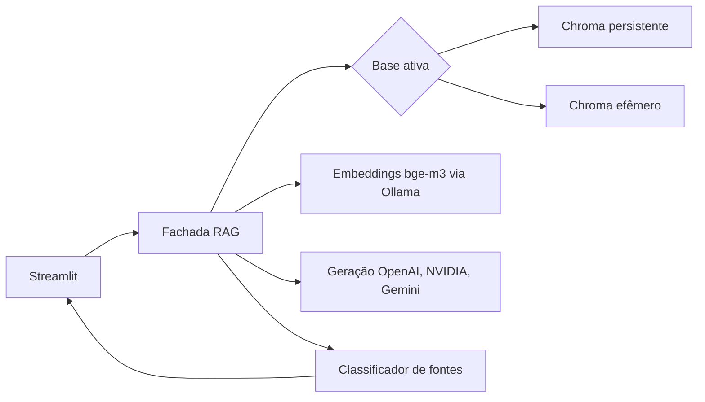

# TDD: Migração OpenAI RAG

| Campo | Valor |
| --- | --- |
| Status | Aprovado |
| Criado | 2026-09-19 |
| Responsável | A definir |
| Branch | `main` |

## Plano operacional atualizado — 2026-09-20

Base atual: `main`, após merge do PR #72 (fallback remoto) e PR #73 (CTO Sol).

- MIG-04: código e testes concluídos em `f8ec561`. Índice de Sessão permanece
  contrato de domínio; Streamlit não o expõe durante treino.
- MIG-05: código anterior em `738cc0c` e `5de05e4`; agora inclui fallback
  remoto OpenAI, NVIDIA e Gemini. Streamlit consulta somente Corpus Oficial.
  `UPLOADS_STREAMLIT_HABILITADOS=False` reserva upload para futuro.
- Gate CTO MIG-05: `ALTERAÇÕES NECESSÁRIAS`. AppTests pendentes, fallback,
  streaming, fontes, Recusa, Resposta Parcial e evidência real dos três
  providers precisam passar antes do aceite.
- MIG-06: material híbrido preparado em branch de trabalho; não confundir com
  aceite do gate MIG-05.
- MIG-07: bloqueada até MIG-05. Ensaio mantém recuperação, citação, Recusa e
  filtro. Caso upload fica adiado até flag Streamlit habilitar.
- MIG-08: permanece dependente de MIG-07 e gate final.

Treino usa Corpus Oficial. Não publicar upload, OCR, consulta combinada ou
geração local. `IndiceSessao` não deve ser removido; prepara implementação pós-
apresentação.

## Contexto

RAG atual acopla UI, indexação e geração ao Ollama. A arquitetura híbrida mantém
`bge-m3` via Ollama somente para embeddings e move geração e streaming para
providers remotos. Preserva Chroma, metadados e ensino do pipeline. Resposta não usa
conhecimento fora do contexto recuperado.

## Escopo

Inclui provider Ollama para embeddings, provider OpenAI direto para geração,
reindexação do Corpus Oficial, upload efêmero, streaming, fontes, memória
limitada, testes e evidências do ensaio. Exclui geração local no caminho
principal, fallback automático para geração local, OCR, upload persistente,
consulta entre bases, LangChain, FAISS, avaliação offline e revisão pós-webinar
de UX.

## Solução técnica

- **Provider Ollama**: contrato de embeddings com `bge-m3` para as duas bases;
  indisponibilidade ou modelo ausente produz erro acionável.
- **Providers remotos**: OpenAI, NVIDIA e Gemini fornecem geração e streaming;
  chaves de `st.secrets`/ambiente; nunca exibir. Roteador troca somente antes
  do primeiro token.
- **Índice**: valida provedor, modelo, dimensão e versão do esquema;
  incompatibilidade exige reindexação; upload nunca destrói coleção oficial.
- **Retrieval**: recebe Base Ativa, aplica filtros, retorna até cinco chunks para
  relevância de upload e envia no máximo três à geração.
- **Resposta**: recebe pergunta atual, até duas turnos anteriores e chunks
  numerados; classifica `citadas`, `recusa`, `fallback`, `sem_resultados`.
- **Streamlit**: durante o treino guarda somente o histórico em `session_state`;
  limpar conversa remove esse histórico. O Índice de Sessão é contrato de domínio
  futuro e não é exposto pela interface enquanto
  `UPLOADS_STREAMLIT_HABILITADOS=False`.

## Falhas, segurança, observabilidade

Ollama indisponível, `bge-m3` ausente, chave de provider remoto ausente,
autenticação, limite API e rede: mensagens acionáveis sem segredo ou traceback.
Roteador pode avançar ao próximo provider somente sem token; depois preserve
**Resposta Parcial**. Registre provider, modelo, Base Ativa, quantidade de
chunks, tentativa, recusa e tempos; nunca chave nem conteúdo integral do PDF.

## Migração e rollback

1. Separe os providers e seus testes de contrato; não altere coleção legada.
2. Gere coleção oficial nova com `bge-m3`, identificada por provider, modelo,
   dimensão e esquema; valide metadados.
3. Adapte a fachada para consultar a coleção híbrida e faça o gate conjunto de
   reindexação e fachada antes de iniciar MIG-04.
4. Alterne aplicação após testes do ensaio.
5. Falha de provider/reindexação: roteie entre providers remotos antes do
   primeiro token; geração local só retorna pela tag `legacy-pre-openai`.

## Operação por subagentes

- **Implementador**: `gpt-5.6-terra`, `medium`; uma issue, teste-first,
  implementação e evidência; `MIG-01`–`MIG-08`, sequencial.
- **Executor mecânico**: `gpt-5.6-luna`, `medium`; inventário, links, referências
  Ollama, testes e revisão documental isolada; não altera código de produto.
- **Revisor/CTO**: `gpt-5.6-sol`, `medium`; gate independente, somente leitura,
  sem editar/aprovar sem evidência; após `MIG-01`, após a adaptação híbrida de
  `MIG-02`/`MIG-03`, após `MIG-05` e antes do ensaio.

Não paralelize escritas no mesmo worktree. Executor entrega lista verificável ou
saída de comando; não muda decisões arquiteturais. Implementador é único papel
que altera código de produto.

### Gate CTO

1. Leia ADR, PRD, TDD, issue, diff, testes e evidências desde gate anterior.
2. Verifique aceite e riscos de segurança, grounding, isolamento e rollback.
3. Rastreie mudanças pelos componentes, não só arquivo editado. Embeddings devem
   cobrir provider, reindexação, compatibilidade Chroma, retrieval, metadados,
   fontes, configuração, testes e rollback.
4. Execute ou solicite verificações reproduzíveis.
5. Emita `APROVADO`, `APROVADO COM RESSALVAS` ou `ALTERAÇÕES NECESSÁRIAS`, com
   achados localizáveis, severidade e evidência.

Próximo bloco dependente inicia só após `APROVADO` ou ressalvas com plano que não
comprometa P0. `ALTERAÇÕES NECESSÁRIAS` retorna issue ao implementador; CTO segue
somente leitura. Em particular, MIG-04 não começa antes de o gate conjunto
aprovar a reindexação do Corpus Oficial com `bge-m3` e a fachada RAG usando a
arquitetura híbrida.

## Riscos

- Ollama/modelo local: mensagem clara, evidência e reindexação reproduzível.
- API/credencial OpenAI: mensagem clara, evidência e rollback explícito.
- Custo/latência: registrar tempos/tokens; limitar contexto.
- Citação ausente: mostrar fallback recuperado, nunca citação real.
- Vazamento entre uploads: coleção efêmera por sessão + teste de isolamento.
- Espaços vetoriais misturados: validar provider, modelo, dimensão e esquema
  antes da consulta.

## Validação

Critérios PRD, estratégia test-first e matriz de quatro perguntas encerram a
migração. O caso de upload só entra quando
`UPLOADS_STREAMLIT_HABILITADOS=True`.
