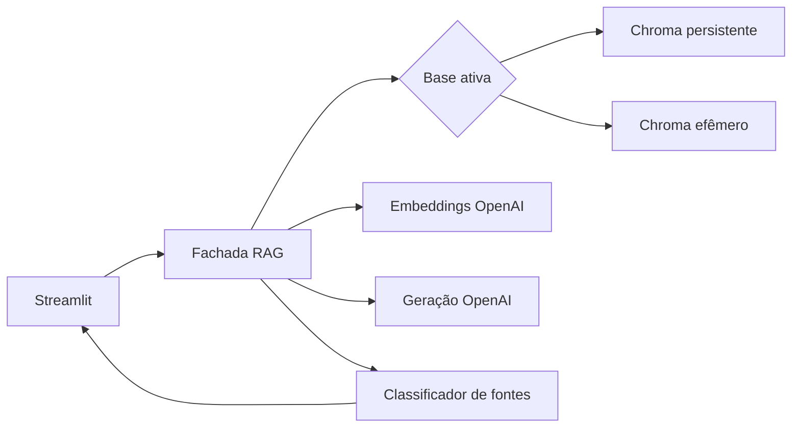

# TDD: Migração OpenAI RAG

| Campo | Valor |
| --- | --- |
| Status | Aprovado |
| Criado | 2026-09-19 |
| Responsável | A definir |
| Branch | `feat/openai-rag-migration` |

## Contexto e problema

O RAG atual acopla interface, indexação e geração ao Ollama. A migração substitui
essa dependência de caminho crítico preservando Chroma, metadados e a leitura
didática do pipeline. O sistema não pode usar conhecimento fora do contexto
recuperado para completar uma resposta.

## Escopo

Inclui provider OpenAI direto, reindexação do corpus oficial, upload efêmero,
streaming, fontes, memória limitada, testes e evidências do ensaio. Exclui OCR,
upload persistente, consulta entre bases, LangChain, FAISS, avaliação offline e
revisão de UX pós-webinar.

## Solução técnica

- **Provider OpenAI** expõe contratos específicos para embedding, geração e
  streaming; a chave vem de `st.secrets` ou ambiente e nunca é exibida.
- **Índice** valida o modelo de embedding da coleção. Vetores incompatíveis exigem
  reindexação explícita; a coleção oficial nunca é destruída por upload.
- **Retrieval** recebe a Base Ativa, aplica filtros, retorna até cinco chunks para
  avaliação de relevância do upload e envia no máximo três para geração.
- **Resposta** recebe a pergunta atual, no máximo duas turnos anteriores e chunks
  numerados. A classificação separa `citadas`, `recusa`, `fallback` e
  `sem_resultados`.
- **Streamlit** guarda histórico e índice efêmero em `session_state`; limpar a
  sessão remove o índice de upload e o histórico.

## Falhas, segurança e observabilidade

- Chave ausente, erro de autenticação, limite da API e falha de rede possuem
  mensagens acionáveis sem segredo ou traceback.
- A chamada repete somente se nenhum token chegou; depois do primeiro token, a UI
  preserva a Resposta Parcial.
- Registrar modelo, base ativa, quantidade de chunks, tentativa, recusa e tempos,
  sem registrar chave nem conteúdo integral do PDF enviado.

## Migração e rollback

1. Criar provider e testes de contrato sem alterar a coleção legada.
2. Gerar nova coleção oficial identificada pelo modelo OpenAI e validar metadados.
3. Alternar a aplicação para a nova coleção após os testes do ensaio.
4. Reverter para a tag `legacy-pre-openai` se o provider ou a reindexação falhar.

## Riscos

- API indisponível ou credencial inválida: mensagem clara, evidência e rollback.
- Custo ou latência inesperados: registrar tempos/tokens e limitar o contexto.
- Citação ausente: mostrar como fallback recuperado, nunca como citação real.
- Vazamento entre uploads: manter uma coleção efêmera por sessão e testar
  isolamento.

## Validação

Os critérios do PRD, a estratégia test-first e a matriz de cinco perguntas são
condições para encerrar a migração.
