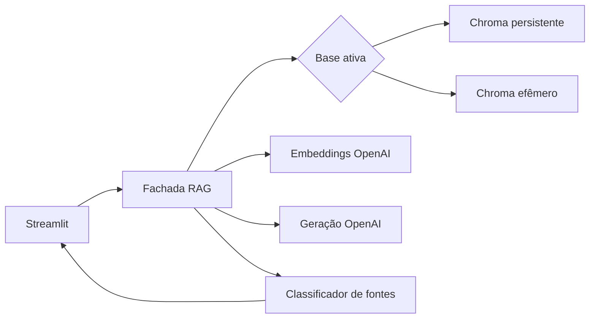

# TDD: Migração OpenAI RAG

| Campo | Valor |
| --- | --- |
| Status | Aprovado |
| Criado | 2026-09-19 |
| Responsável | A definir |
| Branch | `feat/openai-rag-migration` |

## Contexto

RAG atual acopla UI, indexação e geração ao Ollama. Migração remove dependência
do caminho crítico, preserva Chroma, metadados e ensino do pipeline. Resposta não
usa conhecimento fora do contexto recuperado.

## Escopo

Inclui provider OpenAI direto, reindexação do Corpus Oficial, upload efêmero,
streaming, fontes, memória limitada, testes e evidências do ensaio. Exclui OCR,
upload persistente, consulta entre bases, LangChain, FAISS, avaliação offline e
revisão pós-webinar de UX.

## Solução técnica

- **Provider OpenAI**: contratos de embedding, geração e streaming; chave de
  `st.secrets`/ambiente; nunca exibir.
- **Índice**: valida modelo de embedding; incompatibilidade exige reindexação;
  upload nunca destrói coleção oficial.
- **Retrieval**: recebe Base Ativa, aplica filtros, retorna até cinco chunks para
  relevância de upload e envia no máximo três à geração.
- **Resposta**: recebe pergunta atual, até duas turnos anteriores e chunks
  numerados; classifica `citadas`, `recusa`, `fallback`, `sem_resultados`.
- **Streamlit**: guarda histórico e índice efêmero em `session_state`; limpar
  sessão remove índice de upload e histórico.

## Falhas, segurança, observabilidade

Chave ausente, autenticação, limite API e rede: mensagens acionáveis sem segredo
ou traceback. Repita só se nenhum token chegou; depois preserve **Resposta
Parcial**. Registre modelo, Base Ativa, quantidade de chunks, tentativa, recusa e
tempos; nunca chave nem conteúdo integral do PDF.

## Migração e rollback

1. Crie provider e testes de contrato; não altere coleção legada.
2. Gere coleção oficial nova, identificada pelo modelo OpenAI; valide metadados.
3. Alterne aplicação após testes do ensaio.
4. Falha de provider/reindexação: reverta para tag `legacy-pre-openai`.

## Operação por subagentes

- **Implementador**: `gpt-5.6-terra`, `medium`; uma issue, teste-first,
  implementação e evidência; `MIG-01`–`MIG-08`, sequencial.
- **Executor mecânico**: `gpt-5.6-luna`, `medium`; inventário, links, referências
  Ollama, testes e revisão documental isolada; não altera código de produto.
- **Revisor/CTO**: `gpt-6-astra`, `medium`; gate independente, somente leitura,
  sem editar/aprovar sem evidência; após `MIG-01`, `MIG-03`, `MIG-05` e antes do
  ensaio.

Não paralelize escritas no mesmo worktree. Executor entrega lista verificável ou
saída de comando; não muda decisões arquiteturais. Implementador é único papel
que altera código de produto.

### Gate CTO

1. Leia ADR, PRD, TDD, issue, diff, testes e evidências desde gate anterior.
2. Verifique aceite e riscos de segurança, grounding, isolamento e rollback.
3. Rastreie mudanças pelos componentes, não só arquivo editado. Embeddings devem
   cobrir provider, reindexação, compatibilidade Chroma, retrieval, metadados,
   fontes, configuração, testes e rollback.
4. Execute ou solicite verificações reproduzíveis.
5. Emita `APROVADO`, `APROVADO COM RESSALVAS` ou `ALTERAÇÕES NECESSÁRIAS`, com
   achados localizáveis, severidade e evidência.

Próximo bloco dependente inicia só após `APROVADO` ou ressalvas com plano que não
comprometa P0. `ALTERAÇÕES NECESSÁRIAS` retorna issue ao implementador; CTO segue
somente leitura.

## Riscos

- API/credencial: mensagem clara, evidência, rollback.
- Custo/latência: registrar tempos/tokens; limitar contexto.
- Citação ausente: mostrar fallback recuperado, nunca citação real.
- Vazamento entre uploads: coleção efêmera por sessão + teste de isolamento.

## Validação

Critérios PRD, estratégia test-first e matriz de cinco perguntas encerram migração.
